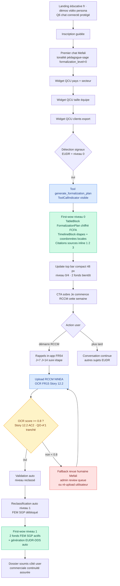
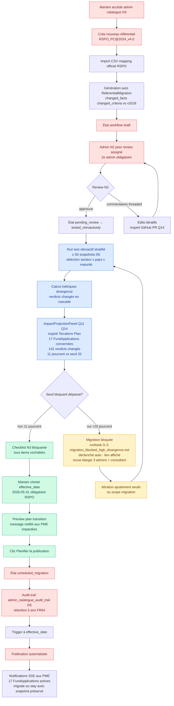

# UX Design Specification — esg_mefali (Extension 5 clusters)

**Auteur :** Angenor
**Date de démarrage :** 2026-04-19
**Périmètre :** Extension 5 clusters du PRD 2026-04-18 (71 FR, 76 NFR)
**Exclus :** Legacy feature 019 floating copilot (déjà livrée, utilisée uniquement en contexte de réutilisation composants)

---

<!-- Append only. -->

## Executive Summary

### Project Vision

Mefali est un copilote IA conversationnel qui automatise le métier du consultant ESG ouest-africain pour PME francophones UEMOA/CEDEAO. Le produit repose sur cinq innovations structurelles : architecture ESG 3 couches (faits atomiques → critères composables → verdicts multi-référentiels) avec DSL borné Pydantic, Cube 4D de matching financement (projet × entreprise × référentiels × voie d'accès directe vs intermédiée), trio PME-intermédiaire-bailleur comme objet métier de premier ordre, formalisation graduée en 4 niveaux comme gate d'accès bailleur, et catalogue dynamique extensible sans redéploiement via workflows admin N1/N2/N3.

Le design UX orchestre deux modalités complémentaires en **arbitrage hybride contrôlé** (Q2) :

- **Chat conversationnel primaire** (widget flottant spec 019 + 32 tools LangChain + widgets interactifs QCU/QCM spec 018) pour la saisie guidée des faits atomiques, l'accompagnement pédagogique, la génération du plan d'action.
- **Pages dédiées structurées** pour les actions à gravité juridique non négociables : modal signature électronique (FR40), workflow section-par-section > 50k USD (FR41), BETA banner SGES NO BYPASS (FR44), publication référentiel N3 par Mariam.

La **tonalité du copilote est adaptative** (Q1) : le système injecte le `formalization_level` de l'entreprise dans les prompts système, produisant un discours pédagogique et rassurant niveau 0 (Aminata) et concis/expert niveau 3 (Akissi). Le **langage visuel est dual-face** (Q4) : UI PME chaleureuse et accessible en interaction quotidienne ; templates d'export bailleur sobres et conformes aux standards internationaux IFC/GCF/Proparco/EUDR.

### Target Users

Cinq personas représentatifs du PRD couvrent toute la gamme du marché cible :

- **Aminata Diagne** (34 ans, Ziguinchor SN) — transformatrice de mangues séchées en informalité, Android 2 Go RAM, 3G faible. Primary user success path, voie directe FNDE, parcours EUDR-DDS + FormalizationPlan. Design **100 % mobile-optimized** (Q3) : mode low-data, reconnexion SSE gracieuse, pédagogie niveau 0 via `formalization_level=0` injecté en prompt (Q1).
- **Moussa Kouakou** (48 ans, Bouaflé CI) — président coopérative COOPRACA 152 producteurs cacao, niveau 2, desktop au bureau. Multi-projets consortium, voie intermédiée multi-banques (SIB / Ecobank CI / BOAD Ligne Verte), `BeneficiaryProfile` agrégé. Exige dashboard multi-projets et comparateur intermédiaires desktop-primary, lecture mobile secondaire.
- **Akissi Kouadio** (51 ans, Abidjan CI) — DG SARL OHADA palme 47 salariés, niveau 3 audité, desktop professionnel. Advanced case : voie mixte IFC direct + SGES/ESMS BETA + vue comparative multi-référentiels (IFC PS3 FAIL / RSPO 5.3 PASS conditionnel / ISO 14001 gap / GRI 303 reporté). Tonalité concise/expert via `formalization_level=3` (Q1).
- **Ibrahim Sawadogo** (39 ans, Ouagadougou BF) — PME recyclage plastique, niveau 2, edge case projet refusé FNDE (hors zone). Gestion UX du refus **empathique cadrante** (Q5) : reconnaissance de l'effort + statistique contextuelle (« 6 PME sur 10 trouvent un fonds adapté après une première tentative ») + lien immédiat vers le parcours de remédiation (nouveau matching cube 4D avec `country=BF`).
- **Mariam Touré** (Admin Mefali) — data owner catalogue, workflows N1 libre / N2 peer review / N3 versioning strict. Interface admin **desktop-primary** (Q3) avec mobile read-only : dashboards monitoring, publication `RSPO_PC@2024_v4.0` avec test rétroactif stratifié ≥ 50 snapshots, seuil blocage > 20 % verdicts changés, date d'effet et plan de transition notifié aux PME impactées.

### Key Design Challenges

1. **Dualité mobile-first informel vs desktop pro OHADA** — arbitrage **responsive adaptatif** (Q3) : Aminata 100 % mobile-optimized ; Moussa/Akissi desktop-primary avec mobile responsive ; Mariam desktop-primary avec mobile read-only admin. Risque mitigé : pas de compromis qui dilue ni Aminata ni Akissi.
2. **Gravité juridique des livrables bailleur** (RI-10) — signature électronique FR40 + blocage section-par-section > 50 k USD FR41 + SGES BETA NO BYPASS FR44 traités en **pages dédiées** (Q2) pour isoler la charge juridique du flux conversationnel. Design doit convaincre sans effrayer, imposer sans dévitaliser, tracer sans alourdir.
3. **Rendre visible l'architecture 3 couches ESG sans la complexifier** — faits/critères/verdicts invisibilisés en saisie (chat + widgets), mais la comparaison multi-référentiels (FR26, use case Akissi) exige une visualisation claire de la dérivation « même fait effluents → 4 verdicts différents selon référentiel ».
4. **Complexité des workflows admin N1/N2/N3 (Mariam)** — publication référentiel N3 avec test rétroactif stratifié, seuil blocage > 20 %, date d'effet, plan de transition. Charge cognitive maximale. Desktop-primary indispensable.
5. **Connectivité dégradée** — FCP ≤ 5 s p95 3G (NFR7), mode low-data Phase 3, PWA offline Phase 4 avec service worker + IndexedDB queue. Tout composant Aminata-path doit fonctionner en 3G et tolérer les ruptures SSE (badge `ConnectionStatusBadge` déjà livré spec 7-3).
6. **Dual-face visuel** (Q4) — maintenir cohérence entre UI PME chaleureuse (palette brand `--color-brand-green` / `-blue` / `-purple` / `-orange` / `-red` + dark mode) et templates export sobre conforme IFC/GCF. Nécessite système de design à deux niveaux : tokens interaction vs tokens livraison.

### Design Opportunities

1. **Chat comme orchestrateur universel** — leverage de l'existant spec 019 (widget flottant, state module-level `useChat`) et des 32 tools LangChain + 4 variantes widgets interactifs QCU/QCM (spec 018) pour unifier les 5 parcours personas au lieu de concevoir 5 UX distinctes. Les pages dédiées juridiques (Q2) ne sont invoquées qu'en fin de parcours critique.
2. **Comparaison multi-référentiels comme différenciateur visuel** — écran « même fait effluents → IFC PS3 FAIL / RSPO 5.3 PASS conditionnel / ISO 14001 gap / GRI 303 reporté » démontre visuellement la valeur de l'architecture 3 couches (INN-1) et justifie le positionnement premium face aux cabinets européens à 35 000 EUR pour Akissi.
3. **Coordonnées locales contextualisées** — afficher le Tribunal de commerce de Ziguinchor pour Aminata, le bureau NINEA local, les conseillers PME régionaux SIB/Ecobank/BOAD pour Moussa : UX = sentiment d'être compris, différenciant radical face aux outils génériques. Leverage de `AdminMaturityRequirement(country × level)` et `Intermediary.coordinates`.
4. **Storytelling du snapshot à la soumission** — exposer exactement ce qui est figé (« vos faits au 15 mai 2026, les seuils RSPO 2024 v4.0, votre profil niveau 2 OHADA, IFC PS 2012 ») transforme le hash cryptographique en confiance et réassurance juridique avant la signature électronique FR40.
5. **Tableau de bord consortium pour coopératives (Moussa)** — vue porteur + co-porteurs + `BeneficiaryProfile` agrégé (152 producteurs répartis par genre/revenus/formalisation individuelle) positionne Mefali comme outil de référence pour les structures collectives africaines, segment peu servi par les outils existants.
6. **Gestion empathique cadrante des refus** (Q5) — transformer Journey 4 Ibrahim en moment de **récupération de confiance** : reconnaissance + statistique (« la majorité des dossiers bancables impliquent 2-3 tentatives, c'est normal ») + CTA unique vers la remédiation. Opportunité de différenciation forte face aux portails bailleurs qui renvoient des refus secs.
7. **Tonalité adaptative** (Q1) — le `formalization_level` injecté en prompt système permet un même produit avec deux voix (pédagogue niveau 0 vs expert niveau 3) sans duplication d'UI. Économie de design substantielle.

## Core User Experience

### Defining Experience

Le cœur de Mefali est **une conversation persistante avec un copilote IA qui orchestre toutes les capabilities métier**. Le chat SSE en français avec tonalité adaptative (`formalization_level` injecté en prompt système — Q1) constitue le point d'entrée unifié : saisie des faits atomiques via widgets interactifs QCU/QCM, lancement de la requête Cube 4D, préparation du FormalizationPlan, guidage vers les pages dédiées juridiques (signature FR40, section-par-section FR41, SGES FR44 — Q2).

Le copilote n'est pas un gadget : il est l'orchestrateur unique des 32 tools LangChain (profiling, ESG, carbon, financing, application, credit, action_plan, document, admin). L'utilisateur ne construit pas son parcours — il exprime son besoin, et Mefali invoque les tools nécessaires, présente les widgets adaptés, route vers les pages structurées quand la gravité juridique l'exige. Cette unification conversationnelle — héritée et étendue des specs 012 (tool calling), 018 (widgets interactifs) et 019 (widget flottant) — permet de livrer 5 journeys personas via une même architecture UX sans duplication.

**Core loop** : message utilisateur → parsing intent LLM → invocation tool → streaming résultat inline (richblocks Chart / Mermaid / Gauge / Timeline / Table / Progress) → question de clarification via widget interactif → persistance en base → évolution du contexte `active_project` + `active_module` → tour suivant.

**Entrée par défaut (Q6)** : chat **réservé aux utilisateurs connectés** au MVP, avec landing éducative riche (explication des 5 clusters, démos vidéo persona Aminata / Moussa / Akissi, tableau comparatif "avec Mefali vs consultant à 35k€", FAQ) et formulaire d'inscription guidée. Décision motivée par le contrôle des coûts LLM non authentifiés : l'option du chat public démo (mode invité 2-3 tours avant inscription) est identifiée comme évolution post-MVP une fois le budget LLM stabilisé et le rate limiting invité dimensionné.

### Platform Strategy

**Plateforme unique : application web Nuxt 4 SSR responsive adaptatif (Q3)**, accessible via navigateur sur tout device. Pas d'application mobile native au MVP — justification : les PME informelles cibles (Aminata) ont des appareils Android avec peu de stockage, installer une app est une friction ; un PWA Phase 4 couvrira les besoins offline sans contrainte d'installation.

**Déclinaisons par persona :**

- **Aminata path (mobile-first 100 %)** — toutes les interactions du parcours PME solo optimisées ≤ 480 px. Chat flottant devient plein écran en mobile, widgets QCU/QCM touch-optimisés, uploads document avec capture caméra, affichage minimal low-data (graphiques réduits ou tableaux, Phase 3).
- **Moussa / Akissi path (responsive, desktop-primary pour multi-projets)** — dashboards multi-projets, comparateur d'intermédiaires, vue comparative multi-référentiels dimensionnés pour écran desktop. Mobile responsive pour consultation en déplacement.
- **Mariam path (desktop-primary, mobile read-only)** — interface admin N1/N2/N3 non viable en mobile (complexité workflow N3 avec test rétroactif échantillon ≥ 50 snapshots, ReferentialMigration avec date d'effet). Mobile = lecture dashboard monitoring + alerting uniquement, pas d'édition catalogue.

**Stratégie résilience réseau (Q8 — hybride minimal MVP) :**

- **(a) Reconnexion SSE gracieuse** — déjà livré spec 7-3 (`ConnectionStatusBadge.vue`, classification d'erreurs `abort/network/http/other`, bannière "Connexion perdue. Vérifiez votre réseau."). Socle de base pour tous les parcours.
- **(c) Bouton "Enregistrer brouillon" manuel** — sur les deux écrans à criticité maximale : le modal de signature électronique (FR40, avant export bailleur) et les formulaires de saisie de fait quantitatif avec preuve documentaire. Clic explicite → persistance backend immédiate → message de confirmation → l'utilisateur peut quitter en paix.
- **(b) IndexedDB queue + service worker PWA offline** — **différé Phase 4** conformément à la roadmap. Le choix MVP évite la complexité synchronisation / résolution de conflits sans preuve de besoin pilote.

**Contraintes techniques UX à respecter :**
- FCP ≤ 2 s p95 sur 4G, ≤ 5 s p95 sur 3G dégradée (NFR7)
- TTI ≤ 1,5 s p95 sur 4G (NFR6)
- Chat first-token ≤ 2 s p95 (NFR5)
- Cube 4D query ≤ 2 s p95 (NFR1)
- Dark mode via `@theme` Tailwind 4 obligatoire (variables `--color-dark-*`)
- WCAG 2.1 AA (NFR54–NFR58) : clavier, ARIA, contraste 4.5:1, lecteurs écran

**Infrastructure UX héritée (à ne pas réinventer) :** 60 composants Vue, 18 composables dont 3 à state module-level (`useAuth`, `useChat`, `useGuidedTour`), 11 stores Pinia, 8 richblocks streamés, 5 composants copilot, 4 variantes widgets interactifs, 6 tours guidés driver.js.

### Effortless Interactions

Sept interactions doivent demander **zéro effort cognitif** à l'utilisateur :

1. **Détection automatique du niveau de formalisation** — upload d'un RCCM ou NINEA déclenche OCR + reclassification automatique du niveau (FR15). L'utilisateur n'a pas à re-saisir son niveau après upload.
2. **Coordonnées locales contextualisées sans demande** — dès que le pays de la PME est connu, Mefali affiche par défaut les coordonnées du Tribunal de commerce local, du bureau NINEA/IFU/NIF, du conseiller PME régional, sans que l'utilisateur ait à chercher.
3. **Activation automatique des packs référentiels** — détection d'un secteur (palme → RSPO) ou d'un client export UE (EUDR-DDS) active le pack adéquat en façade sans intervention utilisateur (FR22).
4. **Snapshot cryptographique à la soumission** — l'utilisateur signe, Mefali fige faits + verdicts + versions référentiels + profil dans un hash immuable (FR39) sans demander confirmation technique.
5. **Génération calibrée par voie d'accès** — même projet, deux templates différents (SIB intermédiaire vs GCF direct) générés automatiquement selon la `FundApplication` sélectionnée (FR42).
6. **Reprise de conversation interrompue** — l'utilisateur revient après une coupure 3G, la conversation reprend au dernier checkpoint LangGraph MemorySaver (FR50).
7. **Tonalité adaptative sans switch UI** — niveau 0 reçoit du pédagogue, niveau 3 reçoit du concis, via `formalization_level` injecté en prompt système (Q1) — l'utilisateur ne configure rien.

### Critical Success Moments

Cinq moments déterminent succès ou abandon :

1. **Premier message reçu du copilote (onboarding)** — la phrase d'accueil doit démontrer compréhension du contexte (pays détecté, secteur évoqué, niveau induit) et inviter à l'action sans surcharge. Échec = perte d'Aminata dans les 30 premières secondes.
2. **First "wow" adaptatif par niveau de formalisation (Q7)** — moment de révélation de valeur séquencé, cohérent avec la tonalité adaptative (Q1) :
   - **Niveau 0-1 (Aminata)** → **FormalizationPlan chiffré en FCFA + coordonnées locales** apparaissent en premier : "125 000 FCFA pour RCCM Ziguinchor + 15 000 FCFA NINEA + 3 semaines, Tribunal de commerce de Ziguinchor, adresse X, bureau NINEA local, contact Y". Le wow est la découverte d'un chemin concret et abordable là où l'utilisateur voyait un mur.
   - **Niveau 2 (Moussa, Ibrahim)** → **Cube 4D affiche 3-5 fonds concrets** avec intermédiaires, critères superposés (SIB 2 ans vs Ecobank 5 ans), délais estimés. Le wow est la projection stratégique : voir 5 portes ouvertes au lieu d'une.
   - **Niveau 3 (Akissi)** → **vue comparative multi-référentiels** révèle les divergences entre IFC PS3 FAIL / RSPO 5.3 PASS conditionnel / ISO 14001 gap / GRI 303 reporté sur le même fait d'effluents. Le wow est la démonstration de cohérence architecturale là où l'utilisateur attendait juste un rapport.
   Le séquençage est déclenché par `formalization_level` + `sector` détectés, sans choix utilisateur explicite.
3. **Signature électronique (FR40) avant export** — moment légalement critique, traité en page dédiée (Q2). Le modal doit exposer clairement ce qui est signé, ce qui est figé dans le snapshot, le disclaimer IA, sans faire fuir l'utilisateur. Bouton "Enregistrer brouillon" (Q8) présent pour sortir sans perdre l'état. Échec = refus d'exporter ou, pire, signature à l'aveugle.
4. **Notification de refus (Journey 4 Ibrahim)** — arbitrage Q5 empathique cadrante : reconnaissance + statistique contextuelle + lien immédiat vers le parcours de remédiation cube 4D avec critères ajustés (FR33). Échec = abandon pur et simple de la plateforme.
5. **Publication référentiel N3 par Mariam** — workflow admin critique : `draft → pending_review → tested_retroactively (≥ 50 snapshots, seuil blocage > 20 %) → scheduled_migration → published`. L'UI doit rendre évidents les impacts sur FundApplications actives et la date d'effet. Échec = publication erronée qui invalide des centaines de verdicts en cascade.

### Experience Principles

Huit principes directeurs pour toutes les décisions UX ultérieures :

1. **Conversation d'abord, pages dédiées quand la loi l'exige** — le chat orchestre tout sauf les trois îlots juridiques (FR40 signature, FR41 section-par-section > 50k USD, FR44 SGES BETA NO BYPASS) et l'admin N2/N3 qui nécessitent un espace dédié hors flux conversationnel.
2. **Connaissance locale = différenciateur cœur** — ne jamais afficher d'information générique quand une information pays-spécifique est disponible : Tribunal de commerce local, bureau NINEA/IFU/NIF, SMIG pays, conseiller PME régional, montants en FCFA avant EUR/USD.
3. **Gravité juridique ritualisée, pas diluée** — les moments à enjeu légal (signature, export > 50k, SGES BETA) ont leur propre scénographie visuelle (page dédiée, modal bloquant, banner BETA) pour signaler clairement au cerveau de l'utilisateur que ce n'est pas un chat anodin.
4. **Résilience réseau intégrée par défaut (Q8)** — chaque interaction tolère 3G faible et ruptures SSE via la reconnexion gracieuse spec 7-3 ; les écrans critiques FR40 et saisie fait quantitatif offrent un bouton "Enregistrer brouillon" explicite ; offline full PWA est un objectif Phase 4, pas un prérequis MVP.
5. **Tonalité et first-wow adaptatifs au lieu de duplication UI (Q1, Q7)** — un seul produit, deux voix (pédagogue niveau 0, expert niveau 3) via `formalization_level` en prompt ; le moment de révélation de valeur est séquencé automatiquement par niveau (FormalizationPlan → Cube 4D → comparateur multi-ref) sans mode toggle visible.
6. **Rendre visible la dérivation multi-référentiels quand c'est différenciant** — pour Akissi, la vue comparative « même fait → 4 verdicts » n'est pas un détail technique mais LA preuve de valeur. Pour Aminata niveau 0, elle reste masquée derrière un pack façade EUDR-DDS.
7. **Dual-face visuel (Q4)** — système de design à deux registres : **tokens interaction PME** (palette brand chaleureuse, dark mode, animations GSAP) vs **tokens livraison bailleur** (templates PDF sobres IFC/GCF-compliant, typographie institutionnelle, aucune couleur de marque intrusive). Cohérence préservée, attentes respectées.
8. **Entrée connectée protégée, landing éducative riche (Q6)** — le chat n'est jamais public au MVP pour maîtriser les coûts LLM ; la landing doit compenser via contenu pédagogique substantiel (démos vidéo persona, tableau comparatif valeur, FAQ) et un onboarding inscription guidé sans friction.

## Desired Emotional Response

### Primary Emotional Goals

Mefali vise cinq émotions primaires, hiérarchisées par ordre d'importance stratégique :

1. **Confiance légitime** — la conviction profonde que l'utilisateur ne se ridiculisera pas devant le bailleur. Pour Aminata, qu'elle peut déposer un dossier EUDR-DDS qui tient la route ; pour Akissi, que son SGES généré vaut celui d'un cabinet européen ; pour Moussa, que sa fiche de préparation SIB est calibrée au bon interlocuteur. Cette confiance est le cœur de la promesse produit — sans elle, aucun autre sentiment n'importe.
2. **Émancipation** (empowerment) — le sentiment concret de ne plus avoir besoin d'un intermédiaire coûteux (consultant ESG à 35 k€, cabinet européen). Traduction UX : affichage explicite de ce qui aurait coûté ailleurs, génération de livrables que l'utilisateur signe lui-même, autonomie dans l'exploration des voies d'accès.
3. **Compréhension sans infantilisation** — l'utilisateur comprend pourquoi il est là, ce qu'il fait, ce qui se passe. Niveau 0 reçoit de la pédagogie sans condescendance ; niveau 3 reçoit de la concision sans présupposer. Le pire contraire est l'effet « boîte noire LLM » où l'utilisateur clique sans rien maîtriser.
4. **Ancrage local** (belonging) — le sentiment unique que cet outil a été pensé pour ma région, mon pays, ma réalité : coordonnées Tribunal Ziguinchor affichées d'emblée, montants en FCFA avant EUR/USD, conseiller PME régional SIB nommé, SMIG pays cité. Différenciateur émotionnel radical face aux outils SaaS globaux.
5. **Progression tangible** (momentum) — chaque interaction rapproche visiblement d'un objectif concret : FormalizationPlan avec étapes cochables, jauge de niveau de formalisation, pipeline de FundApplication avec lifecycle 7 états. L'utilisateur sent qu'il avance, ne tourne pas en rond.

**Émotion centrale qui ferait que l'utilisateur en parle à un pair :** « Cet outil fait ce que je croyais devoir payer 15 millions FCFA à un consultant européen pour faire — et il connaît mon pays. »

### Emotional Journey Mapping

Émotions cibles à chaque étape du parcours, pour les 5 personas :

- **Découverte (landing + inscription)** — **Curiosité légitimée**. L'utilisateur arrive sceptique (« encore un outil IA générique »), les démos vidéo persona (Q6) doivent produire la bascule : « Ils ont compris ma situation ». Pas d'euphorie commerciale ; crédibilité tranquille.
- **Onboarding (premier chat + détection contexte)** — **Reconnaissance**. Le premier message de Mefali doit refléter avec précision ce qui a été compris : pays, secteur, niveau induit, enjeu évoqué. L'utilisateur ressent « on me voit » plutôt que « on me vend ».
- **First "wow" adaptatif par niveau (Q7)** :
  - Niveau 0-1 (Aminata) — **Soulagement** face au FormalizationPlan chiffré en FCFA avec coordonnées locales. « Ce n'est pas un mur, c'est un chemin. »
  - Niveau 2 (Moussa, Ibrahim) — **Projection stratégique** face au Cube 4D affichant 3-5 fonds et voies. « J'ai le choix, je peux arbitrer. »
  - Niveau 3 (Akissi) — **Maîtrise experte** face à la vue comparative multi-référentiels. « L'outil comprend la complexité que j'ai dû gérer seule. »
- **Core action (saisie faits via chat + widgets)** — **Fluidité concentrée**. L'utilisateur est « dans le flux », les widgets QCU/QCM réduisent l'effort, la tonalité adaptative évite la fatigue. Absence d'émotion négative = victoire.
- **Moments à enjeu juridique (FR40 signature, FR41 > 50k, FR44 SGES)** — **Gravité sereine**. Pas d'anxiété, pas de légèreté. L'utilisateur comprend ce qu'il signe, voit le snapshot figé, a relu section par section quand requis. Sort du modal en se sentant responsable et protégé, pas piégé.
- **Notification de refus (Journey 4 Ibrahim, arbitrage Q5)** — **Récupération rapide**. Reconnaissance + normalisation statistique + lien de remédiation immédiat. « Ce n'est pas un échec définitif, c'est une étape. »
- **Soumission réussie (FundApplication exportée)** — **Accomplissement calme**. Confirmation sobre (Q10) avec mention du jalon et des débloquages (« Dossier SIB exporté · snapshot #a3f9… · prochaine étape : suivi statut »), pas de confetti ostentatoires.
- **Retour ultérieur** — **Familiarité opérationnelle**. La conversation reprend au checkpoint LangGraph, le dashboard affiche l'état des FundApplications, les rappels in-app (deadline bailleur, renouvellement certif, MàJ référentiel) créent un sentiment de continuité maîtrisée.
- **Côté admin Mariam (Q11)** — **Maîtrise responsable**. La publication d'une ReferentialMigration N3 produit un sentiment de contrôle éclairé (panneau « Projection d'impact » temps réel : N FundApplications actives concernées, M verdicts changés, pourcentage vs seuil bloquant 20 %) couplé à la conscience du poids de l'action (checklist N3 bloquante : test rétroactif ≥ 50 snapshots, date d'effet choisie, plan de transition notifié, procédure de rollback documentée).

### Micro-Emotions

Six axes de micro-émotions à gérer explicitement :

- **Confiance > Scepticisme** — l'utilisateur arrive sceptique vis-à-vis de l'IA et des outils SaaS africains. Chaque interaction doit consolider la confiance : sources documentaires citées (FR71), snapshot cryptographique visible, disclaimer IA explicite, coordonnées officielles vérifiables.
- **Accomplissement > Frustration** — chaque action utilisateur doit se conclure par un signal clair de progression, même si c'est une étape intermédiaire. Jamais d'écran de fin flou.
- **Ancrage > Isolement** — face à un outil global, l'utilisateur AO doit sentir qu'il n'est pas un cas marginal mais au cœur du produit. Références locales, exemples de personas régionaux, valeurs en FCFA.
- **Gravité sereine > Anxiété juridique** — les écrans FR40/FR41/FR44 doivent rendre l'utilisateur conscient sans l'effrayer. La pire issue est un utilisateur qui évite la signature et n'exporte jamais.
- **Émancipation > Condescendance** — pédagogie niveau 0 oui, infantilisation jamais. Aminata doit sentir qu'on lui ouvre un chemin, pas qu'on lui parle comme à une débutante.
- **Continuité > Reset** — chaque retour dans la plateforme reprend exactement là où l'utilisateur s'était arrêté, sans effort de re-contextualisation.

### Design Implications

Traduction des émotions cibles en choix UX actionnables :

| Émotion visée | Choix UX supportant |
|---|---|
| **Confiance légitime** | Affichage systématique des sources documentaires (FR71), snapshot cryptographique visible avant signature, disclaimer IA en tête et pied de livrable (Risque 10), `source_url` du catalogue consultable, audit trail accessible au user. |
| **Émancipation** | Affichage explicite du coût évité ("équivalent consultant ESG : 15 M FCFA · Mefali : gratuit MVP"), livrables signés par l'utilisateur lui-même, comparateur d'intermédiaires permettant l'arbitrage autonome. |
| **Compréhension sans infantilisation** | Tonalité adaptative `formalization_level` (Q1/Q9) spectre mentor-sage niveau 0 → factuel-expert niveau 3, vue comparative multi-référentiels pour niveau 3 (FR26), explications "pourquoi cette règle" accessibles à la demande sans être intrusives. |
| **Ancrage local** | Coordonnées locales systématiques (Tribunal, bureau NINEA, SIB Abidjan conseiller régional), devises FCFA prioritaires, personas de démo régionaux sur landing (Q6), libellés métier pays-spécifiques. |
| **Progression tangible** | Jauge de niveau de formalisation toujours visible, pipeline FundApplication 7 états exposé, étapes cochables dans FormalizationPlan, rappels in-app granulaires (FR54), confirmations sobres avec mention du débloquage (Q10 chat PME). |
| **Gravité sereine** (FR40/FR41/FR44) | Page dédiée hors chat (Q2), snapshot figé visualisé avant signature, restraint institutionnel (Q10 pages juridiques : statut factuel + hash snapshot, pas d'animation festive), bouton "Enregistrer brouillon" (Q8) pour sortir sans pression. |
| **Récupération après refus** (Journey 4) | Statistique contextuelle normalisante + CTA unique remédiation (Q5), pas de notification push agressive, aperçu immédiat des nouvelles voies d'accès. |
| **Maîtrise responsable** (Mariam — Q11) | Panneau Projection d'impact temps réel avant publication N3 (X FundApplications actives, Y verdicts concernés, %vs seuil 20 %), checklist N3 bloquante visible (test rétroactif ≥ 50 snapshots, date d'effet, plan de transition notifié, rollback documenté), preview du message notifié aux PME impactées. |

### Emotional Design Principles

Sept principes émotionnels directeurs :

1. **Crédibilité avant séduction** — Mefali ne cherche pas à plaire visuellement à tout prix ; il cherche à être perçu comme légitime face aux bailleurs internationaux. Sobriété dans les animations, substance dans les contenus, sources documentaires apparentes. **GSAP est réservé aux transitions fonctionnelles** (rétraction widget, navigation tour guidé) et exclu des célébrations décoratives (Q10).
2. **Reconnaissance avant explication** — chaque premier message du copilote démontre qu'il a compris le contexte utilisateur avant de proposer une action. « Je vois » précède « je propose ».
3. **Voix adaptative sans rupture (Q9)** — la tonalité de Mefali glisse du **mentor-sage rassurant** (niveau 0, phrases posées, vocabulaire démystifié) vers le **factuel-expert concis** (niveau 3, efficacité, vocabulaire institutionnel IFC/GCF) via `formalization_level` en prompt système. L'énergie « coach enthousiaste » est explicitement exclue — inadaptée au registre bailleur institutionnel.
4. **Gravité sans peur** — les moments juridiques sont ritualisés visuellement (page dédiée, modal bloquant, restraint institutionnel Q10) pour imposer du sérieux, tout en offrant toujours une porte de sortie (brouillon Q8, retour arrière) pour ne pas produire d'anxiété paralysante.
5. **Régionalité assumée** — le produit revendique son ancrage UEMOA/CEDEAO comme force, pas comme limitation. FCFA en premier, Tribunal Ziguinchor par défaut, coordonnées SIB/Ecobank explicites. C'est différenciateur, pas « local-only ».
6. **Empathie cadrante dans l'échec** — les erreurs, refus, échecs (projet rejeté Ibrahim, dossier bloqué guards LLM, coupure réseau) sont traités avec reconnaissance + normalisation + issue constructive, jamais avec culpabilisation ou abandon.
7. **Célébrations duales selon registre (Q10)** — côté chat PME, confirmations sobres avec mention explicite des débloquages (« RCCM validé · niveau 1 atteint · 2 fonds éligibles ») ; côté pages juridiques FR40/FR41/FR44 et admin N2/N3, restraint institutionnel pur (statut factuel + hash snapshot + checklist cochée), sans emphase. Pas de confetti, pas d'animation festive — décrédibiliseraient l'outil face aux enjeux bailleur et aux responsabilités admin.
8. **Maîtrise responsable côté admin (Q11)** — pour Mariam, l'UX admin doit produire simultanément **contrôle** (projection d'impact avant publication) et **conscience** (checklist bloquante rappelant le poids de l'action). L'efficacité seule est exclue comme dangereuse : publier à la légère une ReferentialMigration N3 invaliderait potentiellement des dizaines de verdicts en cascade.

## UX Pattern Analysis & Inspiration

### Inspiring Products Analysis

Cinq registres d'inspiration couvrent les cinq défis UX identifiés (Aminata mobile-first, Akissi multi-référentiels, FR40/41/44 gravité juridique, Mariam admin avec impact, copilote conversationnel unifiant).

**Registre 1 — Copilote IA conversationnel (core experience Mefali) — combinaison ciblée Q13**

- **Claude.ai (Anthropic)** — chat épuré, tonalité adaptative via system prompt, tools invisibles au user, streaming SSE fluide. Retenu pour la tonalité adaptative invisible via `formalization_level` (Q1) : un seul produit, deux voix, sans switch UI visible par l'utilisateur.
- **Perplexity** — citation sources inline systématique (numéros [1][2][3] avec drawer source détaillé), crédibilité = preuve documentaire. Retenu comme réponse directe à FR71 (citation sources dans verdicts et narratifs) et NFR-SOURCE-TRACKING : chaque verdict affiche ses `source_url` au même niveau visuel que le contenu, drawer latéral pour la règle complète et la version de référentiel.
- **Linear AI / Notion AI** — copilote intégré dans workflow existant, commandes contextuelles via drawer latéral, pas de rupture vers un espace "chat séparé". Retenu pour le widget flottant spec 019 + drawer expandable côté outils lourds, cohérent avec l'arbitrage hybride Q2.
- **Exclu : ChatGPT pur** — modèle chat-only qui ne couvre pas les pages dédiées juridiques FR40/FR41/FR44 exigées par Q2. Mefali a besoin d'un espace hors-chat pour la gravité légale.

**Registre 2 — Mobile-first africain (Aminata path) — inspiration partielle Q12**

- **Wave (fintech SN/CI)** — simplicité radicale mobile-first, typographie large, 3 couleurs, paiement en 2-3 taps, aucun jargon. Retenu **comme discipline de simplicité** appliquée au Aminata path mobile : typographie ≥ 16 px, hiérarchie visuelle extrême (une action primaire par écran), palette réduite ≤ 5 couleurs dominantes, copy en langage quotidien sans jargon ESG. Refusé comme modèle complet : Wave est transactionnel pur ; Mefali porte une densité d'information ESG supérieure que Aminata doit pouvoir consulter. Les écrans Aminata organisent donc cette densité avec la discipline Wave, mais ne la sous-taillent pas.
- **Orange Money / MTN MoMo apps** — flux transactionnels mobiles AO, tolérance aux ruptures réseau, notifications SMS de fallback. Retenu pour les messages d'erreur actionnables en langage simple et la perspective SMS/WhatsApp (NFR Integration, Phase Growth).
- **M-Pesa (Safaricom, Kenya)** — pédagogie niveau 0 sans condescendance. Retenu pour inspirer la copy du pédagogue-sage (Q9) niveau 0.
- **Principe de bascule** — Moussa (niveau 2, desktop pro) et Akissi (niveau 3, desktop OHADA) **conservent leur densité native desktop** : Wave n'est PAS le modèle pour eux. La discipline Wave est exclusivement appliquée au Aminata path mobile.

**Registre 3 — SaaS à gravité juridique (FR40 signature + FR41 > 50k + FR44 SGES)**

- **DocuSign / HelloSign** — rituel de signature électronique : document visible en totalité avant signature, zones surlignées, audit trail, email avec hash. Retenu pour FR40 : modal signature avec exposition complète du snapshot, checkbox obligatoire, horodatage, hash visible. Sobriété institutionnelle alignée Q10.
- **GitHub / GitLab Pull Requests** — snapshot/commit/hash visibles, diff exposé avant merge, reviewer obligatoire. Retenu pour FR41 (section-par-section > 50k USD) : review checkpoint par section avec validation explicite, et pour Mariam N2 (peer review).
- **Stripe Dashboard** — sobriété institutionnelle, documentation inline, zéro fioriture, interface crédible face aux régulateurs. Retenu pour le dual-face visuel Q4 côté export bailleur : tokens livraison sobres, typographie institutionnelle, aucune couleur de marque intrusive.

**Registre 4 — Compliance multi-référentiels (Akissi advanced case)**

- **Workiva (ESG reporting enterprise)** — mapping multi-référentiels, même fait → multiples reports, traçabilité verdict → source. Retenu pour inspirer la vue comparative FR26 : tableau colonnes = référentiels actifs, lignes = critères évalués, cellules = verdicts PASS/FAIL/REPORTED avec lien drawer vers la règle. À adapter (simplifier par rapport à l'enterprise-complex Workiva).
- **Watershed / Persefoni (carbon ESG)** — gestion des faits manquants comme verdicts à part entière, alerte claire bloquante. Retenu pour ne jamais masquer les N/A et REPORTED.
- **EcoVadis (fournisseur scoring)** — **anti-exemple** : scoring opaque, critères non-traçables, verdict sans justification. Mefali doit faire mieux via FR21 (traçabilité verdict → règle + fait source).

**Registre 5 — Workflow admin avec projection d'impact (Mariam N1/N2/N3) — combinaison ciblée Q14**

- **Terraform Cloud (plan / apply)** — dry-run systématique avant apply, exposition des changements, bloquage si drift. Retenu pour la **projection d'impact N3** (Q11) : panneau listant les FundApplications actives impactées, les verdicts qui basculent, le pourcentage vs seuil 20 %, avec bouton `cancel` avant `publish`.
- **GitHub Pull Request review flow** — reviewer obligatoire, statuses CI, conversations threaded, merge bloqué. Retenu pour **N2 peer review** : workflow `draft → pending_review → published` avec 2e admin obligatoire, commentaires threaded par champ modifié, blocage strict tant que review non effectuée.
- **Contentful / Strapi (CMS versioning)** — états de publication (draft / scheduled / published), `effective_date` différée, rollback documenté. Retenu pour **N3 ReferentialMigration** : choix explicite de la date d'effet (ex. `RSPO_PC@2024_v4.0 effective_date = 2026-05-31`), procédure de rollback visible et documentée dans la checklist (Q11).
- **Assemblage complet** : Terraform pour **prévisualiser** → GitHub pour **faire valider** → Contentful pour **planifier la mise en vigueur**. Cette chaîne couvre les trois niveaux N1/N2/N3 avec le niveau de sécurité croissant.

### Transferable UX Patterns

**Patterns de navigation et architecture de l'information**

- **Chat flottant omniprésent + pages dédiées critiques** (Linear AI, Notion AI) — confirme Q2 hybride.
- **Drawer latéral pour citations et tools détaillés** (Perplexity sources panel) — affichage `source_url` et `source_version` du catalogue sans rupture de navigation.
- **Dashboard avec drill-down hiérarchique** (Workiva) — FR52 : sunburst ou table hiérarchique expansible du score global → référentiels → verdicts → faits.

**Patterns d'interaction**

- **Citation inline systématique** (Perplexity) — chaque affirmation copilote ou verdict affiche sa source à côté, pas en tooltip obscur (FR71, Primary Emotional Goal #1).
- **Rituel de signature en 3 phases** (DocuSign) — voir contenu complet + snapshot cryptographique / cocher "j'ai relu" / signer. Pour FR40.
- **Review par section avec unlock séquentiel** (GitHub PR) — pour FR41 : chaque section relue débloque la suivante, pas de bypass global.
- **Dry-run "Plan" avant publication destructive** (Terraform) — pour Mariam N3 Q11 projection d'impact avant publish.
- **Peer review threaded** (GitHub PR) — pour Mariam N2 : 2e admin obligatoire, commentaires par champ modifié.
- **Effective date différée + rollback documenté** (Contentful) — pour Mariam N3 : date d'effet choisie + procédure de retour arrière visible.
- **Reprise conversationnelle avec historique** (Claude.ai) — FR50 + checkpointer LangGraph.

**Patterns visuels**

- **Typographie duale** (Stripe + Wave) — Stripe pour admin/juridique (sobriété institutionnelle), discipline Wave pour Aminata mobile (typo ≥ 16 px, hiérarchie extrême). Dual-face Q4.
- **Palette brand chaleureuse côté PME** (existant) — conserver pour UI interaction, exclure des templates export bailleur.
- **Dark mode complet** (Claude.ai, Linear, Perplexity référence) — confirme discipline `dark:` Tailwind 4 sur tous nouveaux composants.
- **Badges de statut factuels** (GitHub checks) — pour lifecycle FundApplication 7 états (FR32) : badges sobres colorés sans icônes émotionnelles.

### Anti-Patterns to Avoid

Neuf anti-patterns explicitement rejetés :

1. **Confetti et animations festives sur les moments juridiques** (DuoLingo-style) — incompatible Q10 contexte bailleur institutionnel. GSAP réservé aux transitions fonctionnelles.
2. **Onboarding unique rigide** — ignore la dualité Aminata niveau 0 vs Akissi niveau 3. Adaptation via `formalization_level` (Q1, Q7).
3. **Chat "AI magic" opaque** — sources masquées, boîte noire. Incompatible confiance légitime + FR71.
4. **Modal signature anxiogène** (jargon juridique hostile) — incompatible gravité sereine. Préférer DocuSign-style.
5. **Dashboard générique sans ancrage local** (outils SaaS globaux) — absence FCFA, coordonnées locales, contextualisation pays. Incompatible Principle #5.
6. **Publication admin sans dry-run** (CMS basiques) — publier à l'aveugle. Incompatible Q11/Q14 et Principle #8.
7. **Verdict ESG sans traçabilité** (EcoVadis-style) — score sans règle + fait source. Incompatible FR21 + architecture 3 couches.
8. **Notifications push brutales sur refus** (portails bailleurs classiques) — "refusé" sans remédiation. Incompatible Q5 + Journey 4.
9. **Mode "débutant / avancé" avec toggle explicite** — réintroduit choix cognitif et stigmatise niveau 0. Tonalité adaptative invisible préférée (Q1).
10. **Sous-taillage mobile façon Wave pour personas niveau 2-3** — Moussa et Akissi ont besoin de densité desktop native ; la discipline Wave n'est PAS transposée à leur parcours (Q12).
11. **ChatGPT pur sans pages dédiées** — ne couvre pas FR40/FR41/FR44 (exclusion Q13).

### Design Inspiration Strategy

**À adopter tel quel (direct lift)**

- **Citations inline Perplexity-style** pour FR71 + NFR-SOURCE-TRACKING (Q13) : chaque verdict/narratif affiche ses sources au même niveau visuel avec drawer latéral pour règle complète.
- **Rituel de signature DocuSign** pour FR40 : modal complet + snapshot + checkbox + hash + confirmation email.
- **Dry-run Terraform "Plan"** pour Mariam N3 (Q14) : panneau Projection d'impact avant bouton Publier.
- **Peer review GitHub PR threaded** pour Mariam N2 (Q14) : 2e admin obligatoire + commentaires par champ modifié.
- **CMS versioning avec effective_date + rollback** pour Mariam N3 (Q14) : date d'effet planifiée et procédure de retour arrière documentée dans la checklist.
- **Review par section GitHub PR** pour FR41 (> 50k USD) : unlock séquentiel section par section.
- **Sobriété Stripe** pour exports bailleur (Cluster C) : registre institutionnel strict, aucune couleur marque intrusive.
- **Tonalité adaptative Claude.ai** (Q1/Q9) : `formalization_level` en system prompt, voix glisse mentor-sage → factuel-expert sans toggle visible.

**À adapter (inspiration partielle)**

- **Discipline simplicité Wave** appliquée exclusivement au Aminata path mobile (Q12) : typo ≥ 16 px, hiérarchie extrême, ≤ 5 couleurs dominantes, copy quotidien, SANS sous-tailler la densité d'information ESG. Moussa/Akissi desktop conservent leur densité native.
- **Mapping multi-référentiels Workiva** pour vue comparative FR26 (Akissi) : tableau simplifié colonnes référentiels × lignes critères × cellules verdicts avec drawer règle.
- **Copilote drawer Linear AI / Notion AI** pour tools lourds (Q13) : widget flottant spec 019 reste le point d'entrée ; comparateur intermédiaires, dashboard multi-projets, vue comparative multi-ref peuvent ouvrir une vue expandable latérale sans quitter la conversation.
- **Onboarding pédagogique M-Pesa-style** pour niveau 0 : langage simple, démystification EUDR/RCCM/NINEA sans condescendance. Inspire la copy pédagogue-sage Q9.

**À éviter explicitement**

- Tous les anti-patterns #1 à #11 ci-dessus.
- EcoVadis opacité (jamais de score sans traçabilité).
- DuoLingo festivité (jamais de confetti/animations enjouées sur signatures/soumissions/admin).
- Salesforce admin complexity (Mariam N3 reste compréhensible : pas 15 onglets, pas 40 champs par formulaire, discipline de réduction).
- Chat-only sans pages dédiées (ChatGPT pur exclu Q13 car ne couvre pas FR40/FR41/FR44).

**Disciplines de réutilisation (héritage brownfield)**

Tous les patterns adoptés leverage l'infrastructure existante avant d'introduire du neuf :

- `FloatingChatWidget.vue`, `ChatMessage.vue`, `InteractiveQuestionHost.vue` et 4 variantes widgets (spec 018/019) — pour core experience conversationnelle.
- 8 richblocks (`ChartBlock`, `MermaidBlock`, `GaugeBlock`, `ProgressBlock`, `TableBlock`, `TimelineBlock`, `BlockError`, `BlockPlaceholder`) — pour dashboards, comparateurs multi-ref, projections d'impact Mariam.
- 6 tours guidés driver.js (`useGuidedTour` + `GuidedTourPopover`) — pour onboarding adaptatif et révélation first-wow par niveau (Q7).
- `ToolCallIndicator.vue` — transparence sur tools en cours (anti boîte noire).
- `ConnectionStatusBadge.vue` — résilience SSE (Q8).
- 11 stores Pinia + 18 composables — étendre, pas dupliquer (convention CLAUDE.md : pattern > 2 fois = extraction vers `components/ui/` ou composable).

**Chaîne assemblée pour workflows admin N1/N2/N3 (Q14)**

```
N1 (édition libre)           → édition directe publication immédiate
                             → inspiration : CRUD admin standard, pas de workflow spécifique

N2 (peer review)             → draft → pending_review → published | rejected
                             → inspiration : GitHub PR review threaded
                             → 2e admin obligatoire, commentaires par champ, blocage strict

N3 (versioning strict)       → draft → pending_review → tested_retroactively
                             → scheduled_migration → published | rejected
                             → inspiration : Terraform Plan (projection impact)
                                          + GitHub PR (peer review 2e admin)
                                          + Contentful (effective_date + rollback documenté)
                             → chaîne : prévisualiser → faire valider → planifier mise en vigueur
```

## Design System Foundation

### 1.1 Design System Choice

**Décision : Design System customisé sur TailwindCSS 4 + composants Vue maison, formalisé et versionné pour la feature 5 clusters, complété par Reka UI nu pour primitives génériques accessibles (Q15).**

Mefali continue sur l'approche Themeable System (TailwindCSS 4 utility-first + `@theme` pour tokens) déjà établie sur 18 specs livrées. La feature 5 clusters **formalise** le design system existant, **étend** ses tokens pour absorber les nouveaux besoins UX (dual-face Q4, discipline Wave Q12, restraint institutionnel Q10, workflows admin Q14) et **ajoute une seule dépendance UI externe** : **Reka UI** en mode headless nu, exclusivement pour les primitives génériques accessibles. Aucune autre bibliothèque UI lourde n'est introduite (pas de Vuetify, Material Design, Ant Design, Element Plus, PrimeVue, Chakra UI, shadcn-vue).

### Rationale for Selection

Huit raisons motivent ce choix :

1. **Cohérence brownfield préservée** — 60 composants Vue, 18 composables, 11 stores Pinia, 8 richblocks déjà livrés suivent la convention TailwindCSS 4 + dark mode. Introduire une lib UI lourde exigerait un refactor massif non justifié.
2. **Dark mode natif maîtrisé** — les libs comme Material Design v3 ou Ant Design imposent leur dark mode qui ne s'aligne pas sur la discipline `dark:` Tailwind 4 (variables `--color-dark-*` via `@theme` dans `main.css`). NFR62 exige ce dark mode sur tout nouveau composant.
3. **Différenciation visuelle contrôlée** — Mefali doit porter une identité propre (ancrage AO via palette brand warm + sobriété institutionnelle exports bailleur). Une lib établie impose ses codes (Material/Google/Ant/Alibaba) qui ne correspondent pas au public UEMOA/CEDEAO. **shadcn-vue est écarté** pour le même motif : son look "générique moderne" diluerait l'identité brand Mefali.
4. **Dual-face visuel (Q4)** — la distinction tokens interaction PME vs tokens livraison bailleur nécessite un contrôle fin. Les libs établies ne supportent pas nativement deux systèmes de tokens coexistants.
5. **Discipline Wave pour Aminata path (Q12)** — typo ≥ 16 px, hiérarchie extrême, ≤ 5 couleurs, copy quotidien exige des tokens custom qui s'expriment en Tailwind + `@theme`.
6. **Accessibilité WCAG 2.1 AA (NFR54–NFR58) sans réinventer la roue** — Reka UI (fork Vue de Radix Primitives) fournit des primitives accessibles éprouvées (focus trap, ARIA complet, gestion clavier) pour Dialog, Popover, Combobox, DropdownMenu, Tooltip, ScrollArea, Tabs, ToggleGroup. Ces primitives sont **stylées via tokens @theme Tailwind 4** et restent headless (pas d'imposition visuelle). Évite de redévelopper le focus trap et la gestion ARIA sur chaque composant critique.
7. **Bundle size maîtrisé (NFR7 FCP ≤ 5 s 3G)** — Reka UI est tree-shakeable (import par primitive), ajoute ~10–25 ko gzip pour les primitives utilisées, contre 200–400 ko pour Material/Ant/Vuetify. Compatible avec la contrainte performance 3G dégradée pour Aminata.
8. **Identité métier préservée** — les composants à forte valeur métier (SignatureModal FR40, InteractiveQuestionHost spec 018, GuidedTourPopover spec 5-4, ImpactProjectionPanel Q11, SectionReviewCheckpoint FR41, ReferentialComparisonView FR26, SgesBetaBanner FR44) restent **construits from-scratch** pour porter l'identité visuelle et les comportements spécifiques Mefali.

### Implementation Approach

**1. Formalisation du design system existant en référence explicite**

Production d'un document `frontend/docs/design-system.md` (nouveau) répertoriant tokens de couleur, typographiques, d'espacement, d'ombre, de rayons et d'animation. Tous les tokens vivent dans `frontend/app/assets/css/main.css` via `@theme` (existant) — aucune duplication, aucun hardcodé.

Nouveaux tokens sémantiques à ajouter pour la feature 5 clusters :

- **Statuts lifecycle FundApplication 7 états** (draft/snapshot_frozen/signed/exported/submitted/in_review/accepted/rejected/withdrawn) — mapping brand colors + gray.
- **Statuts workflow admin N1/N2/N3** (published/pending_review/tested_retroactively/scheduled_migration/rejected).
- **Statuts verdicts ESG** (PASS/FAIL/REPORTED/N/A) — palette sémantique indépendante des brand colors.
- **Criticité admin N1/N2/N3** avec encodage visuel (badge coloré + icône).
- **Layer typographique "discipline Wave"** pour Aminata path mobile : `font-size min 16 px`, line-height généreux, font-weight contrasté.
- **Layer typographique "sobriété Stripe"** pour pages juridiques et exports bailleur : sans-serif institutionnelle, hiérarchie tempérée.
- **Exclusion explicite animations festives** (Q10) : GSAP réservé transitions fonctionnelles uniquement, pas de confetti ni celebration.

**2. Tokens de livraison bailleur (dual-face Q4)**

Layer tokens distinct pour les templates d'export PDF Cluster C (WeasyPrint + Jinja2) :

- Palette sobre institutionnelle : gris neutres, aucune couleur brand Mefali.
- Typographie serif ou sans-serif institutionnelle (tranchage final Step 8 Visual Foundation).
- Pas de dark mode (PDF imprimé / consommé en blanc).
- Logo Mefali discret en pied de page uniquement, sans dominance visuelle.

**3. Intégration Reka UI (nu, headless)**

Installation : `@reka-ui/vue` (ou équivalent actuel) en dépendance frontend. Usage restreint aux primitives génériques suivantes :

| Primitive Reka UI | Usage Mefali |
|---|---|
| `Dialog` | Base technique de `SignatureModal` (FR40), modals de confirmation admin N2/N3, confirmations de rejet N3 |
| `Popover` | Base de drawers annexes (tooltips enrichis, menus contextuels) |
| `Combobox` | Filtres catalogue fonds/intermédiaires, multi-select référentiels actifs (FR26), sélecteur de pack |
| `DropdownMenu` | Menus actions sur les lignes du catalogue admin, menus sur FundApplication |
| `Tooltip` | Explications inline des seuils, des critères, des statuts ; jamais porteur d'info critique (accessibilité) |
| `ScrollArea` | Panneaux scrollables (drawer sources FR71, ImpactProjectionPanel Q11) avec scrollbar personnalisée dark-mode compatible |
| `Tabs` | Vue comparative multi-référentiels (FR26), onglets dashboard multi-projets (FR53) |
| `ToggleGroup` | Filtres segmentés (lifecycle FundApplication, criticité admin) |

Chaque primitive Reka UI est habillée via classes utilitaires Tailwind 4 pointant sur les tokens `@theme` — aucun style préconçu Reka n'est adopté par défaut. Le résultat visuel reste 100 % Mefali.

**4. Composants métier construits from-scratch**

Composants porteurs de valeur métier spécifique, **non délégués à une lib externe** :

- `SignatureModal.vue` (FR40) — modal signature électronique avec snapshot cryptographique visible, disclaimer IA, checkbox obligatoire, bouton "Enregistrer brouillon" (Q8).
- `InteractiveQuestionHost.vue` + 4 variantes widgets QCU/QCM (spec 018, déjà livré — étendu pour nouveaux nœuds LangGraph).
- `GuidedTourPopover.vue` (spec 5-4, déjà livré — étendu pour nouveaux tours cluster).
- `ImpactProjectionPanel.vue` (Q11/Q14) — panneau Projection d'impact temps réel avant publication Mariam N3.
- `SectionReviewCheckpoint.vue` (FR41) — unlock séquentiel section par section pour exports > 50k USD.
- `ReferentialComparisonView.vue` (FR26) — vue comparative Akissi : colonnes = référentiels actifs, lignes = critères, cellules = verdicts avec drawer règle.
- `SgesBetaBanner.vue` (FR44) — banner BETA NO BYPASS avec workflow bloquant applicatif.
- `SourceCitationDrawer.vue` (FR71 + NFR-SOURCE-TRACKING) — drawer Perplexity-style avec `source_url`, `source_accessed_at`, `source_version`.

Ces composants utilisent les primitives Reka UI (Dialog, Popover, ScrollArea, Tabs) comme base technique, mais leur structure, comportement et rendu visuel sont pleinement Mefali.

**5. Etoffement du dossier `components/ui/`**

Le dossier `ui/` ne contient aujourd'hui que 2 composants (`ToastNotification`, `FullscreenModal`). Extraction progressive des patterns > 2 fois (discipline CLAUDE.md) :

- `ui/Button.vue` — variantes primary/secondary/ghost/danger + sizes + loading state.
- `ui/Input.vue`, `ui/Textarea.vue`, `ui/Select.vue` — unifiés avec dark mode + ARIA.
- `ui/Badge.vue` — statuts lifecycle FundApplication + verdicts ESG + criticité N1/N2/N3.
- `ui/Drawer.vue` — panneau latéral (basé Reka UI Dialog variant side).
- `ui/Combobox.vue` — wrapper stylé autour Reka UI Combobox.
- `ui/Tabs.vue` — wrapper stylé autour Reka UI Tabs.
- Les composants métier listés en §4 au besoin.

**6. Storybook partiel Phase 0 (Q16)**

Storybook ciblé uniquement sur les 6 composants à gravité maximale (risque juridique RI-10, risque admin cascade, accessibilité critique) :

| # | Composant | Spec PRD | Justification Storybook |
|---|---|---|---|
| 1 | `SignatureModal.vue` | FR40 | Gravité juridique maximale — démonstration états (snapshot visible, checkbox cochée/non, signature en cours, confirmation), dark mode, accessibilité clavier, focus trap. |
| 2 | `SourceCitationDrawer.vue` | FR71, NFR-SOURCE-TRACKING | Composant transversal à toutes les features, réutilisé partout — besoin de référence visuelle claire. |
| 3 | `ReferentialComparisonView.vue` | FR26 (Akissi) | Composant différenciateur produit, complexité visuelle (tableau croisé multi-ref), démonstration states avec N référentiels variables. |
| 4 | `ImpactProjectionPanel.vue` | Q11, Q14 (Mariam N3) | Sécurité opérationnelle admin — démonstration projection impact variable (X FundApplications, Y verdicts, % vs seuil 20 %). |
| 5 | `SectionReviewCheckpoint.vue` | FR41 (> 50k USD) | Sécurité juridique — démonstration unlock séquentiel section par section. |
| 6 | `SgesBetaBanner.vue` | FR44 (NO BYPASS) | Gravité juridique + discipline bailleur — démonstration states BETA actif / admin tentant bypass rejeté. |

Setup technique minimal :
- `@storybook/vue3-vite`
- `@storybook/addon-a11y` (vérification accessibilité en temps réel)
- `@storybook/addon-interactions` (tests d'interaction visuels)
- Dark mode toggle intégré via decorator Tailwind.

Les **60 autres composants existants** continuent d'être documentés par docs inline + tests Vitest unitaires. Storybook complet pour tous les composants est différé Phase Growth.

**7. Story d'implémentation — Epic 10 Fondations**

- **Story 10.14 — Setup Storybook partiel 6 composants à gravité** (sizing S, `depends_on: [10.8 framework prompts]`).
  - AC : Storybook installé avec addon-a11y + addon-interactions ; stories écrites pour les 6 composants listés ; chaque story démontre states clés + dark mode ; CI job `build-storybook` ajouté avec artifact HTML publié ; documentation `frontend/docs/storybook-usage.md`.

### Customization Strategy

**Extension progressive, pas rewrite**

- Les 60 composants existants continuent de vivre tels quels. Migration vers les composants `ui/` ou base Reka UI uniquement quand un besoin le justifie (apparition d'un 3e clone du pattern, feature-driven).
- Les nouveaux composants de la feature 5 clusters sont construits **d'abord** en réutilisant `ui/` + richblocks + widgets existants + primitives Reka UI. Création uniquement si aucun existant ne peut être étendu via props/slots.

**Discipline Wave uniquement sur Aminata path mobile (Q12)**

- Pages / composants du parcours Aminata : tokens "discipline Wave" (`text-base min-h-[44px] py-4` + hiérarchie une-action-primaire-par-écran).
- Pages Moussa/Akissi desktop : tokens standards (densité normale).
- Pages Mariam admin : tokens standards desktop-primary, mobile responsive dégradé read-only.
- Le passage d'un registre à l'autre se fait par route + layout dédié ou classe container.

**Sobriété institutionnelle sur pages juridiques + exports bailleur (Q10, Q4)**

- Pages FR40 / FR41 / FR44 : layout institutionnel, fond neutre, typographie sobre, pas d'animation décorative, badges statuts factuels.
- Templates PDF Cluster C : layer tokens livraison bailleur (sans brand Mefali visible).
- Aucun composant GSAP-animé sur ces écrans.

**GSAP réservé transitions fonctionnelles**

- Transitions fonctionnelles autorisées : rétraction widget chat (spec 019), ouverture/fermeture drawer, navigation driver.js tour guidé, transitions entre pages.
- Célébrations ostentatoires interdites : pas de confetti, pas d'animation festive sur signature, soumission, validation niveau, publication admin.

**Dark mode obligatoire**

- Tout nouveau composant respecte la discipline `dark:` Tailwind 4.
- Test de rendu dark mode obligatoire en code review (checklist NFR76).
- Exception unique : exports bailleur PDF (pas de dark mode, contexte imprimé).

**Exclusions explicites**

- Pas d'introduction de Material Design, Ant Design, Vuetify, Element Plus, PrimeVue, Chakra UI, shadcn-vue.
- Pas de migration Tailwind 4 → 3 ou vice-versa.
- Pas de nouvelle police fantaisie — pile fonts existante + éventuelle font institutionnelle pour exports bailleur (arbitrage Step 8).
- Pas de système d'icônes multi-style — cohérence sur la pile heroicons/lucide/feather à confirmer Step 8.

## 2. Core User Experience

### 2.1 Defining Experience

**La micro-interaction définitoire de Mefali : « Je donne un fait, je vois mon monde se recomposer. »**

L'utilisateur saisit un fait atomique (quantitatif ou qualitatif attestable) via le chat guidé par widget interactif, et l'écran réagit instantanément en révélant l'impact multi-dimensionnel : verdicts multi-référentiels dérivés (architecture 3 couches INN-1), fonds éligibles recalculés (Cube 4D INN-2), plan d'action mis à jour, sources documentaires citées (FR71). Cette boucle — **fait → verdicts + matching + sources en < 3 secondes perçues** — matérialise visuellement la promesse architecturale du produit en une seule action utilisateur.

Ce que l'utilisateur racontera à un pair : « Tu dis trois choses à cet outil et tu vois immédiatement quelles banques peuvent te financer, quelle version de l'RSPO tu respectes, et la liste des pièces manquantes — avec les sources officielles à côté. »

Déclinaisons par persona (cohérentes avec Q1 tonalité adaptative, Q7 first-wow, Q17 granularité adaptative) :

- **Aminata (niveau 0, mobile 3G)** — saisie 1 fait par widget systématique, questions pédagogiques courtes, révélation niveau 0 : FormalizationPlan chiffré FCFA + coordonnées Tribunal Ziguinchor + 2 fonds FEM SGP conditionnels.
- **Moussa (niveau 2, desktop)** — saisie rapide, widget batch composite **autorisé uniquement pour faits sémantiquement liés** (ex. « activité principale + budget projet + clients export » si le schema du tool LangChain invoqué les déclare liés), révélation niveau 2 : Cube 4D avec 3–5 voies directe/intermédiée + fiche SIB.
- **Akissi (niveau 3, desktop)** — saisie experte, widget batch composite pour chaînes métier (effluents BOD+COD+volume+système ; consommation énergie multi-postes ; employés par genre/handicap), révélation niveau 3 : `ReferentialComparisonView` avec 4 verdicts + drawer sources.

### 2.2 User Mental Model

**Comment l'utilisateur pense spontanément ce qu'il vient faire :**

L'utilisateur arrive avec un problème concret et flou (EUDR pour Aminata, financement vert pour Moussa, SGES IFC pour Akissi). Son modèle mental dominant est celui d'un **formulaire long et opaque à remplir** (portail bailleur ou cabinet ESG), associé à une anxiété (« je ne sais pas par où commencer », « je vais faire des erreurs », « ça va coûter cher »).

La **substitution mentale** opérée par Mefali est radicale : au lieu de remplir un formulaire linéaire, l'utilisateur a une conversation où chaque réponse transforme sa projection en temps réel. Il n'a pas besoin de connaître le vocabulaire ESG (« critère EUDR Article 10 », « verdict IFC PS3.1 ») — il dit des choses simples (« 4 salariés », « Ziguinchor », « client français »), et Mefali dérive tout le reste.

**Attentes implicites de l'utilisateur :**

- Que l'outil parle sa langue (FR accentué, vocabulaire quotidien pour Aminata, institutionnel pour Akissi — Q1/Q9).
- Que chaque réponse le rapproche visiblement d'un résultat (progression tangible Primary Emotional Goal #5).
- Qu'il puisse revenir en arrière sans perdre ses données (Q8 brouillon + FR50 reprise checkpoint).
- Qu'il comprenne ce qui se passe (`ToolCallIndicator`, citations inline FR71).
- Qu'il ne se ridiculise pas face au bailleur (confiance légitime, snapshot, signature, disclaimer IA).

**Frustrations des outils existants résolues par Mefali :**

- Cabinets ESG 15–35 M FCFA, 3–6 mois, PDF figé.
- Portails bailleurs (GCF / IFC / BOAD) : formulaires longs sans aide, rejet sec sans remédiation.
- SaaS ESG internationaux (Workiva / Watershed / EcoVadis) : anglais, codes européens, coûts inadaptés, pas d'ancrage AO.
- Consultants ESG locaux : disponibilité rare, qualité variable, pas scalable.

### 2.3 Success Criteria

**Signaux qui disent « ça marche » à l'utilisateur :**

| Signal de succès | Seuil mesurable |
|---|---|
| Réponse première (first-token copilote) | ≤ 2 s p95 (NFR5) |
| Widget interactif apparaît après message assistant | ≤ 1 s |
| Cube 4D matching retourne les fonds éligibles | ≤ 2 s p95 (NFR1) |
| Verdicts multi-référentiels dérivés (30–60 critères × 3–5 ref) | ≤ 30 s p95 (NFR2) |
| Citations sources au même niveau visuel que le contenu | 100 % verdicts et narratifs (FR71) |
| Snapshot visible avant signature ou export | 100 % parcours FR40 |
| Reprise conversation après coupure 3G | Au dernier checkpoint LangGraph MemorySaver (FR50) |
| First-wow adaptatif (Q7) | ≤ 3 tours selon `formalization_level` |
| Indicateurs sidebar mis à jour après fait saisi | ≤ 500 ms perçu, via SSE push (Q18, pas polling) |

**Feedback visuel de progression :**

- `ToolCallIndicator` en français contextuel — transparence.
- Richblocks streamés inline (pas d'attente bloc complet).
- Sidebar persistant droite (desktop) ou top bar compact ≤ 48 px (mobile) — arbitrage Q18.
- Pipeline FundApplication si active (lifecycle 7 états FR32).
- Badge connexion SSE (`ConnectionStatusBadge`, spec 7-3).

**Indicateurs d'abandon à éviter :**

- first-token > 4 s sur mobile 3G → bannière explicative + bouton « Réessayer ».
- widget interactif ne charge pas en 2 s → fallback input texte libre avec même question.
- tool calling échoue 3 fois → circuit breaker 60 s + message d'erreur actionnable + bouton brouillon (Q8).

### 2.4 Novel UX Patterns

**Familier (adopté sans éducation) :**

- Chat messaging (spec 019 widget flottant, familier WhatsApp / Messenger).
- Widgets QCU/QCM (spec 018, radio + checkbox connus).
- Bulles conversation user droite / assistant gauche.
- Dashboard drill-down standard SaaS B2B.
- Modal signature DocuSign-like (FR40).

**Novel (onboarding léger) :**

- Chat + richblocks streamés inline (rare hors copilotes IA enterprise) — tour guidé au premier message.
- Citations sources inline Perplexity-style dans verdicts métier — tooltip lors du premier verdict.
- Cube 4D avec critères intermédiaires superposés — tour guidé dédié (use case Moussa).
- `ReferentialComparisonView` (FR26, Akissi) — panneau explicatif intégré (« un même fait peut donner des verdicts différents selon le référentiel »).
- `ImpactProjectionPanel` admin N3 (Q11, pattern Terraform Plan) — documentation Storybook story 10.13 + tour guidé Mariam.
- Tonalité adaptative invisible (Q1) — pas de toggle, invisible par design.

**Combinaison novatrice** : chat + widgets (familier) + richblocks + sources inline + cube 4D + tonalité adaptative (novel, agrégés de façon rare). Le pari UX est que les éléments familiers servent de porte d'entrée rassurante pour digérer les éléments novel sans friction.

### 2.5 Experience Mechanics

**Flux complet de la micro-interaction définitoire — Aminata (niveau 0, mobile 3G, granularité 1-fait-par-widget Q17) :**

**1. Initiation**

- Après login, widget chat flottant (spec 019) ouvert par défaut sur mobile (plein écran).
- Premier message copilote : « Bonjour. Je suis Mefali, votre conseillère ESG. Pour commencer, dites-moi simplement ce que vous faites et dans quelle région. » (registre pédagogue-sage Q9, tonalité `formalization_level` induit).
- Pas de suggestion cliquable intrusive.

**2. Interaction (1 fait par tour)**

- Aminata tape : « Je transforme des mangues séchées à Ziguinchor. »
- Streaming SSE assistant : « Merci. Je comprends : agroalimentaire, transformation, Sénégal (Ziguinchor). Avant d'aller plus loin, quelques questions. » (`ToolCallIndicator` : `update_company_profile` en cours).
- Widget QCU mono-fait (Q17 Aminata = mode a strict) :
  - Question : « Combien de personnes travaillent avec vous ? »
  - Options : [Moi seule] / [2 à 5] / [6 à 15] / [Plus de 15]
- Aminata tap une option → fait enregistré → transition vers question suivante.

**3. Feedback (révélation impact multi-dimensionnel — Q18 hybride)**

- Après 3–5 tours (pays / secteur / taille / clients export), Mefali déclenche le first-wow adaptatif niveau 0 (Q7) :
  - Tool `generate_formalization_plan` → `ToolCallIndicator` « Mefali prépare votre plan de formalisation… ».
  - Streaming token : « J'ai identifié votre situation. Voici le chemin concret. »
  - **Richblock inline pleine largeur** (Q18) — `TableBlock` FormalizationPlan chiffré FCFA (125 000 RCCM + 15 000 NINEA + 3 semaines).
  - **Richblock inline** — `TimelineBlock` avec étapes ordonnées + check states.
  - **Sources inline Perplexity-style** — « Sources : Tribunal de commerce de Ziguinchor [1], Bureau NINEA local [2], OHADA Acte uniforme [3] » — cliquables, ouvrent `SourceCitationDrawer`.
  - **Top bar compact mobile ≤ 48 px mis à jour** (Q18) — 2 indicateurs : « Formalisation : 0 / 4 · En cours » + « 2 fonds bientôt accessibles ». Animation discrète 300 ms GSAP (count fade-in sur le compteur fonds, jauge qui progresse si changement niveau). Zéro célébration festive (Q10).
  - Tap sur l'un des indicateurs → drawer plein détail (desktop équivalent : sidebar persistant droite avec 3 indicateurs + pipeline FundApplication compact si active).

**4. Completion (continuité)**

- Mefali enchaîne : « Quand vous aurez votre RCCM et votre NINEA, ces deux fonds FEM SGP s'ouvriront pour vous. En attendant, voulez-vous que je vous aide à préparer votre déclaration EUDR pour votre client français ? »
- Aminata peut répondre librement ou utiliser les suggestions CTA sobres en dessous (« Oui, préparer l'EUDR » / « Plus tard »).
- Conversation persiste (`useChat` module-level state). Coupure 3G → reprise automatique au même endroit (FR50 + checkpoint LangGraph).
- Bouton « Enregistrer brouillon » (Q8) toujours visible dans l'en-tête du chat — clic explicite → persistance backend + toast sobre.

**Flux adapté — Akissi (niveau 3, desktop, batch composite Q17 autorisé) :**

Même mécanique, mais :

- Tonalité concise / expert (Q1/Q9).
- **Widget batch composite** pour faits sémantiquement liés (détecté par le schema du tool LangChain invoqué) : formulaire court avec plusieurs champs de faits liés (exemple effluents : BOD mg/L + COD mg/L + volume m³/jour + système de traitement existant). Validation structurée Pydantic côté frontend. Faits disparates restent en mode 1-fait-par-widget même pour Akissi.
- Richblocks affichés : `ReferentialComparisonView` (FR26) avec 4 verdicts PASS/FAIL/REPORTED/N/A + drawer source par règle.
- **Sidebar persistant droite desktop (Q18)** avec 3 mini-indicateurs : jauge `formalization_level` (0→4), compteur fonds éligibles, pipeline `FundApplication` lifecycle 7 états compact si dossier active. Animations 300 ms GSAP sur changements.
- Pas de suggestion CTA intrusive.

**Flux adapté — Mariam (admin N3, desktop-primary) :**

Micro-interaction équivalente côté admin : **« Je modifie un élément catalogue, je vois l'impact avant de publier »** (Q11, Q14).

1. **Initiation** : Mariam édite `RSPO_PC@2024_v4.0` dans l'interface admin N3.
2. **Interaction** : formulaire d'édition, champs standardisés, `edition_criticality=N3` → workflow strict.
3. **Feedback** : clic « Prévisualiser l'impact » → `ImpactProjectionPanel` s'ouvre → X FundApplications actives, Y verdicts qui basculent, % vs seuil 20 %, test rétroactif stratifié ≥ 50 snapshots (D6). Sources des règles modifiées citées drawer Perplexity-style.
4. **Completion** : si seuil respecté, clic « Planifier la publication » → choix `effective_date` → peer review N2 par 2e admin (workflow obligatoire) → publication à la date d'effet + notification SSE aux PME impactées.

**Mécaniques transversales (tous flux) :**

- **SSE push (pas polling)** — les mini-indicateurs sidebar / top bar sont mis à jour via events SSE émis par les tools LangChain (ex. `profile_update`, `formalization_level_changed`, `fund_matching_refreshed`). Pinia store `ui` met à jour réactivement les composants observateurs.
- **GSAP réservé transitions fonctionnelles** (Q10) — rétraction widget, ouverture drawer, fade-in indicateur, progression jauge 300 ms. Zéro confetti, zéro célébration.
- **Reka UI primitives** (Q15) pour Dialog (SignatureModal base), Popover (tooltips), Combobox (filtres), Tabs (`ReferentialComparisonView`), ScrollArea (`ImpactProjectionPanel`). Stylage via tokens `@theme` Tailwind 4.
- **Accessibilité WCAG 2.1 AA** (NFR54–NFR58) — focus trap hérité spec 019, ARIA étendu spec 018, navigation clavier sur tout widget nouveau, contraste 4.5:1 sur tous les indicateurs sidebar / top bar.

## Visual Design Foundation

### Color System

**1. Tokens existants conservés (socle brand, déjà en prod)**

La palette brand Mefali déjà en place dans `frontend/app/assets/css/main.css` (Tailwind gray + 5 couleurs sémantiques saturées 500) reste le socle de la feature 5 clusters. Aucune rupture de l'identité visuelle accumulée sur 18 specs.

| Token | Valeur | Usage |
|---|---|---|
| `--color-brand-green` | `#10B981` (emerald-500) | Primary — durabilité ESG, validations, CTA primaire |
| `--color-brand-blue` | `#3B82F6` (blue-500) | Secondary — info, liens, snapshot frozen, `SourceCitationDrawer` |
| `--color-brand-purple` | `#8B5CF6` (violet-500) | Accent — signature, snapshot signé, moments juridiques non-bloquants |
| `--color-brand-orange` | `#F59E0B` (amber-500) | Warning — attention, draft pending, SGES BETA banner (FR44) |
| `--color-brand-red` | `#EF4444` (red-500) | Danger — erreurs, guards LLM failed, rejet admin, SGES BYPASS attempt rejected |
| `--color-surface-bg` | `#F9FAFB` (gray-50) | Fond général light mode |
| `--color-surface-text` | `#111827` (gray-900) | Texte général light mode |
| `--color-surface-dark-bg` | `#111827` (gray-900) | Fond général dark mode |
| `--color-surface-dark-text` | `#F9FAFB` (gray-50) | Texte général dark mode |
| `--color-dark-card` | `#1F2937` (gray-800) | Surfaces de cartes dark mode |
| `--color-dark-border` | `#374151` (gray-700) | Bordures dark mode |
| `--color-dark-hover` | `#374151` (gray-700) | States hover dark mode |
| `--color-dark-input` | `#1F2937` (gray-800) | Inputs dark mode |

**2. Nouveaux tokens sémantiques (feature 5 clusters)**

Ajoutés via `@theme` en complément des existants. Arbitrage Q21 retenu : **tokens sémantiques distincts (option b stricte)** pour découplage long terme, SANS gradient conditionnel (complexité prématurée MVP). Variance "PASS conditionnel" gérée par **métadonnée + badge soft** et non par un nouveau token.

```css
/* Verdicts ESG (FR26, Akissi use case) — tokens sémantiques distincts (Q21 b strict) */
--color-verdict-pass:          #10B981;  /* green-500 */
--color-verdict-pass-soft:     #D1FAE5;  /* green-100 — fond de badge */
--color-verdict-fail:          #EF4444;  /* red-500 */
--color-verdict-fail-soft:     #FEE2E2;  /* red-100 */
--color-verdict-reported:      #F59E0B;  /* amber-500 */
--color-verdict-reported-soft: #FEF3C7;  /* amber-100 */
--color-verdict-na:            #9CA3AF;  /* gray-400 */
--color-verdict-na-soft:       #F3F4F6;  /* gray-100 */

/* Lifecycle FundApplication 7 états (FR32) */
--color-fa-draft:             #9CA3AF;  /* gray-400 */
--color-fa-snapshot-frozen:   #3B82F6;  /* blue-500 — snapshot figé immuable */
--color-fa-signed:            #8B5CF6;  /* violet-500 — engagement user */
--color-fa-exported:          #F59E0B;  /* amber-500 — en attente soumission */
--color-fa-submitted:         #06B6D4;  /* cyan-500 — chez le bailleur */
--color-fa-in-review:         #EAB308;  /* yellow-500 — en revue bailleur */
--color-fa-accepted:          #10B981;  /* green-500 — validé */
--color-fa-rejected:          #EF4444;  /* red-500 — refusé (Journey 4 Ibrahim) */
--color-fa-withdrawn:         #6B7280;  /* gray-500 — retiré par user */

/* Criticité admin N1/N2/N3 (NFR-ADMIN-LEVELS, Q11, Q14) */
--color-admin-n1:             #10B981;  /* green — édition libre immédiate */
--color-admin-n2:             #F59E0B;  /* amber — peer review obligatoire */
--color-admin-n3:             #EF4444;  /* red — versioning strict + test rétroactif */

/* Livraison bailleur (dual-face Q4) — layer distinct pour PDF Cluster C */
--color-deliverable-bg:       #FFFFFF;
--color-deliverable-text:     #0F172A;  /* slate-900 */
--color-deliverable-muted:    #475569;  /* slate-600 */
--color-deliverable-border:   #E2E8F0;  /* slate-200 */
--color-deliverable-accent:   #334155;  /* slate-700 — soulignements institutionnels */
/* Aucun brand color dans ce layer (sobriété Stripe — Q4 + Step 5) */
```

**Gestion de la nuance PASS strict vs PASS conditionnel (Q21 compromis)**

Pas de gradient tokens supplémentaires en MVP. Le système porte l'information via :

- **Métadonnée** : chaque `verdict` de la `ReferentialComparisonView` expose `verdict.metadata.pass_type: 'strict' | 'conditional'` (côté backend, dérivation 3 couches).
- **Rendu UI** : badge `--color-verdict-pass` + `--color-verdict-pass-soft` standard, avec une **mention discrète** `small italic text-xs` à côté : « PASS conditionnel » quand `pass_type=conditional`.
- **Évolution Phase Growth conditionnelle** : si le use case PASS conditionnel devient volumétrique (suivi FR26 Akissi + autres personas niveau 3 après pilote), ajout de variants tokens `--color-verdict-pass-strict` et `--color-verdict-pass-conditional` et migration des badges vers des teintes différenciées. Pas MVP.

**3. Contraste et accessibilité**

Tous les nouveaux tokens respectent WCAG 2.1 AA (NFR57) :

- Texte standard ≥ 4.5:1 sur fond correspondant.
- Texte large (≥ 18 px ou ≥ 14 px bold) ≥ 3:1.
- Vérification automatique via axe-core / pa11y en CI (NFR57).

Paires critiques vérifiées :

| Token texte | Sur fond | Ratio |
|---|---|---|
| `--color-surface-text` | `--color-surface-bg` | 15.8:1 ✅ |
| `--color-surface-dark-text` | `--color-dark-card` | 13.2:1 ✅ |
| `--color-verdict-fail` | `--color-verdict-fail-soft` | 3.6:1 — usage texte large uniquement |
| Texte blanc | `--color-brand-green` (fond badge) | 4.7:1 ✅ |
| `--color-deliverable-text` | `--color-deliverable-bg` | 18.1:1 ✅ (layer bailleur) |

Tokens interdits sur texte de petite taille : `--color-brand-*` en texte direct sur fond clair (sauf blue et purple avec garde-fou). Usage correct : badge coloré avec texte blanc ou texte coloré sur fond soft matching.

**4. Exclusions explicites**

- Pas de palette Material Design / Ant Design / Bootstrap importée.
- Pas de couleur brand intrusive dans le layer livraison bailleur (Q4 confirmé).
- Pas de gradient "fun" ni néon — incompatible crédibilité institutionnelle.
- Pas de création de 8e brand color pour nouveaux besoins sémantiques — utiliser `--color-verdict-*` / `--color-fa-*` / `--color-admin-*` ou créer un token sémantique dédié, pas un brand color supplémentaire.

### Typography System

**Décision arbitrée Q19 : system fonts partout UI + serif institutionnel PDF uniquement.**

**1. UI interaction PME (chat, dashboard, admin) — system fonts**

- Pile Tailwind 4 par défaut : `ui-sans-serif, system-ui, -apple-system, "Segoe UI", Roboto, "Helvetica Neue", Arial, sans-serif`.
- **Rationale** : performance 3G Aminata prioritaire (NFR7 FCP ≤ 5 s 3G) ; zéro download ; cohérence OS multi-plateforme ; dark mode natif ; aucune licence à gérer.
- Inter self-hosted non adopté au MVP — évaluation reportée Phase Growth avec mesure Core Web Vitals avant / après pour valider un trade-off identité vs performance.

**2. Exports bailleur PDF (Cluster C) — Source Serif Pro self-hosted**

- **Source Serif Pro** (Adobe + Google Fonts, licence OFL open-source) — diacritiques français complets (é è ê à ç ù), excellente lisibilité imprimée, registre institutionnel proche des documents bailleur IFC/GCF.
- Alternative de repli : **Noto Serif** (Google Fonts) si besoin futur de cohérence multi-langues Phase Vision (i18n `en` / éventuelles langues africaines).
- **Exclu** : Merriweather (trop éditorial / magazine) ; Libre Baskerville (trop classique pour des documents techniques modernes).
- Embedding dans le PDF via WeasyPrint + `@font-face` déclaré dans le CSS du template. Fichiers woff2 stockés dans `backend/app/templates/assets/fonts/`.
- Usage **exclusif** au layer livraison bailleur — jamais dans l'UI frontend.

**3. Échelle typographique (UI)**

Harmonisation sur l'échelle Tailwind 4 par défaut :

| Rôle | Classe | Taille | Line-height |
|---|---|---|---|
| H1 (page title) | `text-3xl font-bold` | 30 px | 1.2 |
| H2 (section) | `text-2xl font-semibold` | 24 px | 1.25 |
| H3 (sub-section) | `text-xl font-semibold` | 20 px | 1.3 |
| Body large (chat message) | `text-base` | 16 px | 1.5 |
| Body (default desktop) | `text-sm` | 14 px | 1.5 |
| Caption (metadata, timestamps) | `text-xs` | 12 px | 1.4 |

**4. Layer "discipline Wave" pour Aminata path mobile (Q12)**

Surcharge appliquée uniquement aux routes du parcours Aminata (mobile niveau 0-1) :

- **Body minimum `text-base` 16 px** (jamais `text-sm` ou `text-xs` sur contenu critique mobile).
- Line-height 1.6 (plus généreux que le standard 1.5).
- Boutons et widgets QCU touch-target ≥ 44 × 44 px.
- Hiérarchie extrême : une action primaire par écran (CTA dominant) + secondaires en ghost muted.
- Font-weight contrasté : body regular (400) vs title semibold/bold (600–700) — pas de medium ambigu.

**5. Layer "sobriété Stripe" pour pages juridiques (Q10) + exports bailleur (Q4)**

- Pages web FR40 / FR41 / FR44 : system sans-serif hiérarchisée sobrement (même pile UI), pas de couleurs brand proéminentes, pas de font-weight > 700.
- Exports PDF bailleur : Source Serif Pro, hiérarchie tempérée, pas de majuscules décoratives.

### Icon System

**Décision arbitrée Q20 : adopter Lucide comme pile unique.**

**Constat existant** : aucune librairie d'icônes installée dans `frontend/package.json` (pas de `@heroicons/vue`, pas de `lucide-vue-next`, pas de `@phosphor-icons/vue`). Les icônes actuelles sont des SVG inline dans quelques composants (`FullscreenModal.vue`, `CertificateButton.vue`, `ScoreGauge.vue`). Aucune contrainte d'alignement sur une lib préexistante.

**Choix retenu** : **Lucide (via `lucide-vue-next`)** — fork moderne et enrichi de Feather, ~1000 icônes open-source (ISC license), écosystème actif, tree-shakeable, excellent support Vue 3, cohérent avec TailwindCSS (taille via classe utilitaire, couleur via `currentColor`).

**Usage** :

- Composants UI, dashboards, admin, chat : `lucide-vue-next`.
- Remplacement progressif des SVG inline existants (non-prioritaire, feature-driven).
- Tous les composants à gravité (SignatureModal, ImpactProjectionPanel, ReferentialComparisonView, SgesBetaBanner, SourceCitationDrawer) utilisent Lucide pour leur iconographie standard.

**Icônes ESG-spécifiques manquantes** (effluents, biodiversité, audit social, CLIP, grievance mechanism, formalisation administrative, bailleur institutionnel, taxonomie verte) :

- Stockées en SVG custom dans `frontend/app/assets/icons/esg/*.svg`.
- Wrapper `EsgIcon.vue` à interface identique à `<LucideXxx />` de `lucide-vue-next` : `<EsgIcon name="effluents" :size="24" class="text-brand-blue" />`.
- Création as-needed (ne pas pré-créer un catalogue entier avant usage).

**Exclusions** :

- Pas de dual Heroicons + Phosphor (maintenance de 2 libs).
- Pas d'emoji Unicode sur l'UI production (usage acceptable uniquement en copy de démo / onboarding léger).
- Pas de font d'icônes (FontAwesome etc.) — approche SVG inline Lucide strictement.

**Story d'implémentation — Epic 10 Fondations** :

- **Story 10.21 — Setup Lucide + dossier icônes ESG custom** (sizing S, `depends_on: [10.14 Storybook partiel]`).
  - AC : `lucide-vue-next` installé + documentation d'usage dans `frontend/docs/design-system.md` ; wrapper `EsgIcon.vue` créé avec interface mirror Lucide ; dossier `frontend/app/assets/icons/esg/` créé avec README.md listant les icônes custom attendues feature 5 clusters ; 3 icônes ESG initiales créées (effluents, biodiversité, audit social) ; tests Vitest basiques sur `EsgIcon.vue` (rendu + taille + color propagation).

### Spacing & Layout Foundation

**Base spacing** : grille Tailwind 4 par défaut conservée (unit 4 px, échelle 4/8/12/16/24/32/48/64/96 px).

**Discipline spacing par registre** :

- **UI interaction PME standard (Moussa / Akissi desktop)** : densité normale Tailwind — `p-4` à `p-6` sur cards, `gap-4` entre sections.
- **Aminata mobile (discipline Wave Q12)** : padding plus généreux — `p-6` sur cards, `gap-6` entre sections, marges horizontales `px-4` mini, touch-targets `min-h-[44px]`.
- **Pages juridiques FR40 / FR41 / FR44** : padding large institutionnel — `p-8` à `p-12` sur le bloc principal, marges généreuses, sensation « document officiel ».
- **Admin N1/N2/N3 (Mariam desktop)** : densité compacte autorisée — tableaux admin peuvent être denses, `py-2 px-3` sur lignes de catalogue.
- **Livraison bailleur PDF** : marges A4 standard institutionnelles (2 cm haut/bas, 2.5 cm gauche/droite), espacement typographique serré (line-height 1.4 serif pour les paragraphes).

**Rayons de bordure** :

| Élément | Classe | Valeur |
|---|---|---|
| Inputs, boutons, badges | `rounded-md` | 6 px |
| Cards, modals, drawers | `rounded-lg` | 8 px |
| `SourceCitationDrawer` côté intérieur | `rounded-l-lg` | 8 px gauche uniquement |
| Layer livraison bailleur PDF | aucun | rectangles nets |

**Ombres (élévation)** :

| Niveau | Classe | Usage |
|---|---|---|
| Élévation 1 (hover) | `shadow-sm` | Boutons hover, cards subtiles |
| Élévation 2 (surfaces) | `shadow-md` | Cards principales, drawers |
| Élévation 3 (overlays) | `shadow-lg` | Modals, popovers, tooltips |
| Layer bailleur PDF | aucun | plat institutionnel |

**Breakpoints responsive (Tailwind 4 défaut)** :

| Alias | Valeur | Persona / registre cible |
|---|---|---|
| `sm` | ≥ 640 px | Transition mobile → tablet bas de gamme |
| `md` | ≥ 768 px | Tablet / laptop bas de gamme |
| `lg` | ≥ 1024 px | Desktop standard (Moussa / Akissi / Mariam) |
| `xl` | ≥ 1280 px | Desktop large (admin complexe Mariam N3) |
| `2xl` | ≥ 1536 px | Ultra-wide (rare, admin power-user) |

**Aminata path** cible `< md` en priorité. **Admin Mariam** cible `≥ lg` avec mobile responsive dégradé read-only au `< md`.

### Accessibility Considerations

**1. Conformité WCAG 2.1 niveau AA (NFR54–NFR58)**

- Contraste ≥ 4.5:1 pour texte standard, ≥ 3:1 pour texte large. Vérification CI via axe-core / pa11y.
- Navigation clavier complète sur tous les composants nouveaux (hérité convention spec 019 story 1.7).
- ARIA roles et attributs conformes (hérité spec 018 : `radiogroup`, `checkbox`, `aria-checked`, `aria-describedby`). Reka UI (Q15) apporte nativement les rôles ARIA pour `Dialog`, `Popover`, `Combobox`, `DropdownMenu`, `Tooltip`, `ScrollArea`, `Tabs`, `ToggleGroup`.
- Support lecteurs d'écran NVDA, JAWS, VoiceOver pour les parcours critiques (signature FR40, comparateur multi-ref FR26, admin N3).
- Audit accessibilité indépendant Phase 3 (NFR58, ~1–2 k€).

**2. Reduced motion**

- `prefers-reduced-motion: reduce` respecté (déjà présent dans `main.css` pour driver.js).
- GSAP rétraction widget, animations 300 ms des indicateurs sidebar / top bar (Q18) — toutes bornées et désactivables.
- Aucune animation bloquante : état final stable atteint immédiatement si reduced motion activé.

**3. Touch targets (mobile Aminata)**

- Boutons, widgets QCU/QCM, CTA : ≥ 44 × 44 px (discipline Wave Q12).
- Espacement mini 8 px entre zones d'interaction pour éviter les taps accidentels.

**4. Lisibilité dans des conditions dégradées**

- Contraste renforcé automatiquement si `prefers-contrast: more` détecté — évaluation Phase 3.
- Typographie ≥ 16 px sur Aminata path (pas de `text-xs` sur éléments critiques mobile).

**5. Focus visible**

- Outline custom sur focus clavier : `focus-visible:ring-2 focus-visible:ring-brand-green focus-visible:ring-offset-2` ou équivalent adapté au dark mode.
- Jamais de `outline: none` sans remplacement visible.
- Focus trap sur modals et drawers (hérité `useFocusTrap` + Reka UI primitives).

**6. Internationalisation (NFR65–NFR67)**

- Locale unique `fr` au MVP, extensibilité `en` Phase Vision.
- Tous les strings user-facing via framework i18n Nuxt (`@nuxtjs/i18n` ou `vue-i18n`) installé Phase 0.
- Accentuation FR obligatoire (é, è, ê, à, ç, ù) — jamais de substitution ASCII.
- Données pays-spécifiques via tables BDD (`AdminMaturityRequirement`, `regulation_reference`, `Country`), pas dans les strings locale.

## User Journey Flows

Les 5 journeys du PRD sont transformés ici en flowcharts Mermaid opérationnels (Q23 option b). Chaque flow porte les arbitrages Q1–Q22 dans ses décisions et ses composants UX.

### Journey 1 — Aminata (PME informelle niveau 0, voie directe)

**Objectif utilisateur** : se formaliser (niveau 0 → 1) pour débloquer le financement FEM SGP et générer une déclaration EUDR-DDS pour son client français.

**Contraintes UX clés** : mobile Android 2 Go, 3G faible, typo ≥ 16 px (Q12 discipline Wave), tonalité pédagogue-sage (Q1/Q9), granularité 1-fait-par-widget (Q17), first-wow FormalizationPlan (Q7).



**Composants UX mobilisés** : `FloatingChatWidget` plein écran mobile, `InteractiveQuestionHost` + `SingleChoiceWidget` QCU, `ToolCallIndicator`, `TableBlock`, `TimelineBlock`, `SourceCitationDrawer`, top bar compact ≤ 48 px (nouveau), `ConnectionStatusBadge`, bouton « Enregistrer brouillon ».

**Points de friction** : OCR score < 0.8 → fallback revue humaine Mefali (admin review queue) ou ré-upload utilisateur avec meilleur cadrage ; rupture SSE 3G → reconnexion gracieuse + reprise checkpoint LangGraph FR50 ; abandon après FormalizationPlan chiffré → rappels in-app FR54 à J+7 / J+14.

---

### Journey 2 — Moussa (Coopérative niveau 2, voie intermédiée, multi-projets)

**Objectif utilisateur** : financer deux projets (fermentation cacao + reforestation) avec accès stratégique à plusieurs voies intermédiées et BeneficiaryProfile pour 152 producteurs.

**Contraintes UX clés** : desktop-primary (Q3), tonalité factuelle-expert (Q1/Q9), widget batch composite autorisé pour faits liés (Q17), sidebar persistant 3 indicateurs (Q18), comparateur intermédiaires drawer Linear AI-style (Q13).

```mermaid
flowchart TD
    A[Landing éducative + inscription COOPRACA] --> B[Premier chat Mefali<br/>tonalité factuelle-expert formalization_level=2]
    B --> C[Création Company COOPRACA<br/>OHADA niveau 2 déclaré]
    C --> D[Création Project 1 Fermentation<br/>380 M FCFA]
    D --> E[Batch composite widget<br/>activité + budget + clients export]
    E --> F[Tool query_cube_4d<br/>ToolCallIndicator 2s p95 NFR1]
    F --> G[First-wow niveau 2<br/>TableBlock 3 voies intermédiaires<br/>critères superposés intermédiaires FR29]
    G --> H[Update sidebar<br/>niveau 2/4 · 3 fonds éligibles]
    H --> I{Moussa arbitre}
    I -->|SIB| J[Drawer expandable comparateur<br/>conseiller PME SIB Abidjan<br/>coordonnées locales]
    J --> K[Création FundApplication SIB<br/>voie intermédiée]
    K --> L[Génération fiche SIB calibrée FR42<br/>template intermédiaire]
    L --> M[Création Project 2 Reforestation<br/>BeneficiaryProfile 152 producteurs<br/>bulk-import CSV FR9]
    M --> N[Pack Rainforest + EUDR activé<br/>FR22]
    N --> O[Conversation continue<br/>deux projets parallèles]
    O --> P[Soumission Project 1 SIB<br/>signature électronique FR40<br/>page dédiée hors chat Q2]
    P --> Q[Snapshot figé<br/>pipeline FundApplication<br/>snapshot_frozen sidebar]
    Q --> R{Bailleur / intermédiaire<br/>demande pièces complémentaires<br/>FR35}
    R -->|oui| S[Rappel in-app FR54<br/>snapshot cohérence garantie]

    classDef wow fill:#D1FAE5,stroke:#10B981,color:#064E3B
    classDef tool fill:#DBEAFE,stroke:#3B82F6,color:#1E3A8A
    classDef legal fill:#EDE9FE,stroke:#8B5CF6,color:#4C1D95
    class G wow
    class F,J tool
    class P,Q legal
```



**Composants UX mobilisés** : `FloatingChatWidget` desktop + drawer latéral expandable, `InteractiveQuestionHost` batch composite, `TableBlock` Cube 4D avec critères superposés, comparateur intermédiaires drawer, sidebar 3 indicateurs (jauge niveau, compteur fonds, pipeline FA), `SignatureModal` page dédiée, `ConnectionStatusBadge`, bouton brouillon.

**Points de friction** : arbitrage entre intermédiaires → comparateur `Tabs` Reka UI avec pros/cons ; BeneficiaryProfile 152 producteurs → bulk-import CSV avec validation par ligne + erreurs affichées FR9 ; modif référentiel pendant dossier actif → notification FR34 avec option migrate/stay ; demande de pièces complémentaires à horizon variable (FR35) → snapshot garantit la cohérence dans le temps.

---

### Journey 3 — Akissi (SARL OHADA niveau 3, voie mixte + SGES BETA)

**Objectif utilisateur** : financer modernisation usine (1,2 Md FCFA) avec IFC voie directe + SGES/ESMS complet + comparateur multi-référentiels pour comprendre les divergences IFC/RSPO/ISO/GRI.

**Contraintes UX clés** : desktop-primary pro (Q3), tonalité factuelle-expert concise (Q1/Q9), widget batch composite pour effluents liés (Q17), `ReferentialComparisonView` comme first-wow niveau 3 (Q7), SGES BETA NO BYPASS FR44.

```mermaid
flowchart TD
    A[Inscription Palmoil CI SARL] --> B[Upload documents audit<br/>statuts SARL + 3 bilans]
    B --> C[OCR auto → niveau 3 validé<br/>FR15]
    C --> D[Chat Mefali tonalité expert<br/>formalization_level=3]
    D --> E[Tool query_cube_4d<br/>palme secteur + RSPO actif auto]
    E --> F[TableBlock 5 fonds<br/>IFC direct + Proparco direct<br/>GCF BOAD + BOAD SUNREF + FEM]
    F --> G[Batch composite effluents<br/>BOD + COD + volume + système]
    G --> H[Tool derive_verdicts_multi_ref<br/>30s p95 NFR2]
    H --> I[First-wow niveau 3<br/>ReferentialComparisonView FR26<br/>IFC PS3 FAIL RSPO 5.3 PASS cond<br/>ISO 14001 gap GRI 303 reporté<br/>drawer SourceCitationDrawer par règle]
    I --> J[Tool generate_action_plan<br/>lagunage complémentaire 35 M FCFA]
    J --> K[Assemblage SGES BETA FR36<br/>politique E&S + procédures + PS1-8<br/>ESAP + grief mechanism]
    K --> L[SgesBetaBanner BETA NO BYPASS FR44<br/>workflow bloquant revue humaine]
    L --> M{Revue humaine Mefali<br/>admin N2 workflow peer review<br/>Story 15.5 revue interne MVP}
    M -->|validée| N[SGES exportable]
    M -->|bloquée ou commentaires| O[Retour édition + itération]
    O --> K
    N --> P[Dossier IFC assemblé<br/>AIMM + SGES + EIES + RSPO]
    P --> Q{Montant > 50k USD?}
    Q -->|oui FR41| R[SectionReviewCheckpoint<br/>unlock séquentiel par section]
    R --> S[Toutes sections relues?]
    S -->|oui| T[SignatureModal FR40<br/>page dédiée institutionnelle]
    T --> U[Snapshot figé · hash visible<br/>Export PDF Source Serif Pro<br/>disclaimer IA tête+pied]
    U --> V[Dossier IFC soumis direct<br/>+ BOAD Ecobank backup parallèle]

    classDef wow fill:#D1FAE5,stroke:#10B981,color:#064E3B
    classDef tool fill:#DBEAFE,stroke:#3B82F6,color:#1E3A8A
    classDef legal fill:#EDE9FE,stroke:#8B5CF6,color:#4C1D95
    classDef beta fill:#FEF3C7,stroke:#F59E0B,color:#78350F
    classDef block fill:#FEE2E2,stroke:#EF4444,color:#7F1D1D
    class I wow
    class E,H,J tool
    class T,U legal
    class L,M beta
    class O,R block
```



**Composants UX mobilisés** : `FloatingChatWidget` desktop, widget batch composite pour chaîne effluents, `ReferentialComparisonView` (nouveau, Storybook story 10.13), `SourceCitationDrawer` (nouveau), `TableBlock` cube 4D, `SgesBetaBanner` (nouveau, NO BYPASS FR44), `SectionReviewCheckpoint` (nouveau, > 50k USD FR41), `SignatureModal` (nouveau, FR40).

**Points de friction** : 4 verdicts divergents perçus comme "erreur" → panneau explicatif intégré (Step 7 Novel Pattern onboarding) ; SGES BETA bloqué → revue humaine Mefali via admin N2 workflow peer review (Story 15.5 revue interne MVP, pas réseau consultants externes encore) avec notification aux admins reviewers ; export > 50k USD → section-par-section ne peut être bypassé, même admin (FR41).

---

### Journey 4 — Ibrahim (Edge case projet refusé, parcours de remédiation)

**Objectif utilisateur** : après un refus FNDE (hors zone), être récupéré émotionnellement et orienté vers des fonds éligibles au Burkina Faso.

**Contraintes UX clés** : gestion empathique cadrante du refus (Q5), pas de notification push brutale (anti-pattern Step 5 #8), statistique contextuelle normalisante + CTA unique remédiation, transition émotionnelle rapide.

```mermaid
flowchart TD
    A[Ibrahim dossier FNDE soumis · statut submitted] --> B[Bailleur rejette FR33<br/>motif hors zone SN/BF]
    B --> C[Update FundApplication status rejected]
    C --> D{Notification stratégie Q5}
    D -->|empathique cadrante| E[In-app notification sobre<br/>pas de push brutal<br/>Votre dossier FNDE a été archivé]
    E --> F[Ibrahim ouvre notification]
    F --> G[Page remédiation dédiée<br/>Récupération de confiance]
    G --> H[Reconnaissance + contexte<br/>Les dossiers bancables impliquent<br/>souvent 2-3 tentatives c'est normal]
    H --> I[Stat contextuelle<br/>6 PME sur 10 trouvent un fonds adapté<br/>après une première tentative]
    I --> J[CTA unique sobre<br/>Lancer la remédiation]
    J --> K[Tool query_cube_4d relaunched<br/>country=BF en paramètre]
    K --> L[3 nouvelles voies matchées<br/>FEM SGP BF + BOAD BDU + FEDER BF]
    L --> M[FEDER BF voie directe mise en avant<br/>très adaptée recyclage plastique]
    M --> N[FundApplication précédente archivée<br/>motif enregistré pour apprentissage]
    N --> O[Préparation FEDER en cours<br/>pipeline sidebar mis à jour]
    O --> P[Mefali signale admin<br/>erreur matching initiale FR56<br/>catalogue à corriger en arrière-plan]

    classDef empathy fill:#DBEAFE,stroke:#3B82F6,color:#1E3A8A
    classDef cta fill:#D1FAE5,stroke:#10B981,color:#064E3B
    classDef admin fill:#FEF3C7,stroke:#F59E0B,color:#78350F
    class H,I empathy
    class J,L cta
    class P admin
```



**Composants UX mobilisés** : `ToastNotification` (existant) sobre in-app (pas push), page dédiée remédiation (nouveau layout, not chat), `TableBlock` nouvelles voies, pipeline FundApplication sidebar, `FloatingChatWidget` disponible pour questions.

**Points de friction** : tentation de minimiser le refus (anti-pattern toast bref — exclu Q18) → page dédiée pour prendre le temps de la récupération ; risque d'abandon définitif → CTA unique sobre + stat contextuelle normalisante.

---

### Journey 5 — Mariam (Admin Mefali N1/N2/N3 ReferentialMigration)

**Objectif utilisateur** : publier `RSPO_PC@2024_v4.0` avec date d'effet 2026-05-31, sans casser les FundApplications actives et avec traçabilité admin complète.

**Contraintes UX clés** : desktop-primary admin (Q3), maîtrise responsable Q11 (projection d'impact + checklist bloquante), chaîne Terraform Plan + GitHub PR + Contentful versioning (Q14), restraint institutionnel (Q10).



**Composants UX mobilisés** : interface admin catalogue N3 (nouveau layout), éditeur de référentiel avec upload CSV, `ImpactProjectionPanel` (nouveau, Storybook story 10.13), checklist N3 bloquante, panneau peer review threaded (inspiration GitHub PR), preview plan de transition, date picker `effective_date`.

**Points de friction** : test rétroactif > 10 min de compute sur ≥ 50 snapshots → indicateur de progression + estimate ; seuil > 20 % verdicts changés → migration bloquée + **runbook G-3 `migration_blocked_high_divergence.md` déclenché auto** (lien affiché dans le panneau, processus documenté, pas improvisé) + revue élargie 3 admins + consultant ; erreur humaine sur effective_date → lecture confirmation obligatoire + documentation rollback.

---

### Journey Patterns

Patterns transverses extraits des 5 flows, à standardiser pour cohérence :

**Navigation Patterns**

1. **Chat flottant omniprésent + pages dédiées critiques (Q2)** — le widget reste la porte d'entrée ; bascule vers page dédiée sur FR40 signature, FR41 section-par-section, FR44 SGES BETA, admin N2/N3. Retour au chat possible via CTA explicite après l'action.
2. **Sidebar persistant 3 indicateurs (desktop) / top bar compact (mobile)** — omniprésent Q18 sauf sur pages juridiques (focus exigé) et admin (remplacé par panneaux spécifiques).
3. **Drawer latéral pour contenu secondaire** (Perplexity-style) — `SourceCitationDrawer` pour sources, comparateur intermédiaires, peer review threaded (inspiration GitHub PR).

**Decision Patterns**

1. **Widget QCU / QCM (spec 018) pour questions structurées** — mono-fait (Aminata) ou batch composite (Moussa/Akissi), trigger automatique via schema tool LangChain (Q17).
2. **CTA unique sobre après first-wow** — « Je commence le RCCM » / « Lancer la remédiation » ; pas de choix multiples cognitifs en moment clé.
3. **Checklist bloquante avant action critique** — FR41 section-par-section unlock, N3 checklist Mariam, FR40 checkbox signature. Pas de bypass possible.
4. **Gate OCR explicite** (Aminata Story 12.2 AC2) — seuil `score >= 0.8` visible dans le flow ; en-deçà, fallback revue humaine Mefali ou ré-upload utilisateur.

**Feedback Patterns**

1. **Citations sources inline Perplexity-style** (FR71) — chaque verdict et narratif porte ses `[1][2][3]` cliquables vers `SourceCitationDrawer`.
2. **Update indicateurs sidebar/top bar discret** (Q18) — fade-in 300 ms GSAP sur changement de valeur, pas de célébration festive.
3. **Snapshot cryptographique visible** avant signature et après figeage — rassure l'utilisateur sur l'immuabilité.
4. **Statistique contextuelle sur refus** (Q5 Journey 4) — normalisation + CTA remédiation.
5. **ToolCallIndicator transparent** — l'utilisateur voit en français ce que Mefali fait (anti-pattern "AI magic" Step 5 #3).

**Error / Recovery Patterns**

1. **Reconnexion SSE gracieuse** (Q8) — `ConnectionStatusBadge` + bannière explicative + bouton « Réessayer » si first-token > 4 s sur 3G.
2. **Bouton « Enregistrer brouillon »** (Q8) — sur tous les écrans critiques (FR40, saisie fait quantitatif, admin N3). Persistance backend + toast confirmation sobre.
3. **Fallback widget → input texte libre** — si widget ne charge pas en 2 s, même question en texte libre.
4. **Fallback OCR < 0.8** (Aminata) — revue humaine Mefali en admin queue ou ré-upload utilisateur avec meilleur cadrage.
5. **Circuit breaker tool** — après 3 échecs, désactivation 60 s + message actionnable + proposition brouillon.
6. **Parcours de remédiation dédié après refus** (Journey 4 Ibrahim) — page dédiée, pas toast, avec stat + CTA unique.
7. **Migration bloquée si seuil > 20 %** (Mariam N3) — runbook G-3 `migration_blocked_high_divergence.md` déclenché auto avec lien, revue élargie 3 admins + consultant, pas de bypass.
8. **SGES BETA NO BYPASS** (Akissi FR44) — revue humaine Mefali obligatoire via admin N2 workflow peer review (Story 15.5 revue interne MVP), aucun export possible tant que non validée.

### Flow Optimization Principles

Cinq principes directeurs appliqués à tous les flows :

1. **Minimiser les pas vers le first-wow** — Aminata doit voir son FormalizationPlan en 3–5 tours max (first-wow adaptatif Q7). Moussa doit voir son Cube 4D dès la création du projet. Akissi doit voir la vue comparative multi-ref dès la saisie batch des effluents.
2. **Préserver la continuité conversationnelle** — le chat reste le fil conducteur ; les pages dédiées sont des îlots temporaires (FR40/FR41/FR44 + admin), avec retour au chat après l'action.
3. **Rendre l'état toujours visible** — sidebar / top bar / pipeline FundApplication / badge connexion SSE. L'utilisateur ne doit jamais se demander « où en suis-je ? ».
4. **Gravité sans peur** — les moments juridiques (FR40 signature, FR41 > 50k, FR44 SGES, N3 publication) sont ritualisés visuellement (Q10 restraint institutionnel) avec toujours une porte de sortie (brouillon, retour arrière).
5. **Récupération systématique avec runbook quand l'auto échoue** — chaque erreur, refus, blocage a son chemin de sortie constructif documenté (brouillon Q8, remédiation empathique Q5, fallback widget/OCR, rollback admin documenté, runbook G-3 migration bloquée).

## Component Strategy

> ℹ️ **Note réconciliation (résolue 2026-04-19)** — La numérotation Epic 10 a été réconciliée avec `epics.md` finalisé : Storybook → 10.14, Button → 10.15, Input/Textarea/Select → 10.16, Badge → 10.17, Drawer → 10.18, Combobox/Tabs → 10.19, DatePicker → 10.20, Lucide+EsgIcon → 10.21. Story 10.13 reste attribuée à la migration embeddings Voyage. Amendment appliqué à `epics.md` le 2026-04-19 (Epic 10 passe de 13 à 21 stories).

### Design System Components — Couverture et gaps

**1. Composants existants réutilisés tels quels (aucune modification)**

Les composants livrés par les 18 specs antérieures sont conservés. Une modification n'est envisagée que si un bug est identifié en code review sprint review.

| Catégorie | Composants réutilisés |
|---|---|
| **Copilot (spec 019)** | `FloatingChatWidget`, `FloatingChatButton`, `ChatWidgetHeader`, `ConnectionStatusBadge`, `GuidedTourPopover` |
| **Chat (spec 002–018)** | `ChatMessage`, `ChatInput`, `ConversationList`, `WelcomeMessage`, `MessageParser`, `ToolCallIndicator`, `InteractiveQuestionHost`, `SingleChoiceWidget`, `MultipleChoiceWidget`, `JustificationField`, `AnswerElsewhereButton` |
| **Richblocks (spec 012+)** | `ChartBlock`, `MermaidBlock`, `GaugeBlock`, `ProgressBlock`, `TableBlock`, `TimelineBlock`, `BlockError`, `BlockPlaceholder` |
| **Structurels** | `AppHeader`, `AppSidebar`, `ToastNotification`, `FullscreenModal` |
| **Documents (spec 004)** | `DocumentList`, `DocumentDetail`, `DocumentUpload`, `DocumentPreview` |
| **Profil (spec 003)** | `ProfileForm`, `ProfileField`, `ProfileProgress` |

**2. Composants existants à étendre (extension via props/slots, pas rewrite)**

| Composant | Extension pour feature 5 clusters | Justification |
|---|---|---|
| `ChatMessage.vue` | Nouveau prop `sources?: SourceCitation[]` pour `[1][2][3]` inline | FR71 citations |
| `MessageParser.vue` | Parsing des balises `<source-ref id="X" />` dans markdown | FR71 citations |
| `TableBlock.vue` | Support colonnes sémantiques (verdict cells avec tokens) | FR26 vue comparative |
| `TimelineBlock.vue` | Support lifecycle FundApplication 7 états avec tokens `--color-fa-*` | FR32 |
| `GaugeBlock.vue` | Variante `formalization_level` (0→4 ticks) | Sidebar Q18 |
| `AppSidebar.vue` | Slot pour sidebar droite 3 indicateurs (desktop) | Q18 layout |
| `InteractiveQuestionHost.vue` | Variant `batch_composite` (schema Pydantic ≥ 2 champs liés) | Q17 batch |

**3. Primitives Reka UI adoptées (gratuit, accessibles ARIA)**

| Primitive Reka UI | Usage |
|---|---|
| `Dialog` | Base `SignatureModal`, modals confirmation admin, `FullscreenModal` progressif |
| `Popover` | Tooltips enrichis, menus contextuels |
| `Combobox` | Filtres catalogue, multi-select référentiels actifs, sélecteur pack |
| `DropdownMenu` | Menus actions sur lignes catalogue admin, actions FundApplication |
| `Tooltip` | Explications inline seuils/critères/statuts — jamais porteur d'info critique |
| `ScrollArea` | Panneaux scrollables (drawer sources, `ImpactProjectionPanel`) |
| `Tabs` | `ReferentialComparisonView`, dashboard multi-projets, onglets admin |
| `ToggleGroup` | Filtres segmentés lifecycle FA, criticité admin N1/N2/N3 |

**4. Composants `ui/` génériques à extraire (discipline > 2 fois)**

| Composant `ui/` nouveau | Pattern dupliqué | Priorité |
|---|---|---|
| `ui/Button.vue` | variantes primary/secondary/ghost/danger + sizes + loading | **P0** |
| `ui/Input.vue` | inputs avec dark mode + label + erreur | P0 |
| `ui/Textarea.vue` | textareas avec compteur + validation | P1 |
| `ui/Select.vue` | wrapper Reka UI Combobox simple | P1 |
| `ui/Badge.vue` | statuts lifecycle FA + verdicts ESG + criticité admin | P0 |
| `ui/Drawer.vue` | wrapper Reka UI Dialog variant side + dark mode | P0 |
| `ui/Combobox.vue` | wrapper Reka UI Combobox stylé Tailwind | P1 |
| `ui/Tabs.vue` | wrapper Reka UI Tabs stylé Tailwind | P1 |
| `ui/DatePicker.vue` | sélection date (effective_date admin, deadlines FA) | P2 |
| `ui/EsgIcon.vue` | wrapper mirror Lucide pour SVG ESG custom | P0 |

> Numérotation des stories (10.14–10.21 selon réconciliation sprint planning) à trancher à l'ouverture d'Epic 10 — voir TODO frontmatter.

**5. Composants métier nouveaux from-scratch (feature 5 clusters)**

**5.1 — Les 8 composants à gravité Storybook (story « Setup Storybook partiel »)**

| # | Composant | Journey/FR | Priorité sprint |
|---|---|---|---|
| 1 | `SignatureModal.vue` | Akissi + Moussa · FR40 | P1 Sprint 2 |
| 2 | `SourceCitationDrawer.vue` | Tous · FR71 + NFR-SOURCE-TRACKING | P0 Sprint 1 (transversal) |
| 3 | `ReferentialComparisonView.vue` | Akissi · FR26 | P1 Sprint 3 |
| 4 | `ImpactProjectionPanel.vue` | Mariam · Q11/Q14 | P2 Sprint 4 |
| 5 | `SectionReviewCheckpoint.vue` | Akissi · FR41 > 50k USD | P1 Sprint 2 |
| 6 | `SgesBetaBanner.vue` | Akissi · FR44 NO BYPASS | P1 Sprint 3 |
| 7 | `FormalizationPlanCard.vue` | Aminata · first-wow niveau 0 | P1 Sprint 1 |
| 8 | `RemediationFlowPage.vue` | Ibrahim · Q5 Journey 4 | P2 Sprint 4 |

**5.2 — Composants métier d'accompagnement (non-Storybook MVP)**

| Composant | Journey / Usage | Priorité |
|---|---|---|
| `PackFacadeSelector.vue` | Activation packs façade IFC/RSPO/EUDR-DDS/BCEAO (FR22) | P1 |
| `IntermediaryComparator.vue` | Drawer comparateur intermédiaires Moussa | P1 |
| `FormalizationLevelGauge.vue` | Sidebar/top bar indicateur 0→4 | P0 |
| `FundEligibilityCounter.vue` | Sidebar/top bar compteur fonds éligibles | P0 |
| `FundApplicationPipeline.vue` | Sidebar lifecycle 7 états compact | P1 |
| `ComplianceBadge.vue` | Badge verdict PASS/FAIL/REPORTED/N/A + italic PASS conditionnel Q21 | P0 |
| `FundApplicationLifecycleBadge.vue` | Badge 7 états tokens `--color-fa-*` | P1 |
| `BeneficiaryProfileBulkImport.vue` | Upload CSV + validation par ligne (Moussa 152 producteurs FR9) | P2 |
| `AdminCatalogueEditor.vue` | Éditeur générique référentiel/fond/intermédiaire/pack | P2 |
| `ReferentialMigrationPreview.vue` | Preview plan transition + message user (Mariam N3) | P2 |
| `PeerReviewThreadedPanel.vue` | Peer review N2 avec commentaires threaded (GitHub PR Q14) | P2 |
| `TopBarCompactIndicators.vue` | Top bar mobile ≤ 48 px avec 2 indicateurs (Aminata) | P0 |
| `SidebarPersistentIndicators.vue` | Sidebar droite desktop 3 indicateurs | P0 |
| `CubeResultTable.vue` | `TableBlock` spécialisé Cube 4D avec critères superposés (FR28, FR29) | P1 |

**5.3 — Layouts et pages nouveaux**

| Fichier | Usage |
|---|---|
| `layouts/aminata-mobile.vue` | Layout discipline Wave Q12 |
| `layouts/admin.vue` | Layout desktop-primary admin + mobile read-only dégradé |
| `layouts/juridique.vue` | Layout institutionnel sobre FR40/FR41/FR44 |
| `pages/remediation/[id].vue` | Page remédiation Ibrahim |
| `pages/admin/catalogue/referentials/**` | CRUD + migration N3 |
| `pages/admin/catalogue/funds/index.vue` | CRUD fonds (Mariam N1) |
| `pages/admin/catalogue/intermediaries/index.vue` | CRUD intermédiaires (Mariam N1) |
| `pages/projects/[id]/fund-applications/[appId]/sign.vue` | Page signature FR40 |
| `pages/projects/[id]/fund-applications/[appId]/section-review.vue` | Page FR41 > 50k USD |
| `pages/projects/[id]/esg/comparative.vue` | Page `ReferentialComparisonView` Akissi FR26 |

### Custom Components — Specs détaillées (8 composants à gravité Storybook)

**1. `SignatureModal.vue` (FR40)**

- **Purpose** : rituel de signature électronique DocuSign-style avant export d'un livrable bailleur. Moment légalement critique, gravité sereine (Step 4 Principle #4).
- **Content** : snapshot cryptographique visible (horodatage, faits figés, verdicts, référentiels actifs, hash sha256 tronqué), disclaimer IA (risque RI-10), texte d'engagement personnalisé avec nom utilisateur, checkbox obligatoire, boutons Annuler / Signer et figer / Enregistrer brouillon (Q8).
- **Actions** : cocher la case → active bouton Signer ; clic Signer → persist signature + freeze snapshot + état `FundApplication` → `signed` ; clic Brouillon → retour sans perte ; clic Annuler → retour avec confirmation si brouillon non sauvegardé.
- **States** : `initial` (checkbox décochée, signer disabled) / `ready` (cochée, enabled) / `signing` (loading) / `signed` (success redirect) / `error`.
- **Variants** : aucun. Props : `fundApplicationId`, `destinataireBailleur`, `snapshotPreview`.
- **Accessibility** : focus trap (Reka UI Dialog), ARIA `role="dialog" aria-modal="true"`, navigation clavier, focus initial sur checkbox, Escape → annuler avec confirmation brouillon.
- **Design tokens** : `--color-brand-purple` accent signature, `--color-brand-orange` bloc disclaimer, pas d'animation GSAP.

**2. `SourceCitationDrawer.vue` (FR71 + NFR-SOURCE-TRACKING)**

- **Purpose** : afficher en drawer latéral les sources documentaires d'une règle, verdict ou contenu généré. Inspiration Perplexity (Q13), matérialise confiance légitime (Primary Emotional Goal #1).
- **Content** : titre source (ex. `IFC PS 2012 · Version 2.0 · 2012-04-30`), `source_url` cliquable, `source_accessed_at` ISO, `source_version`, extrait textuel, metadata catalogue (admin owner, date dernière vérif).
- **Actions** : clic `[1]`/`[2]`/`[3]` depuis `ChatMessage` ou cellule `ReferentialComparisonView` → ouvre drawer ; bouton « Ouvrir la source officielle » → nouvel onglet ; bouton Fermer.
- **States** : `closed` / `opening` / `open` / `loading` / `error` (HTTP ≠ 200 sur `source_url` — visibilité FR63) / `closing`.
- **Variants** : `source-type: rule | criterion | fact | template | intermediary | fund`.
- **Accessibility** : Reka UI Dialog side + focus trap, Escape ferme, ARIA `role="complementary"`, navigation clavier tabulation, annonce au lecteur d'écran.
- **Design tokens** : `--color-brand-blue` accent lien source.

**3. `ReferentialComparisonView.vue` (FR26)**

- **Purpose** : démontrer visuellement que le même fait produit des verdicts différents selon le référentiel (INN-1). First-wow niveau 3 (Q7) Akissi.
- **Content** : header fait (nom, date saisie, valid_until), tabs (Vue comparative / Détail par règle / Historique), tableau central colonnes = référentiels × lignes = critères × cellules = verdicts avec `ComplianceBadge`, drawer source au clic cellule, bloc « Action recommandée » avec plan correctif.
- **Actions** : clic cellule → `SourceCitationDrawer` avec règle ; switch tab ; filtre critères (Reka UI Combobox) ; clic « Générer plan d'action correctif » → tool `generate_action_plan`.
- **States** : `loading` (dérivation en cours, spinner) / `loaded` / `partial` (certains REPORTED) / `error` (fallback explicite).
- **Variants** : `compact` (drawer) / `fullpage` (page dédiée). Props : `factIds[]`, `activeReferentials[]`, `showCorrectivePlanCta?: boolean`.
- **Accessibility** : Reka UI Tabs + table sémantique, ARIA `role="table"` + headers, navigation arrow keys entre cellules, annonces chargement.
- **Design tokens** : `--color-verdict-pass/-fail/-reported/-na/-soft` (Q21), `--color-brand-orange` action recommandée.

**4. `ImpactProjectionPanel.vue` (Q11/Q14 Mariam N3)**

- **Purpose** : projection d'impact avant publication `ReferentialMigration` N3. Pattern Terraform Plan (Q14) pour maîtrise responsable admin (Q11).
- **Content** : metric cards (FundApplications concernées, verdicts changés, % vs seuil 20 %), distribution des bascules (PASS→FAIL, PASS→REPORTED, FAIL→PASS, autres) avec barres proportionnelles, échantillon test rétroactif stratifié (nombre snapshots, critères stratification, lien rapport PDF), état workflow.
- **Actions** : clic rapport PDF → nouvel onglet ; switch vers `PeerReviewThreadedPanel` ; « Planifier la publication » si seuil respecté → checklist N3 + date picker `effective_date` ; si seuil > 20 % → panneau bloqué + lien runbook G-3 `migration_blocked_high_divergence.md` déclenché auto.
- **States** : `computing` (spinner + estimate) / `computed-safe` / `computed-blocked` (seuil dépassé) / `published`.
- **Variants** : aucun. Props : `migrationId`, `oldVersion`, `newVersion`, `thresholdPercent: number = 20`.
- **Accessibility** : contraste ≥ 4.5:1, annonce état blocked/safe, aria-live pour progress compute.
- **Design tokens** : `--color-admin-n3` header N3, `--color-verdict-*` distribution, `--color-brand-green` safe, `--color-brand-red` blocked.

**5. `SectionReviewCheckpoint.vue` (FR41 > 50k USD)**

- **Purpose** : unlock séquentiel section par section avant export > 50k USD. Inspiration GitHub PR review flow (Q13).
- **Content** : liste sections livrable (ex. SGES : Politique E&S / Procédures / Grief / ESAP / Annexes), chaque section avec checkbox « Relu », indicateur progression global (n/N sections), bouton Exporter disabled tant que toutes non cochées.
- **Actions** : clic « Lire cette section » → déplie contenu ; checkbox après lecture → marque relue ; Exporter enabled quand toutes relues.
- **States** : `locked` / `in-progress` / `all-reviewed` / `exporting` / `exported`.
- **Variants** : aucun. Props : `fundApplicationId`, `sections: Section[]`, `amountUsd: number`.
- **Accessibility** : ARIA `role="list"` sections, checkbox sémantique, annonces progression, disabled button avec aria-disabled explicite.
- **Design tokens** : `--color-brand-green` checkbox cochée, `--color-fa-exported` bouton export, sobriété institutionnelle.

**6. `SgesBetaBanner.vue` (FR44 NO BYPASS)**

- **Purpose** : signaler statut BETA du SGES/ESMS et bloquer l'export tant que revue humaine Mefali (admin N2 peer review, Story 15.5) non validée.
- **Content** : banner top « BETA · Revue humaine obligatoire », progression revue (0/1 ou 1/1 validée), lien « Comprendre le statut BETA » → page explicative, compteur tentatives bypass (admin only).
- **Actions** : bouton « Demander une revue » → crée demande admin N2 ; admin N2 valide → banner vert ; tentative bypass URL direct → rejetée applicativement + incident sécurité loggé.
- **States** : `beta-pending-review` (orange, bloquant) / `beta-review-requested` (bleu, attente N2) / `beta-review-validated` (vert, export débloqué) / `beta-review-rejected` (rouge) / `post-beta-ga` (banner retiré Phase 2).
- **Variants** : `compact` (bannière top) / `detailed` (page explicative). Props : `sgesId`, `reviewStatus`.
- **Accessibility** : ARIA `role="status"`, contraste élevé, navigation clavier CTA.
- **Design tokens** : `--color-brand-orange` pending, `--color-brand-blue` requested, `--color-brand-green` validated, `--color-brand-red` rejected.

**7. `FormalizationPlanCard.vue` (Aminata first-wow niveau 0)**

- **Purpose** : matérialiser le first-wow niveau 0 Q7 — plan chiffré FCFA avec coordonnées locales. Soulagement émotionnel Aminata.
- **Content** : titre « Votre chemin concret » (copy pédagogue-sage Q9), étapes avec coût FCFA et durée estimée, coordonnées locales contextuelles (Tribunal, bureau NINEA/IFU, caisse sociale, contacts), CTA sobre « Je commence cette semaine », progression étapes cochables (FR14).
- **Actions** : clic CTA → marque étape « en cours » + rappels J+7/J+14 ; clic étape → détails ; clic coordonnées → copie presse-papier + toast confirmation ; « Plus tard » → retour conversation sans pression.
- **States** : `initial` / `in-progress` / `partial` (OCR validation en cours) / `completed` (toutes cochées, niveau reclassé).
- **Variants** : `mobile` (discipline Wave Q12 : typo ≥ 16 px, touch ≥ 44 px, vertical stack) / `desktop` (densité standard). Props : `plan: FormalizationPlan`, `layout`.
- **Accessibility** : ARIA checkbox étapes, focus visible, annonce copie presse-papier, touch ≥ 44 px mobile.
- **Design tokens** : `--color-brand-green` CTA + header, palette brand warm.

**8. `RemediationFlowPage.vue` (Ibrahim Journey 4 Q5)**

- **Purpose** : page dédiée récupération après refus bailleur. Transforme échec en rebond (empathie cadrante Q5).
- **Content** : titre sobre « Votre dossier a été archivé · Voici les prochaines étapes », bloc reconnaissance, stat contextuelle (« 6 PME sur 10 trouvent un fonds adapté après une première tentative »), CTA unique « Lancer la remédiation », preview nouvelles voies (cube 4D relancé pays corrigé), lien vers FundApplication archivée avec motif.
- **Actions** : clic CTA → `query_cube_4d` nouveaux paramètres + redirect résultats ; clic « Voir dossier archivé » → lecture seule.
- **States** : `loading` / `ready` / `empty` (aucune alternative, fallback contact) / `launched`.
- **Variants** : aucun. Props : `rejectedApplicationId`, `rejectionMotive`.
- **Accessibility** : ARIA `role="main"`, H1 clair, CTA unique, pas de push agressif, navigation clavier.
- **Design tokens** : `--color-brand-blue` reconnaissance + stat, `--color-brand-green` CTA, palette apaisante (pas de rouge agressif).

### Component Implementation Strategy

**Principes** : réutilisation maximale (discipline > 2 fois CLAUDE.md) · base Reka UI + stylage Tailwind 4 · tokens `@theme` uniquement (zéro hex hardcodé) · dark mode obligatoire (NFR62) · WCAG 2.1 AA par défaut · tests Vitest systématiques (≥ 3 tests par composant) · Storybook uniquement pour les 8 à gravité · discipline Wave par layout route.

**Disciplines de code** : Composition API `<script setup lang="ts">` · `defineProps` / `defineEmits` typés · pas de `style scoped` couleurs (tokens via Tailwind) · alias `~` pour imports · `computed` pour tout calcul dérivé · composables extraits si logique > 30 lignes.

### Implementation Roadmap

> **Note numérotation** — les numéros de stories ci-dessous sont indicatifs. Le sprint planning tranchera entre options A/B/C de réconciliation (voir TODO frontmatter). La **logique de priorisation est préservée** indépendamment de la numérotation finale.

**Phase 0 — Fondations UI (Sprint 0, prérequis bloquants)**

| Livrables | Justification |
|---|---|
| Setup Storybook partiel (@storybook/vue3-vite + addon-a11y + addon-interactions) | Documentation 8 composants à gravité Q16 |
| Setup Lucide + dossier icônes ESG custom + `EsgIcon.vue` wrapper | Q20 pile icônes unique |
| `ui/Button.vue` variantes primary/secondary/ghost/danger | Extraction pattern > 2 fois |
| `ui/Input.vue` + `ui/Textarea.vue` + `ui/Select.vue` | Extraction pattern inputs |
| `ui/Badge.vue` tokens lifecycle FA + verdicts ESG + criticité admin | Sémantique transversale |
| `ui/Drawer.vue` wrapper Reka UI Dialog side | `SourceCitationDrawer` + comparateur Moussa |
| `ui/Combobox.vue` + `ui/Tabs.vue` wrappers Reka UI | Filtres + `ReferentialComparisonView` |

**Phase 1 Sprint 1 — Core experience Aminata + sidebar indicateurs**

`FormalizationLevelGauge` · `FundEligibilityCounter` · `TopBarCompactIndicators` (mobile) · `SidebarPersistentIndicators` (desktop) · `FormalizationPlanCard` · `layouts/aminata-mobile.vue` · `SourceCitationDrawer` finalisation · `ComplianceBadge` · extensions `ChatMessage` + `MessageParser` pour citations inline.

**Phase 1 Sprint 2 — Voies d'accès + signature FR40**

`CubeResultTable` · `IntermediaryComparator` · `SignatureModal` (page `sign.vue`) · `SectionReviewCheckpoint` (page `section-review.vue`) · `FundApplicationPipeline` · `FundApplicationLifecycleBadge` · `layouts/juridique.vue`.

**Phase 1 Sprint 3 — Architecture 3 couches ESG + SGES BETA**

`ReferentialComparisonView` · `SgesBetaBanner` · `PackFacadeSelector` · extensions `TableBlock` + `InteractiveQuestionHost` batch composite Q17.

**Phase 1 Sprint 4 — Admin N1/N2/N3 + Mariam + remédiation**

`AdminCatalogueEditor` · `ImpactProjectionPanel` · `ReferentialMigrationPreview` · `PeerReviewThreadedPanel` · `RemediationFlowPage` · `layouts/admin.vue` · pages admin catalogue + pages remédiation.

**Phase 1 Sprint 5 — Consortiums + bulk import**

`BeneficiaryProfileBulkImport` · extensions `TimelineBlock` + `GaugeBlock` · `ui/DatePicker.vue`.

**Phase Growth — Optimisation**

Storybook complet 60+ composants · lint dédié JS/TS · i18n extraction strings FR · tests E2E Playwright étendus 5 journeys.

**Phase Vision**

PWA offline + service worker + IndexedDB queue (Q8 b) · locale `en` (NFR65) · SMS/WhatsApp notifications (NFR Integration) · évaluation Inter self-hosted Core Web Vitals (Q19 d clause révision).

### Component Reuse Checklist

À vérifier avant toute création de nouveau composant :

- [ ] Un composant existant peut-il être étendu via props/slots ?
- [ ] Le pattern apparaît-il > 2 fois (règle CLAUDE.md) ?
- [ ] Une primitive Reka UI convient-elle comme base technique ?
- [ ] Icône Lucide disponible ou besoin d'une `EsgIcon` custom ?
- [ ] Les tokens `@theme` couvrent-ils tous les styles ?
- [ ] Dark mode planifié dès l'itération 1 ?
- [ ] Accessibilité WCAG 2.1 AA adressée (ARIA, clavier, focus, contraste) ?
- [ ] Composant dans les 8 à gravité Storybook ou non ?
- [ ] Layout dédié nécessaire (Aminata mobile / juridique / admin) ?
- [ ] Tests Vitest prévus (≥ 3 : rendu, états, accessibilité) ?

## UX Consistency Patterns

Neuf catégories de patterns consolident les arbitrages Q1–Q25 en règles opérationnelles pour tous les composants Step 11 et développements futurs.

### 1. Button Hierarchy

| Variante | Token principal | Usage | Anti-pattern |
|---|---|---|---|
| **Primary** | `--color-brand-green` fond + blanc texte | Action unique principale par écran | Plusieurs primary sur un même écran |
| **Secondary** | `--color-brand-blue` fond/border + texte brand | Action secondaire structurante | Utilisation à la place de primary |
| **Ghost** | Transparent + texte gray + hover soft | Action non-engageante (« Plus tard », « Annuler », « Enregistrer brouillon ») | Styler un ghost en primary |
| **Danger** | `--color-brand-red` fond + blanc | Action destructive réversible | Styler un rejet admin N2 comme simple danger |

**Règles transversales**

- Une action primary par écran (sauf arbitrage équivalent explicite).
- CTA sobre (Q10) : pas de pulse/glow/animation GSAP sur le bouton. Hover = `hover:opacity-90`, focus = `focus-visible:ring-2`.
- Loading state obligatoire pour actions asynchrones (spinner Lucide + texte inchangé + disabled pointer).
- Disabled state avec `aria-disabled="true"` explicite.
- Touch target ≥ 44 px (min-height 44 px) sur layer Aminata mobile.

**Hiérarchie pages juridiques FR40/FR41/FR44**

- Primary = action à enjeu (« Signer et figer », « Exporter »).
- Ghost = « Enregistrer brouillon » (Q8) toujours présent.
- Secondary = « Annuler » avec confirmation si brouillon non sauvegardé.

### 2. Feedback Patterns

| Niveau | Token | Usage | Durée toast |
|---|---|---|---|
| **Success** | `--color-brand-green` | Confirmation sobre (« RCCM validé · niveau 1 atteint · 2 fonds éligibles ») | 4 s auto-dismiss |
| **Info** | `--color-brand-blue` | Information contextuelle (« Source [1] copiée ») | 3 s auto-dismiss |
| **Warning** | `--color-brand-orange` | Attention non-bloquante (session expire, SGES BETA) | 6 s auto-dismiss ou persistant |
| **Error** | `--color-brand-red` | Erreur actionnable (« Échec upload · réessayer ») | Persistant jusqu'à action |

**Règles transversales**

- Restraint institutionnel (Q10) — confirmations sobres avec mention des débloquages, jamais confetti/animation festive.
- Pages juridiques + admin N2/N3 — restraint pur : statut factuel + hash snapshot + checklist cochée, sans toast animé.
- Tout message d'erreur actionnable : (1) ce qui s'est passé · (2) ce que l'utilisateur peut faire · (3) bouton d'action ou lien support.
- Empathie cadrante sur refus (Q5 Journey 4) — notification in-app sobre + redirection vers `RemediationFlowPage`.
- Confirmations de succès nomment ce qui est débloqué (« Dossier SIB exporté · snapshot #a3f9… · prochaine étape : suivi statut »).
- ARIA `role="status"` (info/success/warning) ou `role="alert"` (error).

**Exclusions** : pas de confetti GSAP, pas de push agressif sur refus, pas de toast d'erreur sans action, pas de succès sans mention du débloquage.

### 3. Form Patterns & Validation

| Mode | Composant | Trigger | Contexte |
|---|---|---|---|
| **Widget QCU mono-fait** | `SingleChoiceWidget.vue` | Question fermée à 1 réponse | Aminata niveau 0-1, faits disparates |
| **Widget QCM** | `MultipleChoiceWidget.vue` | Question fermée à N réponses | Multi-sélection structurée |
| **Widget batch composite** | `InteractiveQuestionHost.vue` variant `batch_composite` | Schema Pydantic ≥ 2 champs liés + `formalization_level ≥ 2` + device desktop (Q17) | Akissi effluents, énergie multi-postes |

**Règles transversales**

- Validation client + serveur (Pydantic strict backend ; messages inline frontend).
- Erreurs inline sous champ : `--color-brand-red` texte + icône `CircleAlert` Lucide + copy actionnable.
- Champs requis : astérisque `--color-brand-red` + `aria-required="true"` + label explicite.
- Copy adaptative (Q1) — pédagogue-sage niveau 0, concise-expert niveau 3.
- Touch target ≥ 44 px mobile (Q12).
- Bouton brouillon (Q8) obligatoire sur saisie fait quantitatif.
- Bouton Submit disabled tant qu'un champ requis est vide/invalide ; infobulle au hover explique ce qui manque.

**Auto-save draft 30 s (enrichissement 3 confirmé)**

Pattern complément du bouton brouillon manuel Q8, appliqué aux formulaires longs à perte critique :

- **Timer 30 s déclenché** à chaque modification de champ → `POST /api/drafts/{resource_id}` avec payload partiel.
- **Indicateur discret** dans le header du formulaire : « Enregistré automatiquement à HH:MM » + icône `Check` Lucide gray. Pas de toast, pas de célébration (Q10).
- **Safety net** : le bouton « Enregistrer brouillon » manuel (Q8) reste toujours accessible pour engager explicitement une sauvegarde sans attendre.
- **Scope MVP Phase 1** : `SignatureModal` (FR40) + `SectionReviewCheckpoint` (FR41 > 50k USD) — perte de données inacceptable sur ces écrans juridiques.
- **Scope Phase Growth** : `ReferentialEditor` admin (Mariam édition longue) + `SGES assembly` (Akissi, sessions de plusieurs heures) — soulage Mariam (perte crash ≤ 29 s max au lieu de toute la session).
- **État offline** : si le `POST` échoue (3G coupée), retry exponentiel 3 fois ; après échec définitif, changer l'indicateur en « Hors ligne · bouton Enregistrer pour réessayer » jaune.
- **ARIA `aria-live="polite"`** sur l'indicateur pour annoncer au lecteur d'écran sans interrompre.

**Textarea avec compteur** (justification widgets spec 018) — 400 char max, compteur `N/400` passe orange à 350 et rouge à 400, pas de blocage frappe.

**Upload de document** — drop zone + sélection fichier (≥ 44 px), formats listés explicitement, preview avant upload, progression, capture caméra mobile Aminata, fallback si OCR score < 0.8 (Story 12.2 AC2).

### 4. Navigation Patterns

**Chat flottant omniprésent + pages dédiées critiques** (Q2) :

| Contexte | Navigation |
|---|---|
| UI interaction quotidienne | `FloatingChatWidget` spec 019 visible |
| Pages juridiques FR40/FR41/FR44 | Chat masqué, layout `juridique.vue`, navigation linéaire |
| Admin N2/N3 | Chat masqué, layout `admin.vue`, navigation latérale + breadcrumb |
| Onboarding Aminata mobile | Chat plein écran + top bar compact ≤ 48 px (Q18) |

**Sidebar desktop / top bar mobile** (Q18) — mise à jour SSE push, animations 300 ms GSAP fonctionnelles.

**Breadcrumb** — uniquement pages admin profondes (pas PME journey).

**Drawer latéral Perplexity-style** (Q13) — 3 usages documentés section 9.

**Retour contextuel après page dédiée** — redirect chat avec message confirmation copilote ; retour liste admin avec entrée cochée ; nouveau cube 4D affiché après remédiation.

**Keyboard Shortcuts (enrichissement 1 confirmé)**

Pour Akissi / Moussa / Mariam power-users desktop :

| Raccourci | Action | Scope |
|---|---|---|
| `Esc` | Ferme modal / drawer (Reka UI natif) | **MVP — gratuit via Reka UI** |
| `Enter` | Valide action primary si focus dans form | **MVP — natif form behavior** |
| `Cmd+S` / `Ctrl+S` | Déclenche « Enregistrer brouillon » (Q8) | **MVP Phase 1 Sprint 2** — sur `SignatureModal` + `SectionReviewCheckpoint` + `ReferentialEditor` |
| `Cmd+K` / `Ctrl+K` | Ouvre command palette globale (search admin + navigation rapide référentiels/fonds/intermédiaires) | **Phase Growth** — nécessite composant `CommandPalette.vue` dédié |

**Règles transversales**

- **Documentation inline** dans les composants critiques via tooltip au hover d'un icône `Keyboard` Lucide (ex. dans le header `SignatureModal`).
- **Tour guidé admin** déclenché au premier accès à une page N3, listant les raccourcis disponibles (leverage de `useGuidedTour` existant).
- **Pas de raccourci qui override le comportement OS/navigateur** — pas de `Cmd+W`, `Cmd+T`, `Cmd+R`.
- **Accessibilité** : les raccourcis sont une amélioration, jamais un prérequis — chaque action doit rester possible à la souris et au clavier (Tab).

### 5. Modal & Overlay Patterns

**5.1 — Modals juridiques (gravité maximale)** : `SignatureModal`, `SectionReviewCheckpoint`, page admin N3.

- Full-screen ou centré large (max-w-3xl), pas petit.
- Layout institutionnel (Q10), padding 32–48 px, typographie sobre, aucune animation décorative.
- Contenu complet visible — snapshot, disclaimer, engagement, checkbox. Pas d'accordéon.
- Trois boutons pied : Primary (action), Secondary (annuler), Ghost (brouillon Q8).
- Focus trap Reka UI Dialog natif, Escape ferme avec confirmation si brouillon non sauvegardé.
- **Pas de dismiss au clic overlay** — seul Escape/Annuler/Brouillon ferment.

**5.2 — Modals utilitaires (gravité standard)** : confirmations, édition profil, détail fonds.

- Centré max-w-lg ou max-w-xl.
- Padding 24 px, typographie standard, légère transition Reka UI.
- Titre + body + deux boutons pied (Primary + Ghost/Secondary).
- Dismiss au clic overlay autorisé.
- Focus trap Reka UI, Escape ferme sans confirmation.

**Règles transversales** : un seul modal ouvert ; scroll body bloqué ; dark mode obligatoire ; ARIA `role="dialog" aria-modal="true" aria-labelledby` systématiques.

### 6. Empty States & Loading States

**Empty states contextualisés par persona** :

| Contexte | Empty state |
|---|---|
| Aminata — aucun projet | « Vous n'avez pas encore de projet. Mefali va vous guider pour créer votre premier projet. » + CTA Primary « Commencer avec Mefali » |
| Moussa — aucune FundApplication | « Aucun dossier en préparation. » + CTA Secondary « Consulter les fonds éligibles » |
| Akissi — aucun verdict | « Saisissez vos premiers faits pour voir les verdicts apparaître. » + CTA Primary « Saisir les données effluents » |
| Ibrahim — remédiation sans alternative | « Aucun fonds alternatif identifié. » + CTA Ghost « Contacter l'équipe Mefali » |
| Mariam — aucun référentiel en attente | « Toutes les publications sont à jour. » sans CTA |
| Catalogue admin vide | « Aucun fonds enregistré. » + CTA Primary « Ajouter un fonds » |

**Règles** : empathie sans dramatisation (« pas encore X », pas « aucun X trouvé ») ; CTA proposé quand possible ; pas de fausse persona (Aminata sans RCCM → `FormalizationPlan` affiché, pas liste fonds vide).

**Loading states** :

| Niveau | Usage | Pattern |
|---|---|---|
| Skeleton | Chargement page/section | `BlockPlaceholder.vue` (existant) |
| Spinner inline | Button loading, upload | Lucide `Loader2` + `animate-spin` + 300 ms delay (évite flash) |
| Tool call progressive | Tool LangChain en cours | `ToolCallIndicator.vue` (existant) FR + streaming tokens |

**Règles** : never loading indefinitely (> 10 s → message + bouton Réessayer) ; streaming progressive (richblocks inline au fil de l'arrivée) ; transparence via `ToolCallIndicator` ; `prefers-reduced-motion: reduce` respecté.

### 7. Search & Filtering Patterns

**Recherche** (Reka UI Combobox) : champ unique top avec icône `Search` Lucide · placeholder explicite · autocomplétion 2 char + debounce 200 ms · résultats groupés par type · empty result avec CTA Ghost effacer.

**Filtres** : ToggleGroup pour états exclusifs · Combobox multi-select pour attributs cumulables · compteur résultats visible · bouton « Effacer les filtres » si ≥ 1 actif · URL sync query string pour partage/reload.

**Tri** : DropdownMenu top de tableau · options contextuelles · tri par défaut explicite (« Tri par pertinence » small italic).

### 8. Notification Patterns

| Canal | Usage | Composant |
|---|---|---|
| Toast transient | Confirmations (« Source copiée »), infos | `ToastNotification.vue` |
| Banner in-app persistant | Warnings structurants (SGES BETA, MAJ référentiel) | `SgesBetaBanner.vue` ou banner générique |
| Notification in-app sobre | Rappels FR54 | Centre de notifs header |
| Page dédiée | Refus Journey 4 Ibrahim (Q5), publication admin majeure | `RemediationFlowPage.vue` |

**Règles** : pas de push browser agressif ; empathie cadrante sur échecs ; sobriété institutionnelle juridique/admin ; rappels FR54 actionnables avec lien direct ; SSE push temps réel (pas polling).

### 9. Drawer Latéral Patterns

Trois usages basés sur `ui/Drawer.vue` (Reka UI Dialog side) :

| Drawer | Usage | Largeur |
|---|---|---|
| `SourceCitationDrawer` | Sources Perplexity (FR71 + NFR-SOURCE-TRACKING) | 480 px desktop / plein écran mobile |
| `IntermediaryComparator` | Comparateur intermédiaires Moussa | 560 px desktop / plein écran mobile |
| `PeerReviewThreadedPanel` | Peer review N2 GitHub PR-style (Q14) | 480 px desktop / plein écran mobile |

**Règles** : ouverture depuis action explicite (pas hover) · Escape / overlay / bouton Fermer · ARIA `role="complementary"` + label · focus trap Reka UI · `ScrollArea` Reka UI · pas de drawer dans drawer.

### Design System Integration

Tous les patterns s'appuient sur : tokens `@theme` Step 8 · Reka UI primitives Q15 · Lucide + EsgIcon Q20 · Tailwind 4 + dark mode NFR62 · composants `ui/` Step 11 · WCAG 2.1 AA par défaut.

### Custom Pattern Rules (règles spécifiques Mefali)

1. **Aucune célébration festive** (Q10) — pas de confetti, pas d'animation GSAP décorative sur signatures/soumissions/admin.
2. **Sobriété institutionnelle sur moments juridiques** — pages FR40/FR41/FR44 et admin N2/N3 ont leur registre visuel distinct.
3. **Tonalité adaptative invisible** (Q1) — via `formalization_level` prompt système, pas de toggle UI.
4. **Discipline Wave par layout** (Q12) — typo ≥ 16 px + touch ≥ 44 px + hiérarchie extrême sur `layouts/aminata-mobile.vue` uniquement.
5. **Citations sources inline systématiques** (FR71) — tout verdict / narratif affiche ses sources au même niveau visuel.
6. **Empathie cadrante sur échec** (Q5) — reconnaissance + stat contextuelle + CTA unique.
7. **Brouillon explicite + auto-save** (Q8 + enrichissement 3) — bouton « Enregistrer brouillon » manuel obligatoire sur FR40 et saisie fait quantitatif ; auto-save 30 s en complément sur écrans juridiques (MVP) et admin long (Phase Growth).
8. **Dry-run avant action destructive admin** (Q11, Q14) — `ImpactProjectionPanel` obligatoire avant publication N3.
9. **Ancrage local contextualisé** (Step 4 Principle #5) — coordonnées Tribunal, bureau NINEA, conseiller régional par défaut. Devises FCFA en premier.
10. **Une action primary par écran** — sauf arbitrage équivalent explicite.
11. **Couleur jamais seule porteuse d'information** (enrichissement 2 — WCAG 1.4.1 / NFR58) — les badges, statuts et indicateurs qui utilisent une couleur sémantique doivent **toujours** être accompagnés d'une icône + texte explicite :
    - Badges verdicts ESG (`ComplianceBadge`) : icône (`Check` PASS / `X` FAIL / `AlertCircle` REPORTED / `Minus` N/A) + texte (« PASS » / « FAIL » / « REPORTED » / « N/A ») + italic discret « PASS conditionnel » si applicable (Q21).
    - Badges lifecycle FundApplication (`FundApplicationLifecycleBadge`) : texte complet (« Brouillon » / « Snapshot figé » / « Signé » / etc.) à côté de la pastille colorée `--color-fa-*`.
    - Statuts criticité admin N1/N2/N3 : libellé explicite (« Niveau 1 édition libre » / « Niveau 2 revue par pair » / « Niveau 3 versioning strict ») + pastille colorée.
    - Indicateurs `ConnectionStatusBadge` : libellé (« en ligne » / « hors ligne » / « reconnexion… ») + point coloré.
    - Graphiques Chart.js : toujours légende + labels + patterns de hachure optionnels pour daltoniens (si nécessaire Phase Growth).
    Cette règle est **critique pour NFR58** (support daltoniens) et doit être vérifiée dans la code review checklist + axe-core CI (NFR57).

### Pattern Library Summary (synthèse opérationnelle)

| Catégorie | Fichier(s) impliqué(s) | Priorité Sprint |
|---|---|---|
| Buttons (4 variantes) | `ui/Button.vue` | P0 Sprint 0 |
| Feedback 4 niveaux | `ToastNotification.vue` + règles copy | P0 Sprint 0 |
| Formulaires + validation + auto-save 30 s | `InteractiveQuestionHost.vue` + `ui/Input/Textarea/Select.vue` + pattern auto-save | P0-P1 Sprint 0-2 |
| Navigation + keyboard shortcuts Esc/Enter/Cmd+S | `FloatingChatWidget` + layouts + indicateurs + hook `useKeyboardShortcuts` | P0-P1 Sprint 0-2 |
| Keyboard shortcuts Cmd+K global | `CommandPalette.vue` | Phase Growth |
| Modals (juridiques + utilitaires) | `SignatureModal` + `FullscreenModal` + Reka UI Dialog | P1 Sprint 2 |
| Empty/loading states | `BlockPlaceholder` + `ToolCallIndicator` + règles copy | P0 transversal |
| Search & filtering | `ui/Combobox.vue` + `ui/Tabs.vue` + URL sync | P1 Sprint 2-3 |
| Notifications | `ToastNotification` + `SgesBetaBanner` + `RemediationFlowPage` + centre notifs header | P1-P2 Sprint 1-4 |
| Drawers latéraux | `ui/Drawer.vue` + `SourceCitationDrawer` + `IntermediaryComparator` + `PeerReviewThreadedPanel` | P0-P2 Sprint 0-4 |
| Auto-save draft 30 s (MVP) | Hook `useAutoSaveDraft` + indicateur header | P1 Sprint 2 (SignatureModal + SectionReviewCheckpoint) |
| Auto-save draft 30 s (Growth) | Extension `ReferentialEditor` + `SGES assembly` | Phase Growth |

## Responsive Design & Accessibility

### Responsive Strategy

**Approche retenue (Q3) : responsive adaptatif par persona.**

| Persona / parcours | Device primaire | Support mobile | Support desktop | Contraintes spécifiques |
|---|---|---|---|---|
| **Aminata path** (mobile-first 100 %) | Mobile | Optimisé `< md` | Responsive dégradé | Discipline Wave Q12 : typo ≥ 16 px, touch ≥ 44 px, hiérarchie extrême, low-data 3G |
| **Moussa / Akissi path** (desktop-primary) | Desktop (`≥ lg`) | Responsive fonctionnel | Optimisé | Densité standard, widgets batch composite desktop (Q17), comparateurs drawer |
| **Mariam admin path** (desktop-primary strict) | Desktop (`≥ lg`) | Read-only dégradé (consultation seule) | Optimisé | Densité compacte tableaux, workflows N3 non viables mobile |
| **Pages juridiques FR40/FR41/FR44** | Desktop + Mobile | Layout linéaire plein écran | Centré max-w-3xl | Layout `juridique.vue` institutionnel |

**Déclinaisons par layout Nuxt 4**

- **`layouts/default.vue`** — layout principal dashboard / chat / catalogue PME. Responsive fluide Tailwind.
- **`layouts/aminata-mobile.vue`** (nouveau) — active tokens discipline Wave : base font-size 16 px, line-height 1.6, padding 24 px, touch-target 44 px. Activé sur routes Aminata via middleware.
- **`layouts/admin.vue`** (nouveau) — desktop-primary avec navigation latérale N1/N2/N3, breadcrumb, mobile read-only dégradé.
- **`layouts/juridique.vue`** (nouveau) — institutionnel sobre pour FR40/FR41/FR44, pas de sidebar, focus exigé, padding 32–48 px.

**Bascule layout Aminata ↔ standard**

Middleware Nuxt `layout-select.global.ts` inspecte route + `formalization_level` + device :

- Si `formalization_level ∈ {0, 1}` **ET** device mobile détecté via `useDeviceDetection` (existant) → layout `aminata-mobile`.
- Sinon → layout `default`.
- Pas de toggle utilisateur visible (cohérent Q1 tonalité adaptative invisible).

> **Cas desktop pour Aminata niveau 0-1** (clarification 1 Step 13) — Aminata niveau 0-1 se connectant depuis un desktop (cybercafé, fournisseur de services, conseiller accompagnant) utilise le layout **`default`** (pas `aminata-mobile`). La discipline Wave (typo ≥ 16 px, touch ≥ 44 px, hiérarchie extrême) est justifiée par les **contraintes mobile 3G**, pas par le niveau de formalisation. Le déclencheur réel de la bascule est donc « device mobile détecté **ET** `formalization_level ≤ 1` », jamais `formalization_level` seul. Sur desktop, la tonalité adaptative Q1 reste appliquée (vocabulaire pédagogue-sage), mais la densité visuelle standard Tailwind s'applique normalement.

**Desktop (`≥ lg`)**

- Chat central + sidebar persistant droite 3 indicateurs (Q18) + sidebar gauche navigation.
- Dashboard grid 3 colonnes (ESG / carbone / crédit / financement) en `≥ lg`, 2 colonnes `≥ md`, 1 colonne `< md`.
- Tableaux catalogue admin denses, sortable, filtrable, paginables.
- `ReferentialComparisonView` FR26 plein largeur avec scroll horizontal si > 5 référentiels.
- `ImpactProjectionPanel` grid 3 metric cards + panneau distribution + panneau échantillon.

**Tablet (≥ md et < lg)**

- Layout hybride : sidebar gauche collapsible (burger menu), chat central plein écran si widget ouvert.
- Touch-optimized : tap targets ≥ 44 px, pas de hover-only.
- `ReferentialComparisonView` tableau scrollable horizontal.
- Dashboard grid 2 colonnes.

**Mobile (< md)**

- Chat plein écran (widget fullscreen mode).
- Top bar compact ≤ 48 px avec 2 indicateurs (Q18), drawer pour détail.
- Navigation via bottom sheet ou drawer gauche.
- `ReferentialComparisonView` mode compact : cards empilées par référentiel au lieu du tableau.
- `SignatureModal` plein écran.
- `ImpactProjectionPanel` admin **non disponible** — Mariam voit « Ouvrez cette page sur desktop pour publier une migration ».

### Breakpoint Strategy

**Breakpoints Tailwind 4 par défaut** (Step 8 confirmé). Aucun custom.

| Alias | Valeur | Rôle |
|---|---|---|
| `sm` | ≥ 640 px | Mobile → tablet bas de gamme |
| `md` | ≥ 768 px | Tablet / laptop — bascule Aminata mobile → responsive |
| `lg` | ≥ 1024 px | Desktop standard (Moussa/Akissi/Mariam) |
| `xl` | ≥ 1280 px | Desktop large (admin complexe Mariam N3) |
| `2xl` | ≥ 1536 px | Ultra-wide (rare) |

**Mobile-first confirmé** — chaque composant conçu d'abord mobile puis enrichi via `sm:` / `md:` / `lg:` / `xl:` Tailwind utility-first.

**Exceptions mobile-first**

- **Admin N2/N3** — conçus desktop `≥ lg` d'abord, dégradation contrôlée mobile pour consultation seule. Édition mobile non supportée MVP.
- **`ReferentialComparisonView`** FR26 — optimisé desktop, mobile dégrade en cards empilées.

### Accessibility Strategy

**Niveau cible : WCAG 2.1 AA** (NFR54). Audit indépendant Phase 1 fin (NFR58).

**Justification niveau AA**

- Directive européenne 2016/2102 applicable partenaires bailleurs EU ; RGAA applicable si consultants ESG français.
- Public cible Aminata (peu technophile, 3G dégradée), audit bailleurs internationaux IFC/GCF/Proparco.
- Pragmatisme : AAA disproportionné, A insuffisant.

**Critères WCAG 2.1 AA — plan d'application**

| Critère | Application Mefali | Vérification |
|---|---|---|
| 1.1.1 Non-text content | Icônes Lucide + EsgIcon ont `aria-label`, images ont `alt` descriptif | axe-core CI |
| 1.3.1 Info and relationships | HTML5 sémantique, headings hiérarchisés | axe-core + review |
| 1.4.1 Use of color (Règle 11) | Badges verdicts + icône + texte ; statuts lifecycle + libellé + couleur | Code review |
| 1.4.3 Contrast minimum | Texte ≥ 4.5:1 · large ≥ 3:1 | axe-core + pa11y CI |
| 1.4.4 Resize text | Zoom 200 % sans perte (Tailwind rem) | Test manuel |
| 1.4.10 Reflow | Aucun scroll horizontal à 320 px (sauf tableaux data-dense autorisés) | Test manuel |
| 1.4.11 Non-text contrast | Bordures inputs/boutons/badges ≥ 3:1 | axe-core |
| 2.1.1 Keyboard | Navigation clavier complète (Reka UI natif) | Test auto |
| 2.1.2 No keyboard trap | Escape ferme modals/drawers, Tab libre | Test auto |
| 2.4.3 Focus order | Source code order = visual order | Review |
| 2.4.7 Focus visible | `focus-visible:ring-2 focus-visible:ring-brand-green` systématique | Review CSS |
| **2.5.5 Target size** (AAA volontaire) | Touch ≥ 44 × 44 px layer Aminata mobile (Q12) | Review manuelle |
| 3.1.1 Language of page | `<html lang="fr">` | HTML head |
| 3.3.1 Error identification | Messages inline sous champs + icône + couleur + texte | Patterns Step 12 §3 |
| 3.3.3 Error suggestion | Copy actionnable ou bouton d'action | Patterns Step 12 §3 |
| 4.1.2 Name, role, value | ARIA systématiques (Reka UI natif) | axe-core |
| 4.1.3 Status messages | `role="status"` / `role="alert"` + `aria-live="polite"` | Review |

**Support lecteurs d'écran (NFR58)**

- **NVDA** (Windows) — primary test Europe.
- **JAWS** (Windows) — secondary test professionnel.
- **VoiceOver** (macOS / iOS) — primary iOS Safari.
- **TalkBack** (Android) — primary Android Chrome, pertinent pour Aminata.

Parcours critiques à certifier : onboarding chat Aminata mobile · widgets QCU/QCM/batch composite · `SignatureModal` FR40 · `ReferentialComparisonView` FR26 · admin N3 `ImpactProjectionPanel`.

**Accessibilité par composant**

- **Reka UI primitives** (Q15) — ARIA complet natif sur Dialog, Popover, Combobox, DropdownMenu, Tooltip, ScrollArea, Tabs, ToggleGroup.
- **`InteractiveQuestionHost` + widgets** (spec 018 livré) — ARIA `radiogroup`, `checkbox`, `aria-checked`, `aria-describedby` conformes.
- **`FloatingChatWidget`** (spec 019 livré) — navigation clavier + focus trap via `useFocusTrap`.
- **Nouveaux composants Step 11** — checklist ARIA dans spec détaillée des 8 à gravité + Storybook addon-a11y temps réel.

**Daltonisme et vision réduite** — Règle 11 Custom Pattern Rules enforce couleur jamais seule. Simulation daltonisme Chrome DevTools sur 8 composants à gravité ; mode contraste élevé évalué Phase 3 ; zoom 200 % sans rupture.

**Réduction de mouvement** — `prefers-reduced-motion: reduce` respecté (déjà en place `main.css`). Extensions feature 5 clusters : animations 300 ms sidebar/top bar désactivées, transitions modal/drawer instantanées, richblocks apparaissent immédiatement.

### Testing Strategy

**Tests automatisés CI**

| Outil | Scope | Fréquence |
|---|---|---|
| **axe-core** (via `@axe-core/playwright`) | Audit a11y sur E2E Playwright journeys | Chaque PR |
| **pa11y-ci** | Audit a11y CLI sur pages critiques (landing, chat, FR40, FR26, admin) | Chaque PR |
| **Storybook addon-a11y** | Audit a11y sur les 8 composants à gravité | Temps réel dev + CI |
| **Vitest unit tests** | Rendu, états, ARIA attributes (≥ 3 tests par composant nouveau) | Chaque commit |
| **Playwright E2E** | Navigation clavier complète 5 journeys + keyboard shortcuts | Chaque PR critique |

**Tests manuels périodiques — cadence opérationnelle (clarification 2 Step 13)**

| Cadence | Scope | Exécutant |
|---|---|---|
| **Après clôture de chaque Epic Phase 1 frontend** — Epic 11 (Cluster A Projects), Epic 12 (Cluster A' Maturité), Epic 13 (Cluster B 3 couches ESG), Epic 14 (Cube 4D Funding), Epic 15 (Cluster C Livrables + SGES), Epic 16 (Copilot conversationnel), Epic 17 (Cluster D Dashboard), Epic 18 (Audit/Compliance UX) | Parcours critiques livrés par cet epic testés avec NVDA (desktop) + VoiceOver ou TalkBack (mobile) | QA + développeur frontend |
| **Real device testing** | 3 devices mini : Android bas de gamme 3G (proxy Aminata) + iPad + desktop Chrome/Firefox/Safari | QA sprint clôture |
| **Zoom 200 % + keyboard-only** | Sprint clôture sur fonctionnalités livrées | QA |
| **Color blindness simulation** Chrome DevTools | À chaque nouveau composant à gravité | Développeur |
| **Audit externe WCAG/RGAA complet** | Tous parcours critiques + 8 composants à gravité + admin N1/N2/N3 + SGES BETA + remédiation | Prestataire externe certifié **Story 20.4 Phase 1 fin** (Lot 7 validation) |

**Exclusions cadence tests manuels lecteurs d'écran** : Epic 9 (dette backend rate-limiting/quotas/OCR), Epic 10 (fondations infra), Epic 19 (RAG backend transversal), Epic 20 (cleanup feature flag + audit final) — pas de frontend significatif livré qui justifie un test lecteur d'écran dédié.

**Tests avec utilisateurs**

Phase 3 (post-pilote initial) : inclusion d'au moins 1 utilisateur avec handicap (visuel / moteur) dans panel UAT.

**Audit externe — budget réaliste (clarification 3 Step 13)**

> ⚠️ Le budget initial PRD NFR58 `~1–2 k€` est **probablement sous-estimé**. Les prestataires certifiés RGAA / WCAG sont rares en Afrique de l'Ouest ; l'audit sera vraisemblablement mené par un prestataire **France / UE** (Access42, Koena, Atalan, Empreinte Digitale ou équivalent). Estimation réaliste : **3–8 k€ selon scope** (audit complet parcours critiques + 8 composants à gravité + rapport + retest après corrections). La ligne budgétaire sera **réévaluée au sprint planning** lors de l'ouverture de Story 20.4. Ne remet pas en question la décision d'audit externe — précise la ligne.

**Load & performance tests (NFR71)**

- Load testing obligatoire pré-pilote réelle.
- Scénarios : 100 users chat + cube 4D 30 min · 10 générations SGES lourdes simultanées · 500 rps read-only catalogue.
- Critères : NFR1–NFR8 respectés sous charge.
- Outil : Locust / k6. Rapport archivé, re-lancé à chaque Phase avant prod.

**Real device performance — spécifique Aminata**

- Test Android 2 Go RAM avec throttling 3G (400 kbps, 400 ms RTT).
- Critères : FCP ≤ 5 s p95 (NFR7), TTI ≤ 3 s p95, reconnexion SSE < 2 s après rupture.
- Outils : Chrome DevTools throttling + BrowserStack ou LambdaTest real devices en Phase 0.

### Implementation Guidelines

**Responsive development**

- Unités relatives obligatoires (`rem` typo, `%` / `fr` layouts, `vw/vh` justifiés). Pixels fixes interdits sauf bordures (1 px), ombres, icônes Lucide standard.
- Mobile-first media queries Tailwind `sm:` / `md:` / `lg:` / `xl:`.
- Images WebP + srcset, `loading="lazy"`, `fetchpriority="high"` hero.
- Touch targets 44 × 44 px layer Aminata mobile ; 32 × 32 px acceptable desktop admin dense.
- Swipe natif Reka UI pour fermeture drawer mobile, pas de gestures complexes custom.

**Accessibility development**

- HTML5 sémantique avant ARIA (`<nav>`, `<main>`, `<aside>`, `<section>`, `<article>`).
- Headings hiérarchisés (une `<h1>` par page, pas de saut de niveau).
- ARIA minimal — Reka UI apporte Dialog/Tabs/Combobox nativement.
- Labels associés `<label for="">` sur tous `<input>` / `<textarea>` / `<select>` (pas de `placeholder` comme seul label).
- Focus management : après soumission → focus message ; après fermeture modal → retour focus déclencheur.
- Skip links « Aller au contenu principal » invisible sauf focus clavier (`sr-only focus:not-sr-only`).
- Landmark regions (`role="navigation"` / `role="main"` / `role="complementary"`) pour lecteur d'écran.
- Keyboard shortcuts documentés via tooltip `Keyboard` Lucide (Step 12 enrichissement 1).
- `aria-live="polite"` sur indicateurs sidebar/top bar (Q18), auto-save (Step 12 enrichissement 3), `ToolCallIndicator`.

**Performance accessibility**

- Pas de scripts bloquants au premier paint.
- Lazy-load driver.js (ADR7 existant) / Chart.js / Mermaid / Toast UI Editor.
- Code splitting par route (Nuxt 4 natif).

### Accessibility Checklist (pour chaque nouveau composant / page)

À cocher lors de la code review :

- [ ] HTML sémantique (pas de `<div>` pour ce qui devrait être `<button>`, `<nav>`, etc.)
- [ ] Heading hierarchy respectée (une `<h1>`, puis `<h2>`, etc.)
- [ ] Tous les `<input>` / `<textarea>` / `<select>` ont un label associé
- [ ] Contraste texte ≥ 4.5:1 (ou ≥ 3:1 texte large) vérifié axe-core
- [ ] Couleur jamais seule porteuse d'information (règle 11 Step 12) — icône ou texte accompagne
- [ ] Navigation clavier complète (Tab ordre logique, Escape ferme overlays, Enter valide)
- [ ] Focus visible avec `focus-visible:ring-2` ou équivalent
- [ ] Touch targets ≥ 44 px sur layer Aminata mobile
- [ ] `prefers-reduced-motion: reduce` respecté (animations désactivables)
- [ ] `aria-label` / `aria-describedby` / `aria-live` appropriés
- [ ] Testé avec lecteur d'écran (NVDA ou VoiceOver ou TalkBack) sur parcours critique si composant à gravité
- [ ] Zoom 200 % sans perte de fonctionnalité
- [ ] Dark mode implémenté avec contraste vérifié
- [ ] Locale `fr` avec accents complets (é è ê à ç ù), pas de substitution ASCII
- [ ] Documentation Storybook a11y addon passe (si composant dans les 8 à gravité)

### Summary — Strategy Synthesis

| Domaine | Stratégie | Référence arbitrage |
|---|---|---|
| Responsive | Adaptatif par persona (Aminata mobile 100 % · Moussa/Akissi desktop-primary · Mariam desktop strict) · bascule `aminata-mobile` layout via middleware (device mobile **ET** niveau ≤ 1) | Q3, Q12, clarification 1 |
| Breakpoints | Tailwind 4 défaut, mobile-first sauf admin | Step 8 |
| Layouts Nuxt | `default` + `aminata-mobile` + `admin` + `juridique` | Step 10/11 |
| Accessibilité | WCAG 2.1 AA (NFR54) + critère AAA 2.5.5 volontaire mobile · audit externe Story 20.4 fin Phase 1 | PRD + clarif 3 |
| Couleur jamais seule | Règle 11 Custom Pattern Rules (WCAG 1.4.1) | Step 12 enrichissement 2 |
| Keyboard shortcuts | Esc / Enter / Cmd+S MVP · Cmd+K Phase Growth | Step 12 enrichissement 1 |
| Cadence tests manuels | Après clôture Epics 11-18 sur parcours critiques + audit externe Story 20.4 fin Phase 1 | Clarification 2 |
| Tests auto | axe-core / pa11y CI + Storybook addon-a11y + Vitest + Playwright | NFR57, NFR60, NFR71 |
| Budget audit externe | 3-8 k€ réaliste (révision 1-2 k€ PRD NFR58) | Clarification 3 |
| Reduced motion | `prefers-reduced-motion: reduce` respecté partout | NFR14 implicite |
| Internationalisation | Locale `fr` unique MVP, `en` Phase Vision, données pays en BDD | NFR65–NFR67 |
