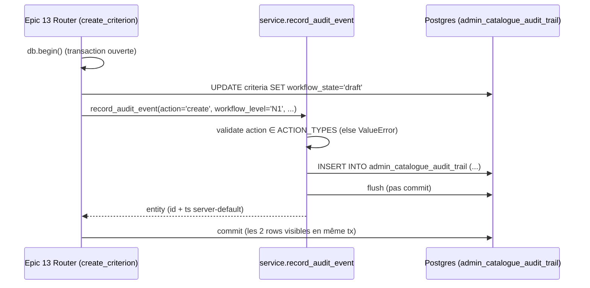
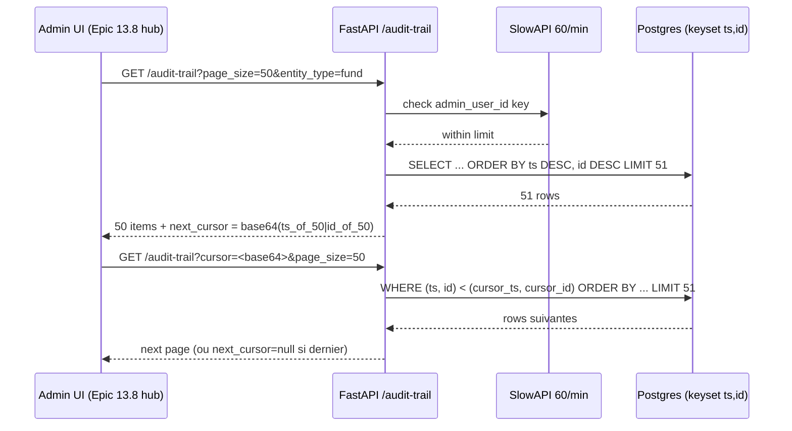

# CODEMAPS — Audit trail catalogue (D6 — immutable append-only)

Pattern **audit trail immuable** pour les mutations du catalogue admin
(Story 10.12 backend + Epic 13 mutations UI). FR64 « rétention 5 ans
minimum + UI consultation », NFR28 « audit trail immuable vérifiable »,
NFR12 « défense en profondeur » (pen test Phase 1).

Table source : `admin_catalogue_audit_trail` (migration 026).
Protection : triggers PL/pgSQL `trg_admin_catalogue_audit_trail_immutable`
(migration 028) qui rejettent UPDATE et DELETE avec ERRCODE **42501**
(`insufficient_privilege`), indépendamment de tout bug applicatif.

---

## 1. Pattern D6 audit immuable

- **Table append-only** : `admin_catalogue_audit_trail` (migration 026,
  colonnes `id/actor_user_id/entity_type/entity_id/action/workflow_level/
  workflow_state_before|after/changes_before|after/ts/correlation_id`).
- **Triggers PG** (migration 028) : `BEFORE UPDATE OR DELETE` →
  `RAISE EXCEPTION USING ERRCODE = '42501'`. `REVOKE UPDATE, DELETE FROM
  PUBLIC` en défense secondaire.
- **INSERT seul autorisé** : via le point d'entrée unique
  `service.record_audit_event` (anti-God NFR64).
- **CCC-14 atomicité** : la row audit est insérée dans la **même
  transaction** que la mutation métier qui la déclenche. Si le caller
  rollback, la row audit disparaît (pas d'orphelin).
- **Anti-récursion** : `admin_audit_listener.py:46` exclut
  `admin_catalogue_audit_trail` du `before_flush` listener pour éviter
  la boucle « auditer l'audit ».

---

## 2. Écriture (producer)

Un seul point d'entrée : `app/modules/admin_catalogue/service.py::record_audit_event`.

Registres `ACTION_TYPES`, `WORKFLOW_LEVELS`, `ENTITY_TYPES`
(`audit_constants.py`) — tuple frozen CCC-9 + validateur import-time
qui fail-fast si désynchronisation avec l'enum DB migration 026.

Valeurs d'`ACTION_TYPES` : `("create","update","delete","publish","retire")`.
Valeurs de `WORKFLOW_LEVELS` : `("N1","N2","N3")`.

Body `record_audit_event` :
1. Valide `action ∈ ACTION_TYPES` et `workflow_level ∈ WORKFLOW_LEVELS`
   → `ValueError` fail-fast sinon.
2. Construit `AdminCatalogueAuditTrail(...)` Python.
3. `db.add(entity)` + `await db.flush()` (pas `commit` — boundary caller).
4. Retourne l'entité (`id` + `ts` server-default disponibles post-flush).



---

## 3. Consultation (consumer)

Endpoint : `GET /api/admin/catalogue/audit-trail`
(`app/modules/admin_catalogue/router.py::list_audit_trail`).

Pagination **keyset** `(ts DESC, id DESC)` opaque base64url :
`base64url("{ts.isoformat()}|{uuid.hex}")`. Invariant stable sous
concurrent inserts (vs. offset qui shifte les pages) + O(log N) via
index composite `ix_catalogue_audit_entity_ts`.

Filtres : `actor_user_id`, `action` (validé ∈ `ACTION_TYPES` sinon 422),
`entity_type` (validé ∈ `ENTITY_TYPES`), `entity_id`, `ts_from`,
`ts_to`. `page_size` borné `[1, 200]` (default 50).

Rate limit : **60/minute** par `admin_user_id` (clé SlowAPI extraite
via `request.state.user.id`, pas IP — pattern FR-013 Story 9.1).
Défense admin malveillant : sans limite, un admin compromis pourrait
dumper 1000 req × 50 rows en 2 s.



Contrat OpenAPI : `AuditTrailPage { items: [...], next_cursor: str|null,
page_size: int }`.

Curl example :

```bash
curl -H "Authorization: Bearer $JWT" \
  "https://api.mefali.local/api/admin/catalogue/audit-trail?entity_type=fund&page_size=50"
```

---

## 4. Export CSV

Endpoint : `GET /api/admin/catalogue/audit-trail/export.csv`
(`app/modules/admin_catalogue/router.py::export_audit_trail_csv`).

Streaming `StreamingResponse` + `db.stream(stmt.execution_options(yield_per=500))` —
mémoire serveur bornée (batch 500) même pour 50k rows. Client reçoit
les premiers chunks en < 1 s (Transfer-Encoding: chunked).

Hard cap : `EXPORT_ROW_HARD_CAP = 50_000`. Au-delà :
- Ligne sentinelle `# TRUNCATED_AT_50000_ROWS — refine filters or paginate`.
- Header HTTP `X-Export-Truncated: true` (calculé via pré-query
  `LIMIT HARD_CAP + 1`).

Escape anti-**formula injection CVE-2014-3524** : `_csv_safe_cell` préfixe
`'` sur toute cellule commençant par `=`, `+`, `-`, `@`, `\t`, `\r`.
`csv.writer(..., quoting=csv.QUOTE_MINIMAL)` gère les virgules embarquées.
`changes_before/after` JSONB sérialisés via `json.dumps(ensure_ascii=False,
sort_keys=True)`.

Rate limit : **10/hour** par `admin_user_id` (plus strict que
consultation — export I/O-intensif ~10 Mo/req × 50k rows).

Meta-audit : `logger.info("audit_export_issued", extra={actor_user_id,
filters_hash, row_count, truncated})`. Traçabilité défense en profondeur
(un admin qui exporte est lui-même audité).

---

## 5. Pièges (checklist pré-merge)

1. **Pagination offset KO sur table qui grossit** — `OFFSET 50k LIMIT 50`
   = seq_scan O(N). Toujours keyset `(ts, id) < (cursor_ts, cursor_id)`.
2. **Rate limit bypass cursor** — la clé limiter est `admin_user_id`,
   pas l'URL. Forger N cursors en parallèle ne contourne pas la limite.
3. **CSV formula injection** — escape `'` préfixe sur `=/+/-/@/\\t/\\r`
   enforcé par `_csv_safe_cell`. Ne pas f-stringer dans le CSV.
4. **Timezone UTC obligatoire** — colonne `ts TIMESTAMPTZ`. Filtres
   `ts_from`/`ts_to` doivent recevoir ISO-8601 UTC (`...Z` ou `+00:00`).
5. **Nomenclature `actor_user_id` vs `admin_user_id`** — la colonne DB
   (migration 026) est `actor_user_id`. Ne pas confondre avec
   `admin_user_id` de `admin_access_audit` (pattern D7 différent).
6. **RLS listener anti-récursion** — `admin_audit_listener.py:46`
   `AUDIT_TABLE_NAMES = frozenset({"admin_access_audit",
   "admin_catalogue_audit_trail"})` **exclut** les mutations sur ces
   tables du logging (anti-boucle infinie). `record_audit_event`
   n'émet donc **PAS** d'event `admin_access_audit` — par design.
7. **Trigger 42501 en tests** — `psycopg.errors.InsufficientPrivilege`,
   SQLSTATE `42501`. En SQLAlchemy async, wrap avec
   `pytest.raises(DBAPIError) as exc` + `exc.value.orig.sqlstate == "42501"`.
   Import `from psycopg import errors` (pas `psycopg2`). Tests gated
   `@pytest.mark.postgres` + skipif `TEST_DATABASE_URL` sans préfixe
   `postgres` (SQLite skip les triggers PL/pgSQL).
8. **Base64 cursor corrompu** — `_decode_cursor` lève `ValueError` ;
   le handler convertit en **HTTP 400** (pas 422, qui est réservé à la
   validation Pydantic des query params).
9. **Registry drift Python↔DB** — ajouter une valeur `action="archive"`
   cote DB sans update `ACTION_TYPES` = filtre `?action=archive` retourne
   422 alors que les rows existent. `_validate_registry_matches_db_enum`
   fail-fast à l'import pour forcer la synchro.
10. **SlowAPI in-memory mono-worker MVP** — compteur par worker. Multi-
    worker uvicorn Phase Growth nécessitera Redis backend. Tracking
    `deferred-work.md` ligne `LOW-10.12-1` + marker CLEANUP dans
    `audit_constants.py`.
11. **Cursor base64 non-signé — pas d'impact sécurité** — le cursor est
    opaque mais **pas HMAC-signé**, donc trivialement forgeable par un
    admin déjà authentifié. **Analyse** : le filtre `(ts, id) < cursor`
    ne fait que **réduire** le jeu de résultats — un cursor forgé (par
    exemple vers un timestamp futur) donne au pire ce que renvoie une
    requête sans cursor. Il n'y a donc **aucune escalade d'autorisation**
    possible : l'admin authentifié a déjà accès à toutes les rows via
    pagination normale. HMAC-signé rejeté MVP (pattern industry aligné :
    GitHub/Stripe/Slack n'HMAC pas leurs cursors non plus).
12. **Export CSV : troncature signalée par sentinelle CSV (pas header HTTP)**
    — le contrat client pour la détection de troncature est la ligne
    sentinelle `# TRUNCATED_AT_50000_ROWS` en dernière ligne du CSV.
    Le header HTTP `X-Export-Truncated` a été retiré (HIGH-10.12-3) pour
    éviter double query + race window + OOM (pré-query UUIDs en RAM
    Python). Le streaming `yield_per=500` reste mémoire-borné à ~100 Ko.

---

## Extension

Ajouter un nouveau `entity_type` (ex. `admin_user`) :
1. Ajouter la valeur dans `ENTITY_TYPES` (`audit_constants.py`).
2. Aucune migration DB nécessaire — la colonne `entity_type` est
   `VARCHAR(64)` libre.
3. Ajouter un test dans `test_audit_trail_registry.py` si l'entity
   nécessite un traitement spécifique côté endpoint.

Ajouter un nouveau `action` (ex. `archive`) nécessite **2 modifications
synchronisées** :
1. Migration Alembic `ALTER TYPE catalogue_action_enum ADD VALUE 'archive'`.
2. Ajouter `"archive"` dans `ACTION_TYPES` (`audit_constants.py`).

Le test `test_action_types_matches_db_enum_source_of_truth` fail-fast si
l'une des deux étapes est oubliée.

---

## Rétention 5 ans (FR64)

MVP : rétention **illimitée** (politique documentée, pas de purge
active). Toute row insérée reste en base pour toujours.

Phase Growth (Epic 20 Story 20.2) : job scheduler réutilisant l'Outbox
(Story 10.10) avec handler `purge_audit_trail_older_than_5y`. Archivage
S3 Glacier via snapshot avant purge.

Aucune suppression manuelle n'est jamais autorisée : le trigger 42501
le rejette. Le job de purge devra utiliser un rôle PostgreSQL dédié
avec `GRANT DELETE` explicite + audit trail du job lui-même
(méta-meta-audit). Design différé Phase Growth.
