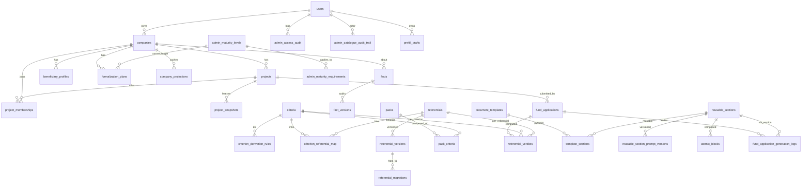

# Data Model Extension — Schéma Story 10.1 (Phase 0)

> **Version** : 2026-04-20 · Story 10.1 migrations Alembic `020` → `027`
> **Objet** : socle BDD pour l'Extension 5 clusters (Projets, Maturité, ESG 3 couches, Moteur livrables, Catalogue admin) + transverses RLS, source tracking, audit trail, micro-Outbox.

## Chaîne des migrations

```
019_manual_edits  ─  état legacy (specs 001-018)
        ↓
020_projects              Cluster A : companies, projects, memberships N:N (D1)
        ↓
021_maturity              Cluster A' : admin_maturity_levels, formalization_plans, admin_maturity_requirements
        ↓
022_esg_3layers           Cluster B : facts, criteria, referential_verdicts + mv_fund_matching_cube (D3 + D4)
        ↓
023_deliverables          Cluster C : document_templates, reusable_sections, prompt_versions (D5)
        ↓
024_rls_audit             Transverse : RLS 4 tables sensibles + admin_access_audit (D7)
        ↓
025_source_tracking       Transverse : source_url/accessed_at/version + table sources (CCC-6)
        ↓
026_catalogue_audit       Cluster D : admin_catalogue_audit_trail 5 ans (D6)
        ↓
027_outbox_prefill        Transverse : domain_events (D11) + prefill_drafts (Story 16.5)
```

## Diagramme ER (vue synthétique)



## Tables par cluster

### Cluster A — Projets (migration 020, D1)

| Table | Colonnes clés | Indexes / Contraintes |
|-------|--------------|-----------------------|
| `companies` | `id UUID PK`, `owner_user_id UUID FK users ON DELETE CASCADE`, `name`, `country`, `sector`, `metadata_json JSONB`, `created_at/updated_at TIMESTAMPTZ` | `ix_companies_owner_user_id` |
| `projects` | `id UUID PK`, `company_id UUID FK companies ON DELETE CASCADE`, `name`, `status ENUM(idea, planning, in_progress, operational, archived) DEFAULT 'idea'`, `version_number INT DEFAULT 1`, `description`, `metadata_json JSONB` | `ix_projects_company_status (company_id, status)` |
| `project_memberships` | `id UUID PK`, `project_id FK CASCADE`, `company_id FK CASCADE`, `role ENUM(porteur_principal, beneficiaire, partenaire, observateur)` | **UNIQUE `(project_id, company_id, role)`** — cumul rôles D1 |
| `project_role_permissions` | `id UUID PK`, `role`, `permission` | UNIQUE `(role, permission)` |
| `project_snapshots` | `id UUID PK`, `project_id FK CASCADE`, `snapshot_hash VARCHAR(64)`, `payload JSONB`, `created_at` | `ix_project_snapshots_project_id` — FR40 gel |
| `company_projections` | `id UUID PK`, `company_id FK CASCADE`, `projection_type`, `payload JSONB`, `refreshed_at` | UNIQUE `(company_id, projection_type)` |
| `beneficiary_profiles` | `id UUID PK`, `company_id FK CASCADE`, `project_id FK SET NULL`, `survey_data JSONB` | `ix_beneficiary_profiles_company_id` |
| **ALTER `fund_applications`** | +`project_id UUID FK projects ON DELETE RESTRICT NOT NULL` (backfill piloté Q2), +`version_number INT DEFAULT 1`, +`snapshot_id UUID FK project_snapshots SET NULL`, +`submitted_hash VARCHAR(64)` | `ix_fund_applications_project_id` |

**Backfill piloté (Q2 arbitrage 2026-04-20)** : pour chaque `user_id` distinct de `fund_applications`, la migration 020 crée une `companies` legacy + un `projects(status='archived')` avant `ALTER COLUMN project_id SET NOT NULL`. Rollback supporté dans `downgrade()`.

### Cluster A' — Maturité (migration 021, FR11-FR16)

| Table | Colonnes clés | Contraintes |
|-------|--------------|-------------|
| `admin_maturity_levels` | `id UUID PK`, `level INT CHECK 1..5`, `code`, `label_fr`, `workflow_state`, `is_published`, `source_url/accessed_at/version` | UNIQUE `level`, UNIQUE `code`, CHECK `level BETWEEN 1 AND 5` |
| `formalization_plans` | `id UUID PK`, `company_id FK CASCADE`, `current_level_id FK SET NULL`, `target_level_id FK SET NULL`, `actions_json JSONB`, `status` | `ix_formalization_plans_company_id` |
| `admin_maturity_requirements` | `id UUID PK`, `country`, `level_id FK RESTRICT`, `requirements_json JSONB`, source tracking | **UNIQUE `(country, level_id)`** — pas de string hardcodé |

### Cluster B — ESG 3 couches (migration 022, D3 + D4)

| Couche | Tables | Contraintes |
|--------|--------|-------------|
| **1. Faits** | `facts` (`company_id`, `criterion_id`, `fact_type`, `value_json`, `source_document_id`), `fact_versions` (`fact_id`, `version_number`, `value_json`) | `ix_facts_company_criterion`, UNIQUE `(fact_id, version_number)`, `ix_fact_versions_fact_version` |
| **2. Critères & DSL borné** | `criteria`, `criterion_derivation_rules` (`rule_type CHECK IN threshold/boolean_expression/aggregate/qualitative_check`, `rule_json JSONB` validé Pydantic **PAS d'eval**), `criterion_referential_map` | UNIQUE `criteria.code`, UNIQUE `(criterion_id, referential_id)` |
| **3. Verdicts** | `referentials`, `referential_versions` (`version`), `referential_migrations`, `packs`, `pack_criteria` (avec `fund_specific_overlay_rule JSONB` D2 strictest wins), `referential_verdicts` (+`invalidated_at TIMESTAMPTZ NULL` D3.2) | `ix_referential_verdicts_composite (fund_application_id, criterion_id, referential_id)` |
| **Cube 4D (PG-only)** | `mv_fund_matching_cube` MATERIALIZED VIEW (fund × sectors × countries × min/max amounts) | Indexes **GIN** sur `sectors_eligible` + `countries_eligible` (D4 SC-T3 ≤ 2 s p95) |

### Cluster C — Moteur livrables (migration 023, D5)

| Table | Colonnes clés | Contraintes spécifiques |
|-------|--------------|-------------------------|
| `document_templates` | `code`, `label_fr`, workflow + source tracking | UNIQUE `code` |
| `reusable_sections` | `code`, `human_review_required BOOL DEFAULT false` | CHECK `(code NOT IN ('sges_beta','esia','stakeholder_engagement_plan')) OR human_review_required = true` — **FR44 NO BYPASS** enforcement BDD |
| `template_sections` | PK composite `(template_id, section_id)`, `ordering`, `is_required` | Pyramide Template → Section |
| `reusable_section_prompt_versions` | **PK composite `(section_id, version)`**, `prompt_text`, `llm_model`, `temperature` | D5.2 versioning prompts obligatoire FR57 |
| `atomic_blocks` | `section_id FK`, `block_type`, `content JSONB`, `ordering` | — |
| `fund_application_generation_logs` | `fund_application_id`, `section_id`, `prompt_version`, `llm_model_version`, `prompt_anonymized`, `referentials_versions JSONB`, `snapshot_hash`, `user_id` | `ix_fund_application_generation_logs_app_generated` |

### Cluster D / Transverses (migrations 024–027)

| # | Table/Objet | Usage |
|---|------------|-------|
| **024** `admin_access_audit` | `admin_user_id FK users RESTRICT`, `admin_role ENUM(admin_mefali/admin_super)`, `table_accessed`, `operation ENUM`, `record_ids JSONB`, `request_id`, `query_excerpt`, `accessed_at`, `reason` | D7 — log admin escape (écrit par event listener Story 10.5) |
| **024** RLS policies | `tenant_isolation FOR ALL USING (owner/user_id = current_setting('app.current_user_id')::uuid OR current_setting('app.user_role') IN ('admin_mefali','admin_super'))` sur `companies`, `fund_applications`, `facts`, `documents` | Skip SQLite — PG only |
| **025** `sources` | Tracking centralisé (url, type, last_verified_at, verified_by_admin_id, http_status_last_check) | CCC-6 — CI nightly HTTP 200 (Story 10.11) |
| **025** CHECK constraints `ck_<table>_source_if_published` | Sur `funds`, `intermediaries`, `criteria`, `referentials`, `packs`, `document_templates`, `reusable_sections`, `admin_maturity_requirements`, `admin_maturity_levels` | NFR-SOURCE-TRACKING enforcement BDD |
| **026** `admin_catalogue_audit_trail` | `actor_user_id FK RESTRICT`, `entity_type`, `entity_id`, `action ENUM(create/update/delete/publish/retire)`, `workflow_level ENUM(N1/N2/N3)`, `workflow_state_before/after`, `changes_before/after JSONB`, `ts`, `correlation_id` | D6 FR64 — rétention 5 ans (purge Story 10.10) |
| **027** `domain_events` | `event_type`, `aggregate_type`, `aggregate_id`, `payload JSONB`, `status`, `retry_count CHECK <= 5`, `error_message`, `created_at`, `processed_at` | D11 micro-Outbox ; index partiel `WHERE processed_at IS NULL AND retry_count < 5` (worker SKIP LOCKED Story 10.10) |
| **027** `prefill_drafts` | `user_id FK CASCADE`, `payload JSONB`, `expires_at NOT NULL` | Story 16.5 fallback deep-link copilot |

## Tables legacy étendues (opérations ALTER)

| Table legacy | Migration | Changement |
|--------------|-----------|-----------|
| `fund_applications` (73d72f6ebd8f) | **020** | +`project_id` (NOT NULL + FK backfill), +`version_number`, +`snapshot_id`, +`submitted_hash` |
| `funds` (008_financing) | **025** | +`source_url`, +`source_accessed_at`, +`source_version` + CHECK `source_if_published` |
| `intermediaries` (008_financing) | **025** | +3 colonnes source + CHECK |
| `companies` (nouvelle 020) | **024** | RLS activé + policy tenant_isolation |
| `documents` (163318558259) | **024** | RLS activé + policy tenant_isolation |

## Arbitrages pré-dev (2026-04-20)

- **Q1** : migration 027 = `domain_events + prefill_drafts`. Cleanup feature flag `ENABLE_PROJECT_MODEL` déplacé vers Story 20.1 (retrait code applicatif uniquement, pas de nouvelle migration).
- **Q2** : `fund_applications.project_id = NOT NULL` avec FK + backfill piloté (un project "legacy" par user avant `ALTER SET NOT NULL`, rollback supporté).
- **Q3** : scope 023 moteur livrables inclus.
- **Q4** : load test `REFRESH MATERIALIZED VIEW CONCURRENTLY` sur `mv_fund_matching_cube` non-bloquant AC1 (reporté Story 20.4).

## Liens décisions architecturales (traçabilité CQ-8)

- D1 : [`architecture.md#décision-1`](../../_bmad-output/planning-artifacts/architecture.md#décision-1--modèle-company--project-nn-avec-cumul-de-rôles)
- D3 : [`architecture.md#décision-3`](../../_bmad-output/planning-artifacts/architecture.md#décision-3--architecture-3-couches-esg-dsl-borné--micro-outbox-invalidation)
- D4 : [`architecture.md#décision-4`](../../_bmad-output/planning-artifacts/architecture.md#décision-4--cube-4d-postgres--gin--cache-lru)
- D5 : [`architecture.md#décision-5`](../../_bmad-output/planning-artifacts/architecture.md#décision-5--moteur-livrables-template_sections-relationnelle--prompt-versioning)
- D6 : [`architecture.md#décision-6`](../../_bmad-output/planning-artifacts/architecture.md#décision-6--admin-n1n2n3-state-machine--échantillon-représentatif)
- D7 : [`architecture.md#décision-7`](../../_bmad-output/planning-artifacts/architecture.md#décision-7--multi-tenancy-rls-4-tables--log-admin-escape)
- D11 : [`architecture.md#décision-11`](../../_bmad-output/planning-artifacts/architecture.md#décision-11--transaction-boundaries--micro-outbox-mvp)
