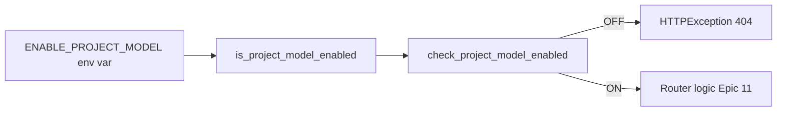

# Feature Flags — `ENABLE_PROJECT_MODEL` (Phase 1 Cluster A)

Story 10.9 — Epic 10 Fondations Phase 0.
Formalise le feature flag **unique** Phase 1 (`ENABLE_PROJECT_MODEL`) en
appliquant la Clarification 5 architecture : simple variable d'environnement,
wrapper de ~10 lignes, **aucune librairie externe** (flipper / unleash /
launchdarkly interdits). Cleanup trivial fin Phase 1 via migration 027
(Story 20.1).

## §1 Vue d'ensemble



La lecture est **dynamique** à chaque appel : `os.environ.get("ENABLE_PROJECT_MODEL")`
sans cache module-level. Contrainte requise par AC6 Story 10.9 (toggle live
DEV via `monkeypatch.setenv` dans les tests, sans redémarrer le serveur).

La dépendance FastAPI `check_project_model_enabled` est **source unique**
(consolidée dans `backend/app/core/feature_flags.py`, consommée par
`backend/app/modules/projects/router.py` et réutilisable par tout router
Phase 1 qui gaterait le modèle Project).

## §2 État actuel (Phase 0 → Phase 1)

| Flag                   | Default | Scope  | Introduit    | Retrait prévu | Tests (core + router) |
| ---------------------- | ------- | ------ | ------------ | ------------- | --------------------- |
| `ENABLE_PROJECT_MODEL` | `false` | global | Story 10.2   | Story 20.1 (migration 027) | 23 (20 core + 4 router) |

**Règle d'or CQ-10** : **1 seul flag Phase 1**. `ENABLE_MATURITY_MODEL` et
`ENABLE_ADMIN_CATALOGUE` ne sont **pas** introduits (parsimonie env var,
Q1 Story 10.1) — les routers correspondants renvoient directement 401 → 501
sans feature flag.

**Bascule opt-in par PME** : non prévue MVP. Flag global uniquement
(arbitrage AC3 Epic : la logique différentielle n'existe pas encore ; elle
sera ajoutée dans Epic 11 Projects si besoin).

## §3 Pattern « ajouter un nouveau feature flag »

> ⚠️ **Prérequis** : tout nouveau flag nécessite décision explicite Tech Lead
> (anti-pattern `profiling_node` dette P1 #3 — dérive par flags permanents).
> La règle d'or CQ-10 reste **1 flag unique pour Phase 1**.

Si la décision est validée, appliquer les 4 étapes :

### Étape 1 — Champ typé dans `Settings` Pydantic

Dans `backend/app/core/config.py`, section Feature Flags :

```python
enable_new_feature: bool = Field(
    default=False,
    description="Feature flag Phase X — description courte (NFR ref).",
)
```

Le champ est **informationnel** : self-documentation du schéma config et
coercion Pydantic au boot (rejette `"garbage"` → `ValidationError`).

### Étape 2 — Helper `is_<name>_enabled()` lisant `os.environ`

Dans `backend/app/core/feature_flags.py` :

```python
def is_new_feature_enabled() -> bool:
    """..."""
    raw = os.environ.get("NEW_FEATURE_ENV_VAR", "false")
    return raw.strip().lower() in _TRUTHY_VALUES
```

Le helper lit **dynamiquement** `os.environ` à chaque appel (pas de cache)
pour que `monkeypatch.setenv` fonctionne dans les tests + toggle live DEV.
Truthy set strict : `{"true", "1", "yes"}` case-insensitive.

### Étape 3 — Dépendance FastAPI (optionnelle, si gate REST)

Dans `backend/app/core/feature_flags.py` :

```python
def check_new_feature_enabled() -> None:
    if not is_new_feature_enabled():
        raise HTTPException(status_code=404, detail="Feature not available: NEW_FEATURE is disabled")
```

Consommé via `Depends(check_new_feature_enabled)` dans le router,
**après** `Depends(get_current_user)` pour préserver l'ordre `401 → 404 → 501`.

### Étape 4 — Marker cleanup + documentation

1. Ajouter un marker déterministe en tête de `feature_flags.py` :
   ```python
   # CLEANUP: Story X.Y — retirer NEW_FEATURE post-bascule Phase N (migration NNN).
   ```
2. Référencer le flag dans ce fichier §2 (tableau État actuel).
3. Planifier la story de cleanup dans l'epic de release (pattern Story 20.1
   + migration 027 pour `ENABLE_PROJECT_MODEL`).

## §4 Règle d'or CQ-10 — anti-pattern flag permanent

Tout flag dépassant **3 mois sans retrait planifié** déclenche une alerte
équipe (post-mortem : a-t-on oublié le cleanup ? la feature est-elle
vraiment Phase-scoped ?).

Signes d'alerte d'un flag qui dérive en permanent :
- Aucune migration de cleanup planifiée dans un epic de release.
- Plus de 2 call sites dispersés dans des modules non-liés (le flag sert
  d'interrupteur ad-hoc au lieu de gater une phase).
- Usage dans les tests comme hack de skip conditionnel.

**Remédiation** : créer une story de suppression dans l'epic de cleanup
courant ou escalader en dette technique (`docs/technical-debt-backlog.md`).

## §5 Pièges connus

1. **Divergence truthy set Pydantic / helper** — Pydantic v2 coerce
   `on/off/y/n/...` (tolérance native bool au boot) ; le helper runtime reste
   **strict** sur `{true, 1, yes}`. Sans effet fonctionnel (Q1 Story 10.9 :
   aucun caller ne lit `settings.enable_project_model`, le runtime passe
   toujours par le helper) — mais bien documenter pour éviter la confusion
   en lecture de logs boot.

2. **Cache Settings vs. lecture dynamique env** — `settings = Settings()`
   est instancié **une seule fois** au boot. Si un helper lisait
   `settings.enable_project_model`, les tests `monkeypatch.setenv` ne
   déclencheraient pas la bascule → régression. **Règle** : le helper lit
   toujours `os.environ` directement, le champ Settings est informationnel.

3. **Ne jamais `try/except Exception` autour de `os.environ.get`** — la
   lecture est totale (retourne la valeur par défaut si absent). Un
   `except Exception` masquerait des bugs réels (C1 leçon 9.7).

4. **Ne pas masquer l'env var absent avec `None`** — utiliser
   `os.environ.get("FLAG", "false")` avec défaut explicite `"false"`, pas
   `None`. Défense par défaut = feature OFF (AC1 Epic Story 10.1).

5. **Ne pas installer de librairie externe** — Clarification 5 interdit
   `flipper-client`, `unleash-client`, `launchdarkly-server-sdk`,
   `configcat-client`, etc. Test `test_no_external_feature_flag_library_installed`
   scanne `importlib.metadata.distributions()` à chaque run CI.

6. **Ne pas retirer le marker cleanup prématurément** — le marker
   `# CLEANUP: Story 20.1 — ...` reste présent tant que la migration 027
   n'est pas livrée. Test `test_feature_flags_has_cleanup_marker` enforce.

---

**Références**
- [Source: `_bmad-output/planning-artifacts/epics/epic-10.md#Story 10.9`] — AC1-AC6.
- [Source: `_bmad-output/planning-artifacts/architecture.md#Clarification 5`] — pas de lib externe.
- [Source: `backend/app/core/feature_flags.py`] — implémentation source unique.
- [Source: `backend/app/modules/projects/router.py`] — consommateur Phase 0.
