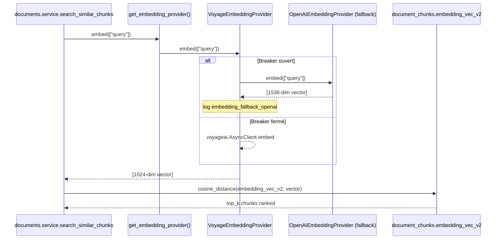

# Rag — Abstraction EmbeddingProvider + switch OpenAI ↔ Voyage

Story 10.13 — migration `text-embedding-3-small` (1536 dim) → `voyage-3` (1024 dim)
avec pattern ports-and-adapters réutilisable. Ce codemap sert de référence
développeur (cf. `docs/CODEMAPS/index.md`) pour comprendre l'architecture
RAG actuelle et les pièges de la coexistence v1/v2.

## 1. Contexte & Architecture

Le RAG Mefali produit des embeddings vectoriels pour deux usages :

- **Document chunks** (`document_chunks.embedding_vec_v2`) : recherche
  sémantique dans les documents uploadés par les PME. Consommé par
  `app.modules.documents.service.search_similar_chunks` et
  `app.modules.esg.service:~L312` (scan par critère ESG).
- **Funds** (`funds.embedding`) : hors scope 10.13 — migration
  différée (cf. `deferred-work.md` §HIGH-10.13-2).

L'abstraction `app.core.embeddings.EmbeddingProvider` concrétise
architecture §D10 LLM Provider Layer *étendu aux embeddings* (la D10
couvrait à l'origine seulement les LLM chat). Elle isole les consommateurs
des détails vendor (SDK `voyageai`, `langchain_openai.OpenAIEmbeddings`)
et permet le switch runtime via `EMBEDDING_PROVIDER=voyage|openai`.

## 2. Abstraction EmbeddingProvider

Trois modules composent la couche :

- `app/core/embeddings/base.py` — ABC `EmbeddingProvider` + exceptions
  canoniques (`EmbeddingError`, `EmbeddingRateLimitError`,
  `EmbeddingQuotaError`, `EmbeddingDimensionMismatchError`). **Jamais** de
  `voyageai.error.*` ou `openai.RateLimitError` qui remonte chez les
  consommateurs — toujours normalisé en canonique (leçon 9.7 C1).
- `app/core/embeddings/openai.py` — `OpenAIEmbeddingProvider` legacy
  wrapping `langchain_openai.OpenAIEmbeddings` (1536 dim fixe).
- `app/core/embeddings/voyage.py` — `VoyageEmbeddingProvider` SDK officiel
  `voyageai>=0.2.3` (1024 dim). Gère nativement `Retry-After` 429 + token
  bucket (Q4 tranchée).
- `app/core/embeddings/__init__.py` — façade étroite (6 symboles) +
  factory `get_embedding_provider()` `@lru_cache(maxsize=1)` singleton.

### Switch provider

Un seul env var + redeploy :

```bash
# Provider primaire MVP (par défaut)
EMBEDDING_PROVIDER=voyage
VOYAGE_API_KEY=<...>
VOYAGE_MODEL=voyage-3       # voyage-3 | voyage-3-large | voyage-code-3 | voyage-3-lite

# Rollback temporaire (legacy)
EMBEDDING_PROVIDER=openai
# OPENAI_API_KEY réutilisé via alias OPENROUTER_API_KEY
```

Le whitelist Pydantic `Settings.voyage_model` rejette toute valeur hors
whitelist (Q1 défense en profondeur fail-fast boot).

## 3. Migration dim 1536 → 1024 (parallel v1/v2)



**Stratégie parallel (Q2 tranchée)** : la migration Alembic 031 ajoute
additivement `embedding_vec_v2 vector(1024)` + index HNSW v2 sans toucher
la colonne v1 `embedding vector(1536)`. Downgrade trivial (`drop column
embedding_vec_v2`). Le drop de la colonne v1 est déféré à la migration
032 (Story 20.X post-validation qualité prod ≥ 3 mois).

### Migration 032 (future — hors scope 10.13)

```sql
-- Phase 1 post-validation (Story 20.X cleanup)
DROP INDEX ix_document_chunks_embedding_hnsw;
ALTER TABLE document_chunks DROP COLUMN embedding;
ALTER TABLE document_chunks RENAME COLUMN embedding_vec_v2 TO embedding;
-- Recrée l'index sur la colonne renommée.
```

## 4. Batch re-embedding corpus

Le script `backend/scripts/rembed_voyage_corpus.py` remplit
`embedding_vec_v2` pour les chunks existants (migration data) :

```bash
# Dry-run (montre combien de chunks à traiter)
python backend/scripts/rembed_voyage_corpus.py --dry-run --limit 10

# Production MVP (batch 100 — plafond rate limit Voyage tier free)
python backend/scripts/rembed_voyage_corpus.py --batch-size 100

# Reprise après interruption
python backend/scripts/rembed_voyage_corpus.py --resume-from <last_chunk_uuid>
```

Idempotent : `WHERE embedding_vec_v2 IS NULL` reprend au point d'arrêt.
Exit codes : 0 succès, 1 erreur non-récupérable, 2 interruption user.
Log JSON structuré `embedding_batch_progress` (pattern Outbox 10.10, pas
d'émission `domain_events` — Q3 tranchée MVP).

**Piège** : `pg_dump -t document_chunks` recommandé AVANT toute
réexécution de `alembic downgrade 031` si la colonne v2 contient des
données — celles-ci sont définitivement perdues au drop.

## 5. Pièges

1. **Dim mismatch runtime** — tout caller qui lit `DocumentChunk.embedding`
   v1 reçoit 1536-dim ; qui lit `embedding_vec_v2` reçoit 1024-dim. Le
   scan `rg -n "DocumentChunk.embedding"` backend/app/ doit retourner 0
   hit hors module `app/core/embeddings/` et tests migration.

2. **HNSW coexistence RAM** — 2 index HNSW (1536 + 1024 dim) coexistent
   pendant la transition (~240 Mo pour 10k chunks). Acceptable PG 16
   default `shared_buffers=128 MB` mais à surveiller si le corpus > 100k.

3. **Rate limits Voyage tier** — le tier free = 1M tokens/min, paid >= 10M.
   SDK `voyageai>=0.2.3` gère `Retry-After` automatiquement. Log WARNING
   si 429 > 3× en 5 min → alerter dev (tier saturé).

4. **Circuit breaker partagé** — réutilisation `_breaker` (common.py)
   avec clé `("embedding", provider_id)`. Dashboard NFR74 doit filtrer
   par `tool_name LIKE 'embedding%'` pour distinguer embeddings vs tool
   chat LLM.

5. **Fund embeddings legacy** — `modules/financing/service.py` et `seed.py`
   continuent à utiliser `OpenAIEmbeddings(` direct (hors scope 10.13).
   Tracé `deferred-work.md` §HIGH-10.13-2 pour migration Phase 1.

## Références

- Story : `_bmad-output/implementation-artifacts/10-13-migration-embeddings-voyage-api.md`
- Architecture : `_bmad-output/planning-artifacts/architecture.md` §D10
- Bench report : `docs/bench-llm-providers-phase0.md`
