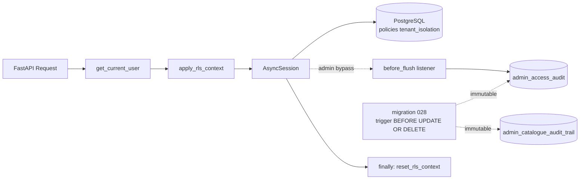

# Security — RLS PostgreSQL + audit tamper-proof (Story 10.5)

**Owner** : Angenor (Project Lead)
**Dernière mise à jour** : 2026-04-20
**Stories livrées** : 10.1 (policies SQL) + 10.5 (couche applicative + tamper-proof)
**Références architecture** : `architecture.md` §D7 (RLS + escape log), §CCC-5 (multi-tenancy)

---

## 1. Vue d'ensemble



**Défense en profondeur** (NFR12) : deux couches complémentaires.

1. **RLS PostgreSQL** (migration 024) — filtrage automatique niveau base :
   `ENABLE ROW LEVEL SECURITY` + policies `tenant_isolation` sur 4 tables.
2. **Filtre WHERE applicatif** (existant, préservé) — performance via
   index + intention explicite dans les requêtes SQLAlchemy.

La Story 10.5 active la couche **applicative** (injection du contexte
RLS à chaque session authentifiée) et rend les tables d'audit
**immutables au niveau SQL** (migration 028).

---

## 2. Les 4 tables sensibles

| Table | Colonne de rattachement tenant | Policy `USING` (extrait) |
|---|---|---|
| `companies` | `owner_user_id` | `owner_user_id = current_setting('app.current_user_id')::uuid OR current_setting('app.user_role') IN ('admin_mefali','admin_super')` |
| `fund_applications` | `user_id` | `user_id = current_setting('app.current_user_id')::uuid OR admin bypass` |
| `facts` | `company_id` (jointure via `companies`) | `company_id IN (SELECT id FROM companies WHERE owner_user_id = ...) OR admin bypass` |
| `documents` | `user_id` | `user_id = current_setting('app.current_user_id')::uuid OR admin bypass` |

`FORCE ROW LEVEL SECURITY` est activé : le propriétaire de la table
(superuser de migration) est lui aussi filtré — seule l'exception
admin via `app.user_role` bypasse.

---

## 3. Contrat `apply_rls_context`

```python
async def apply_rls_context(db: AsyncSession, user: User | None) -> None
```

| Entrée | Effet sur la session |
|---|---|
| `user=None` | `app.current_user_id = ''` ET `app.user_role = ''` (anonyme — RLS filtre tout) |
| `user` normal | `app.current_user_id = str(user.id)` ET `app.user_role = 'user'` |
| `user` whitelist `ADMIN_MEFALI_EMAILS` | `app.user_role = 'admin_mefali'` (bypass) |
| `user` whitelist `ADMIN_SUPER_EMAILS` | `app.user_role = 'admin_super'` (bypass, précédence) |

**Garanties** :

- **Bind params** (`text("SELECT set_config(:k, :v, false)")`) — pas de
  f-string, défense en profondeur contre toute injection future.
- **Pool-safe** : `set_config(..., is_local=false)` a un scope session
  PostgreSQL qui persiste après commit. Le `finally` de `get_db`
  appelle `reset_rls_context(db)` pour éviter qu'une connexion rendue
  au pool asyncpg puis réutilisée n'hérite du contexte précédent.
- **No-op sur SQLite** (tests) — la fonction détecte `dialect.name !=
  "postgresql"` et retourne immédiatement.
- **Fail-closed** : `ADMIN_SUPER_EMAILS` / `ADMIN_MEFALI_EMAILS` vides
  → aucun admin, tout user a rôle `user`.

**Source de vérité unique** pour la whitelist : `resolve_user_role`
ré-importe `_is_admin_mefali_email` depuis
`backend/app/modules/admin_catalogue/dependencies.py` (Story 10.4) —
pas de duplication de liste d'emails.

**Exemple d'appel** : `get_current_user` l'invoque **automatiquement**
après vérification JWT (cf. `backend/app/api/deps.py`) — aucun endpoint
n'a besoin de l'appeler manuellement.

---

## 4. Contrat du listener admin (`admin_audit_listener`)

Enregistré au startup via `register_admin_access_listener(engine)`
dans `backend/app/main.py::lifespan`. Attaché sur
`AsyncSession.sync_session_class` en event `before_flush`.

**Quand il écrit** (1 ligne `admin_access_audit` par objet muté) :

- Session en contexte admin (`app.user_role IN ('admin_mefali', 'admin_super')`).
- Objet ORM dans `session.new | session.dirty | session.deleted`.
- `__tablename__` ∈ {`companies`, `fund_applications`, `facts`, `documents`}.

**Quand il N'écrit PAS** (safeguards) :

- Contexte anonyme / user normal → skip (pas de faux positifs).
- Mutations sur `admin_access_audit` ou `admin_catalogue_audit_trail`
  elles-mêmes → skip (anti-récursion via filtre table + flag
  `session.info[_SESSION_AUDIT_FLAG]`).
- Session bindée SQLite → skip.
- `app.current_user_id` vide alors que rôle admin → skip (état
  incohérent, évite FK violation sur `admin_user_id`).

**Limitation SELECT** (documentée, acceptée MVP) :

> `before_flush` ne se déclenche que sur **mutations** (INSERT/UPDATE/
> DELETE). Les **SELECT admin non suivis de mutation** ne sont pas
> capturés. Extension via intercepteur `Query.execute` déférée à Story
> 18.x si le besoin concret émerge (audit interne/externe).
>
> Mitigation MVP : un admin qui veut exfiltrer des données devra
> nécessairement faire un INSERT pour les persister → donc capturé.

**Atomicité** : l'INSERT audit se fait dans la **même transaction**
que la mutation métier. Si la mutation rollback, l'audit rollback
aussi — pas de log orphelin sans modification effective.

---

## 5. Protection tamper-proof (migration 028)

Deux couches indépendantes, résolution du finding HIGH-10.1-11 :

**5.1 REVOKE privilège mutatif**

```sql
REVOKE UPDATE, DELETE ON admin_access_audit FROM PUBLIC;
REVOKE UPDATE, DELETE ON admin_catalogue_audit_trail FROM PUBLIC;
```

Même un admin_super authentifié applicativement ne peut pas éditer
ou supprimer une ligne d'audit.

**5.2 Trigger `BEFORE UPDATE OR DELETE`**

```sql
CREATE FUNCTION audit_table_is_immutable()
RETURNS trigger LANGUAGE plpgsql AS $$
BEGIN
  RAISE EXCEPTION 'audit table is immutable (D6/D7)'
    USING ERRCODE = '42501';
END;
$$;

CREATE TRIGGER trg_admin_access_audit_immutable
  BEFORE UPDATE OR DELETE ON admin_access_audit
  FOR EACH ROW EXECUTE FUNCTION audit_table_is_immutable();
```

Défense en profondeur : même si un `GRANT` future accidentel ré-ouvre
les droits, le trigger bloque.

**Test local via `psql`** :

```bash
# 1. Insérer une ligne test (doit réussir — INSERT reste permis)
psql -c "INSERT INTO admin_access_audit (id, admin_user_id, admin_role, \
         table_accessed, operation) VALUES (gen_random_uuid(), \
         'some-uuid', 'admin_super', 'companies', 'UPDATE')"

# 2. Tenter UPDATE (doit échouer avec 'audit table is immutable')
psql -c "UPDATE admin_access_audit SET reason='tampered'"

# 3. Tenter DELETE (doit échouer)
psql -c "DELETE FROM admin_access_audit"
```

**Rollback** : `alembic downgrade 027_outbox_prefill` exécute `DROP
TRIGGER` + `DROP FUNCTION` + `GRANT UPDATE, DELETE ... TO PUBLIC`.
Cohérence NFR32 (drill rollback trimestriel).

---

## 6. Limitations connues + roadmap

| # | Limitation | Impact | Résolution prévue |
|---|---|---|---|
| 1 | **SELECT non auditables** (listener `before_flush` seulement) | Un admin peut lire sans trace si aucune mutation ne suit | Story 18.x — intercepteur `Query.execute` si besoin concret émerge (audit interne/externe) |
| 2 | **Whitelist email transitoire** (`ADMIN_MEFALI_EMAILS` + `ADMIN_SUPER_EMAILS`) | Gestion via env var manuelle, pas de UI ops | Epic 18 — colonne `User.role` + MFA step-up (FR61) |
| 3 | **Rôle `auditor` effectif non livré** | Audits cross-tenant read-only requièrent un admin temporaire (mauvaise pratique) | Epic 18 — extension `resolve_user_role` + rôle lecture seule |
| 4 | **⚠️ RLS n'est PAS une protection SQL injection** | Un query construit par concaténation reste vulnérable indépendamment de RLS | **Maintenir impérativement** `sqlalchemy.text(...)` + bind params + validation Pydantic sur toutes les entrées utilisateur. RLS est une ligne de défense **supplémentaire**, pas un remplacement. |
| 5 | **SUPERUSER PG bypasse REVOKE + trigger** (attribut `rolsuper` + `DISABLE TRIGGER`) | Les protections Story 10.5 reposent sur l'hypothèse que les accès opérationnels PostgreSQL sont ségrégués. Un compte PG avec attribut `SUPERUSER` ou propriétaire de table peut désactiver les triggers via `ALTER TABLE admin_access_audit DISABLE TRIGGER ...` et bypasser le `REVOKE FROM PUBLIC` | **Epic 20 Ops** — rôle séparé `app_user` NOINHERIT sans SUPERUSER pour tous les services applicatifs, audit des accès SUPERUSER au niveau infra (pg_log + Cloud SQL audit). Documenter dans runbook `incident_response`. |
| 6 | **`session.execute(text("UPDATE/DELETE ..."))` non capturé par le listener** | Le listener `before_flush` ne se déclenche que sur les mutations ORM (`session.add`, modification d'attribut sur objet mappé, `session.delete`). Les requêtes SQL brutes via `session.execute(text(...))` bypasseront le log audit même en contexte admin. Limitation SQLAlchemy connue. | **Convention projet** : toujours utiliser ORM mutations pour les 4 tables RLS, pas SQL direct. Les stores/services applicatifs doivent privilégier l'ORM ; en cas de nécessité de SQL brut, compléter manuellement par un `INSERT admin_access_audit` explicite. **Linter rule** candidate future story hardening (Epic 20). Risque pratique faible : `backend/app/modules/` utilise massivement l'ORM, les rares `text(...)` concernent migrations/tests. |

> **Note §5.2 complémentaire** : le trigger `audit_table_is_immutable`
> se déclenche pour **tout** utilisateur PG, y compris `SUPERUSER`,
> **mais** un `SUPERUSER` peut le désactiver via `ALTER TABLE
> admin_access_audit DISABLE TRIGGER`. La ségrégation des credentials
> prod (accès SUPERUSER réservé ops/DBA, services applicatifs via rôle
> `app_user` sans SUPERUSER) est **hors scope 10.5** — prérequis
> opérationnel documenté en Limitation 5 ci-dessus.

**⚠️ Rappel sécurité** : RLS protège contre les **bugs applicatifs
(oubli de filtre WHERE) et les admin malveillants** (tamper-proof).
Elle ne protège **pas** contre :

- **SQL injection** (toujours prévenir via bind params)
- **Fuite via LLM prompt** (FR-specific mitigation hors scope 10.5)
- **Extraction via endpoints publics** (aucun contexte RLS n'est posé
  sur les endpoints sans `Depends(get_current_user)` — fail-safe car
  anonyme filtre tout)

---

## 7. Fichiers clés

| Fichier | Responsabilité |
|---|---|
| `backend/app/core/rls.py` | Helper `apply_rls_context` / `reset_rls_context` / `resolve_user_role` + `ADMIN_ROLES` |
| `backend/app/core/admin_audit_listener.py` | Listener `before_flush` + `register_admin_access_listener` |
| `backend/app/core/database.py` | `get_db` avec `finally: reset_rls_context` |
| `backend/app/api/deps.py` | `get_current_user` appelle `apply_rls_context` post-auth |
| `backend/app/main.py` | `register_admin_access_listener` au startup lifespan |
| `backend/alembic/versions/024_*.py` | Policies RLS + création table `admin_access_audit` (Story 10.1) |
| `backend/alembic/versions/028_*.py` | REVOKE + triggers tamper-proof (Story 10.5) |
| `backend/tests/test_security/test_rls_enforcement.py` | Matrice 4 rôles × 4 tables |
| `backend/tests/test_security/test_rls_pool_reuse.py` | Pool asyncpg pool-safe |
| `backend/tests/test_security/test_audit_tamper_proof.py` | INSERT ok / UPDATE / DELETE → raise |
| `backend/tests/test_security/test_resolve_user_role.py` | Unit tests (pure function) |

---

## 8. Incidents type — première démarche

**Suspicion de fuite cross-tenant (user A voit données user B)** :

1. Reproduire localement : appliquer le contexte user A via
   `apply_rls_context(db, user_A)` et exécuter la requête suspecte.
2. Vérifier RLS actif : `SELECT relrowsecurity FROM pg_class WHERE
   relname = '<table>'` (doit retourner `t`).
3. Vérifier policy : `SELECT * FROM pg_policies WHERE tablename =
   '<table>'`.
4. Vérifier que l'endpoint passe bien par `Depends(get_current_user)`
   et non par un router public.
5. Si tout est correct et le bug reproduit → escalade architecture
   (possibilité d'une jointure avec une table non-RLS qui leak).

**Alerte : ligne `admin_access_audit` modifiée ou supprimée** :

1. **ALARME CRITIQUE** : le trigger a dû échouer. Vérifier
   immédiatement l'état du trigger : `SELECT tgname, tgenabled FROM
   pg_trigger WHERE tgname = 'trg_admin_access_audit_immutable'`.
2. Si absent ou disabled → rollback de sécurité immédiat via
   ré-application migration 028.
3. Investigation forensique : qui a `DROP`é le trigger ? Activité suspecte.
