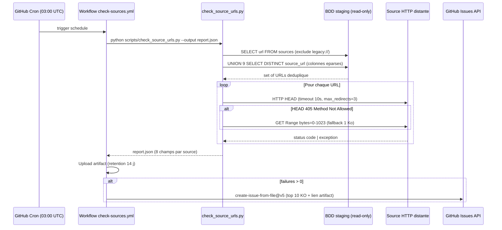

# CODEMAP — Source tracking nightly (Story 10.11)

NFR-SOURCE-TRACKING (CCC-6) + FR63 : toute publication N1/N2 d'un
élément de catalogue (fund, intermédiaire, critère, référentiel, pack,
section, template, niveau/exigence maturité) exige un triplet
`source_url + source_accessed_at + source_version` non-null. Une CI
nightly vérifie l'état HTTP de chaque URL et ouvre une issue GitHub si
au moins une source est KO.

## 1. Pattern NFR-SOURCE-TRACKING

Origine : migration `025_add_source_tracking_constraints.py` (Story
10.1). Trois colonnes ajoutées sur **9 tables** catalogue :

| Colonne | Type | Semantique |
|---|---|---|
| `source_url` | `TEXT NULL` | URL canonique publique (ou sentinelle `legacy://...`). |
| `source_accessed_at` | `TIMESTAMPTZ NULL` | Horodatage de la dernière consultation par l'admin. |
| `source_version` | `VARCHAR(64) NULL` | Étiquette libre (`v2.3`, `2026-01-rev`, etc.). |

CHECK constraint `ck_<table>_source_if_published` appliquée par table :

```sql
NOT (is_published / is_active)
 OR (source_url IS NOT NULL
     AND source_accessed_at IS NOT NULL
     AND source_version IS NOT NULL)
```

Signification : un enregistrement DRAFT accepte des colonnes nulles ;
dès la publication, le triplet est obligatoire. Le backfill Story 10.1
a inséré la sentinelle `legacy://non-sourced` pour ne pas casser les
données existantes — ces lignes sont **exclues** du scan nightly
(§2).

Table centralisée `sources` (migration 025) stocke les références à
grain fin — pour le moment, l'usage est la **table de vérité** du
nightly. Sa contrainte `UniqueConstraint(url)` permet le seed
idempotent.

## 2. Vérification nightly

Le script `backend/scripts/check_source_urls.py` (CLI async httpx)
effectue le scan toutes les 24 h. Il est invoqué par le workflow
`.github/workflows/check-sources.yml` (`cron: '0 3 * * *'`, **UTC**).
Le choix 03:00 UTC correspond au creux de trafic UEMOA + Paris
(GitHub Actions n'accepte pas de fuseau horaire explicite dans cron —
toute indication `TZ=...` est ignorée silencieusement).



Choix techniques verrouillés pré-dev (Q1-Q4, Story 10.11) :

1. **Q1 httpx** : déjà dans `backend/requirements.txt` (`>=0.28.0`).
   `respx` est le compagnon officiel mock HTTP — évite une 2ᵉ stack
   async parallèle (aiohttp rejeté).
2. **Q2 HEAD + fallback GET Range** : HEAD télécharge uniquement les
   en-têtes. Fallback `GET` avec `Range: bytes=0-1023` si HEAD renvoie
   `405 Method Not Allowed` (WAF mal configuré IRMA, Bonsucro
   observés). Évite de télécharger des PDF ≥ 30 Mo sur 22+ sources.
3. **Q3 timeout CLI configurable** : `--timeout <seconds>` défaut 10,
   bornes `[5, 60]`. Dev peut tester la catégorisation timeout avec
   `--timeout 5`. Borne haute évite un worker bloqué 1 h.
4. **Q4 GitHub issue seule** : pas de Mailgun MVP (zero nouvelle dep,
   secrets KMS/DKIM/SPF à provisionner). Admin Mefali = dev team —
   issue GitHub = historique + mention `Fixes #N`.

Catégorisation HTTP (7 statuts finaux, enum `status`) :

| Statut | Cause | `suggested_action` |
|---|---|---|
| `ok` | 2xx (HEAD ou GET fallback) | `no_action` |
| `not_found` | 404 | `admin_update_url` |
| `timeout` | `httpx.TimeoutException` | `admin_check_mirror` |
| `redirect_excess` | `httpx.TooManyRedirects` (> 3) | `admin_update_url` |
| `ssl_error` | `httpx.ConnectError` contenant `"SSL"` | `admin_verify_ssl` |
| `server_error` | 5xx | `admin_check_mirror` |
| `other_error` | tout le reste (ConnectError non-SSL, RequestError) | `admin_check_mirror` |

Aucun `except Exception:` : 5 classes httpx catchées explicitement
(`TimeoutException`, `TooManyRedirects`, `ConnectError`,
`HTTPStatusError`, `RequestError`) — règle C1 9.7.

## 3. Rapport JSON

Schéma validé par `jsonschema.validate(report, REPORT_SCHEMA)`
(voir `backend/app/core/sources/types.py`). Racine :

```json
{
  "generated_at": "2026-04-22T03:00:15Z",
  "total_sources_checked": 31,
  "counts": {
    "ok": 28, "not_found": 1, "timeout": 1,
    "redirect_excess": 1, "ssl_error": 0,
    "server_error": 0, "other_error": 0
  },
  "sources": [
    {
      "source_url": "https://www.greenclimate.fund/projects",
      "table": "sources",
      "status": "ok",
      "http_code": 200,
      "detected_at": "2026-04-22T03:00:12Z",
      "last_valid_at": "2026-04-22T03:00:12Z",
      "suggested_action": "no_action",
      "duration_ms": 432
    }
  ]
}
```

Les 8 clés obligatoires par source (AC4) sont enforcées par le JSON
Schema — un rapport ne validant pas fait tomber les tests
(`test_report_schema_validates_dry_run`).

Champs nullables :

- `http_code` : `null` si l'exception est levée **avant** une réponse
  HTTP (timeout, SSL, redirect excess).
- `last_valid_at` : `null` si `status != "ok"`. Sinon = `detected_at`
  (premier tick de succès). Un futur enrichissement pourra persister
  l'historique dans `sources.http_status_last_check`.
- `suggested_action` : `null` seulement pour un statut non-mappé
  (défensif — toutes les valeurs 7 statuts sont mappées dans
  `_STATUS_TO_ACTION`).

## 4. Alerting

Si `counts.ok < total_sources_checked` (≥ 1 source KO), le workflow
ouvre une issue via `peter-evans/create-issue-from-file@v5` :

- Titre : `[source-tracking] N sources KO detectees <timestamp>`
- Labels : `source-tracking`, `admin-action-required`
- Body (≤ 65 k chars : top 10 seulement + lien artifact) :
  - Résumé counts.
  - Lien vers l'artifact `source-url-report` (rétention 14 j).
  - Tableau Markdown `| URL | Table | Status | HTTP | Action |` tronqué
    à 10 lignes par `scripts/format_issue_body.py`.

Aucun alerting Mailgun MVP (Q4) — l'évolution vers un vrai admin
non-dev (Epic 20) pourra empiler Mailgun **sans casser l'existant** :
l'issue GitHub restera le source of truth.

## 5. Extension

### Ajouter une nouvelle source au seed Annexe F

1. Éditer `backend/app/core/sources/annexe_f_seed.py` :

   ```python
   ANNEXE_F_SOURCES: Final[tuple[SourceSeed, ...]] = (
       ...
       SourceSeed(
           url="https://new.source.example/standard",
           source_type="regulation",
           description="Nouveau standard sectoriel 2026",
       ),
   )
   ```

2. La fonction `_validate_unique_urls` s'exécute à l'import et lève
   `ValueError` si une URL est dupliquée (fail-fast, pattern CCC-9).
3. Créer une **nouvelle migration données** (ex `031_add_<name>_source.py`)
   qui importe `ANNEXE_F_SOURCES` et réexécute l'INSERT idempotent —
   `030_seed_sources_annexe_f.py` reste figée (déjà appliquée en prod).
   Alternative : ajouter l'URL manuellement via l'UI admin N3 Epic 13.

### Ajouter une URL via l'interface admin N3

Epic 13 Story 13.8 exposera une UI `CRUD sources` pour les URLs
non-catalogue (sources ad-hoc par `fund/intermediary/referential`).
Flux : formulaire → INSERT dans `sources` → FK `verified_by_admin_id`
→ le nightly reprend automatiquement la nouvelle URL au run suivant.

### Sources nécessitant une authentification

Certaines sources (Sedex Members area, EcoVadis suppliers portal)
exigent un login. MVP 10.11 ne scanne pas ces sources — elles
retourneront `401 Unauthorized` → catégorisé `other_error`,
`suggested_action = admin_check_mirror`. Documenter manuellement
`sources.last_verified_at` via SQL + UI admin.

### Prérequis infra ops

- Secret GitHub `STAGING_DATABASE_URL_READ_ONLY` à provisionner :
  Settings → Secrets and variables → Actions → Repository secrets.
- User PostgreSQL `mefali_reader` avec `GRANT SELECT ONLY` sur les 10
  tables scannées (`sources` + `SCAN_TABLES`) — tâche DBA à exécuter
  sur staging avant le premier run nightly. Aucun DML/DDL possible
  même si le secret fuite.

### Tester le script localement

```bash
cd backend
source venv/bin/activate
# Mode dry-run avec la fixture checked-in
python scripts/check_source_urls.py \
    --dry-run \
    --output /tmp/source_urls_report.json
cat /tmp/source_urls_report.json | jq .counts

# Mode réel (nécessite DATABASE_URL)
DATABASE_URL=postgresql+asyncpg://... \
    python scripts/check_source_urls.py --output /tmp/full.json
```

Tests integration (réels HTTP) — à activer manuellement :

```bash
SOURCE_URL_CHECK=1 pytest -m integration tests/test_scripts/ -v
```

Pourquoi `@pytest.mark.integration` + `SOURCE_URL_CHECK=1` ? Règle C2
9.7 (pas de réseau en CI par défaut) — le run complet nightly passe
par le workflow dédié, pas par `pytest`.
