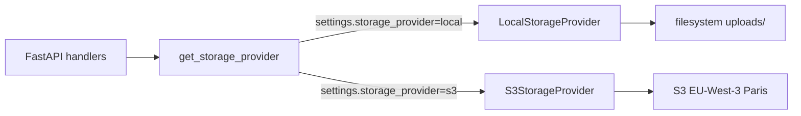

# Storage — Abstraction local + S3 EU-West-3

Story 10.6 — Epic 10 Fondations Phase 0.
Livre la couche d'abstraction `StorageProvider` qui découple les modules
métier (`documents`, `reports`) des détails d'implémentation storage.

## §1 Vue d'ensemble



La bascule local ↔ S3 est **config-only** (`STORAGE_PROVIDER=local|s3`).
Aucun refactor métier n'est requis en Phase Growth — seulement un
déploiement Terraform du bucket + IAM + CRR (Story 10.7).

## §2 Contrat `StorageProvider`

| Méthode                                         | Invariant                                                    |
| ----------------------------------------------- | ------------------------------------------------------------ |
| `put(key, content, *, content_type) -> str`     | Idempotent (écrase). Retourne URI canonique. Multipart auto ≥ 10 MB (S3). SSE-S3 AES256 systématique (S3). |
| `get(key) -> bytes`                             | Lève `StorageNotFoundError` si absent.                       |
| `delete(key) -> None`                           | Idempotent : jamais `StorageNotFoundError` si absent (aligne S3 DeleteObject). |
| `exists(key) -> bool`                           | Jamais d'exception — retourne False si path-traversal rejeté. |
| `signed_url(key, *, ttl_seconds=900) -> str`    | TTL borné [1, 3600] (S3). Local : URI `file://`. **Contrat de présence divergent** — Local lève `StorageNotFoundError` si clé absente (check `is_file`) ; S3 émet l'URL sans pré-check (économise un HEAD, le 404 apparaît à la consommation). Les consommateurs qui requièrent une garantie doivent appeler `await storage.exists(key)` avant. |
| `list(prefix, *, max_keys=1000) -> list[str]`   | Triée lex. Pagination > 1000 déferrée Phase Growth.          |

Clés opaques (portables local ↔ S3) :
- `storage_key_for_document(user_id, doc_id, filename) → "documents/<uid>/<did>/<file>"`
- `storage_key_for_report(report_id, filename) → "reports/<rid>/<file>"`

Hiérarchie d'exceptions : `StorageError` → `StorageNotFoundError`,
`StoragePermissionError`, `StorageQuotaError` (jamais de `ClientError`
boto3 brut qui remonterait aux appelants).

## §3 `LocalStorageProvider`

- **Constructor** : `LocalStorageProvider(base_path: Path)` ; `base_path`
  créé lazy au premier `put()`.
- **Structure filesystem** : `<base>/documents/<uid>/<did>/<filename>` et
  `<base>/reports/<rid>/<filename>`.
- **I/O** : `asyncio.to_thread` sur chaque appel bloquant
  (`write_bytes`, `read_bytes`, `unlink`, `is_file`, `glob`).
- **Streaming BinaryIO** : chunks 1 MB (pas de `content.read()` en entier
  sur un 100 MB — évite OOM).
- **Garde path-traversal** : rejette `..` et segments absolus → lève
  `StoragePermissionError`. Défense en profondeur, même si les helpers
  `storage_key_for_*` produisent toujours des clés sûres.
- **`signed_url`** : retourne un URI `file://<abs_path>` — les endpoints
  FastAPI local doivent passer par `storage.local_path(key)` et
  `FileResponse(path=...)` pour servir (pas de vraie URL pré-signée HTTP).
- **Cleanup parent vide** : `delete` supprime le dossier parent s'il est
  vide (pattern repris du legacy `documents.service._delete_file_from_disk`).

## §4 `S3StorageProvider`

### Config requise (env)

```bash
STORAGE_PROVIDER=s3
AWS_S3_BUCKET=mefali-uploads-prod
AWS_REGION=eu-west-3
# Credentials : IAM role (prod) ou AWS_ACCESS_KEY_ID/SECRET (dev)
```

### IAM policy minimale

```json
{
  "Version": "2012-10-17",
  "Statement": [
    {
      "Effect": "Allow",
      "Action": ["s3:GetObject", "s3:PutObject", "s3:DeleteObject"],
      "Resource": "arn:aws:s3:::mefali-uploads-prod/*"
    },
    {
      "Effect": "Allow",
      "Action": ["s3:ListBucket"],
      "Resource": "arn:aws:s3:::mefali-uploads-prod"
    }
  ]
}
```

### Comportements

- **Client boto3 sync** délégué à `asyncio.to_thread` — justification : `aiobotocore`
  épingle une version botocore incompatible avec langchain-openai ; l'overhead
  thread pool est < 1ms/call vs gain de stabilité packaging.
- **Multipart auto** : seuil 10 MB — bascule vers `boto3.s3.transfer`
  (`upload_fileobj`) pour fichiers ≥ 10 MB ou pour tout `BinaryIO`.
  `boto3.s3.transfer.TransferManager` gère split en chunks 8 MB,
  retry intra-chunk, parallélisation.
- **SSE-S3 AES256** : `ServerSideEncryption="AES256"` systématique sur tous
  les `put_object` / `upload_fileobj` (NFR25 — non négociable).
- **Retry transient** : 3 tentatives, backoff 200 → 400 → 800 ms, sur
  `ClientError.Code ∈ {RequestTimeout, ServiceUnavailable, SlowDown,
  InternalError, ThrottlingException}` et `BotoCoreError`. Les erreurs
  permanentes (`NoSuchKey`, `AccessDenied`) ne sont PAS retryées.
- **Mapping exceptions** : `NoSuchKey → StorageNotFoundError`,
  `AccessDenied → StoragePermissionError`, `QuotaExceeded/SlowDown →
  StorageQuotaError`, autres → `StorageError` (avec code error).
- **Presigned URLs** : TTL borné **[1, 3600]** secondes. Défaut 900 s
  (15 min). Plus long = risque leak URL (signature dans l'URL).
- **`__repr__`** masque les credentials (jamais d'accès à
  `self._client._request_signer._credentials`).

## §5 Limitations MVP

1. **Pas de migration automatique** `/uploads/` local → S3. Script
   `scripts/migrate_local_to_s3.py` différé Phase Growth (hors scope 10.6).
   Cf. `deferred-work.md § Storage`.
2. **4 modules PDF in-memory** (`credit/certificate.py`,
   `financing/preparation_sheet.py`, `applications/export.py`,
   `applications/prep_sheet.py`) ne sont **pas** câblés à `storage`. Ils
   streament via FastAPI Response sans persistance — bascule vers
   `storage.put()` pour caching/audit trail tracée dans `deferred-work.md`.
3. **Libs d'extraction** (PyMuPDF, pytesseract, docx2txt, openpyxl)
   attendent un path filesystem. En S3 Phase Growth un adaptateur tempfile
   sera requis (télécharge la clé dans `tempfile.NamedTemporaryFile` +
   passe le path aux libs). Story future.
4. **`LocalStorageProvider.signed_url`** retourne un URI `file://` —
   **pas** une vraie URL pré-signée HTTP. En mode local, les endpoints
   FastAPI doivent utiliser `storage.local_path(key)` + `FileResponse`.
5. **Pagination `list()` > 1000 keys** non supportée (`NotImplementedError`).

## §6 Propriétés bucket Phase Growth (Story 10.7 AC7)

Trois propriétés S3 critiques — activées ou documentées par Story 10.7 (absorbe LOW-10.6-4) :

### §6.1 Versioning (activé MVP via Terraform)

Active via `aws_s3_bucket_versioning` dans `infra/terraform/modules/s3/main.tf` (AC6 — prérequis CRR, **l'API S3 refuse la Replication Configuration si Versioning absent**).

**Effets** :
- Objets supprimés retenus comme « noncurrent versions » (récupération post-incident).
- Lifecycle rule `NoncurrentVersionExpiration` à **30 jours** (budget NFR69 — pas d'accumulation illimitée).

**Vérification** :
```bash
aws s3api get-bucket-versioning --bucket mefali-prod
# Attendu : { "Status": "Enabled" }
```

### §6.2 MFA Delete (activation ROOT-ONLY — hors Terraform)

**Limitation AWS 2026** : MFA Delete n'est activable **que via credentials ROOT account** — pas accessible à un IAM user même avec `s3:PutBucketVersioning`. Terraform ne peut pas gérer cette propriété.

**Procédure documentée (root AWS CLI)** :
```bash
# ⚠️ Nécessite credentials ROOT account (pas IAM user)
aws s3api put-bucket-versioning \
  --bucket mefali-prod \
  --versioning-configuration Status=Enabled,MFADelete=Enabled \
  --mfa "arn:aws:iam::<account_id>:mfa/root-account-mfa-device 123456" \
  --profile mefali-root
```

**Effet** : toute suppression d'objet ou désactivation du versioning requiert désormais un token MFA récent (< 30 secondes). **Protection anti-automation** (pod ECS compromis ne peut plus supprimer en masse, même avec policy admin).

**Vérification trimestrielle** :
```bash
aws s3api get-bucket-versioning --bucket mefali-prod
# Attendu post-activation : { "Status": "Enabled", "MFADelete": "Enabled" }
```

### §6.3 Object Lock WORM (différé Phase Growth)

**Non activable post-création** — nécessite création bucket avec `object_lock_enabled_for_bucket = true` (flag AWS obligatoire à la création du bucket).

**Hors scope MVP Story 10.7** — activation conditionnée à demande audit bailleur SGES exigeant rétention 10 ans immuable (compliance CDP, Gold Standard).

**Path Phase Growth** :
1. Créer bucket dédié `mefali-sges-worm` avec `object_lock_enabled_for_bucket=true` (nouveau bucket, pas modification du `mefali-prod` existant).
2. Appliquer `ObjectLockRule` mode `COMPLIANCE` (pas `GOVERNANCE` qui peut être contourné) avec `DefaultRetention.Years=10`.
3. Router les uploads SGES vers ce bucket via `StorageProvider.upload_document(key=f"sges/{...}")` — routage côté applicatif.

Cf. ligne `deferred-work.md §story-10.7` pour traçabilité.

## §7 IAM granulaire per-env (Story 10.7 AC4 — absorbe LOW-10.6-2)

Story 10.7 remplace la policy IAM trop large de 10.6 (`s3:DeleteObject` sur `arn:aws:s3:::<bucket>/*`) par **2 rôles distincts per-env** :

### §7.1 Rôle `mefali-<env>-app` (attaché ECS Fargate task)

Actions autorisées (**pas de Delete**) :
- `s3:GetObject` + `s3:PutObject` scopés `arn:aws:s3:::mefali-<env>/*`
- `s3:ListBucket` scopé `arn:aws:s3:::mefali-<env>`

**Justification** : l'application fait du **soft-delete uniquement** via `Document.deleted_at` (migration 027 RLS). Aucun code applicatif n'appelle `delete_object` directement — la suppression hard est une opération ops.

### §7.2 Rôle `mefali-<env>-admin` (assumé IAM user Angenor avec MFA)

Actions autorisées :
- `s3:DeleteObject` + `s3:DeleteObjectVersion` scopés `arn:aws:s3:::mefali-<env>/*`
- **Condition obligatoire** : `aws:MultiFactorAuthPresent == "true"` — AWS refuse l'action si session STS sans token MFA récent.

### §7.3 Procédure assumption rôle admin

```bash
# Token MFA + assume-role → credentials temporaires STS (15 min)
aws sts assume-role \
  --role-arn arn:aws:iam::<account_id>:role/mefali-<env>-admin \
  --role-session-name angenor-ops-$(date +%s) \
  --serial-number arn:aws:iam::<account_id>:mfa/angenor \
  --token-code <mfa-token-6digits> \
  --profile mefali-admin
# Export les 3 variables AWS_ACCESS_KEY_ID / AWS_SECRET_ACCESS_KEY / AWS_SESSION_TOKEN
```

### §7.4 Garde-fou CI anti-wildcard

`.github/workflows/deploy-staging.yml` + `deploy-prod.yml` exécutent :
```bash
! rg 'Resource.*"\*"' infra/terraform/
```
→ **Fail CI** si une future PR réintroduit un wildcard IAM (régression anti-LOW-10.6-2).

**Source unique de vérité** : `infra/terraform/modules/iam/main.tf` (Story 10.7 AC4).

## §8 Migration local → S3 (Phase Growth)

1. Provisionner bucket EU-West-3 + IAM role + CRR EU-West-3 → EU-West-1
   (Story 10.7 Terraform done).
2. Déployer script `scripts/migrate_local_to_s3.py` (écrit `documents/*`
   et `reports/*` de `backend/uploads/` vers S3, conserve les clés
   opaques identiques — aucune migration BDD requise).
3. Vérifier CRR actif : `aws s3api get-bucket-replication --bucket ...`.
4. Switcher env : `STORAGE_PROVIDER=s3` + `AWS_S3_BUCKET=...` → restart
   backend + monitoring 24h via `/api/admin/status` + CloudWatch.

## §7 Fichiers concernés

**Module storage (créé Story 10.6)** :
- `backend/app/core/storage/__init__.py` — factory `get_storage_provider` lru_cache + façade
- `backend/app/core/storage/base.py` — ABC + hiérarchie exceptions
- `backend/app/core/storage/keys.py` — helpers clés opaques
- `backend/app/core/storage/local.py` — `LocalStorageProvider`
- `backend/app/core/storage/s3.py` — `S3StorageProvider` + retry + mapping

**Consommateurs migrés** :
- `backend/app/modules/documents/service.py:upload_document, delete_document, analyze_document`
- `backend/app/modules/reports/service.py:generate_esg_report_pdf`
- `backend/app/modules/reports/router.py:download_report` (FileResponse local / RedirectResponse s3)

**Config** :
- `backend/app/core/config.py` — 4 champs `Settings` (`storage_provider`,
  `storage_local_path`, `aws_s3_bucket`, `aws_region`)
- `backend/.env.example` — section « Stockage fichiers »
- `backend/requirements.txt` — `boto3>=1.34,<2.0`
- `backend/requirements-dev.txt` — `moto[s3]>=5.0,<6.0`
- `backend/pytest.ini` — marker `s3` déclaré

**Tests (29 nouveaux)** :
- `backend/tests/test_core/test_storage/test_local_provider.py` (13 tests)
- `backend/tests/test_core/test_storage/test_s3_provider.py` (11 tests, marker `s3`)
- `backend/tests/test_core/test_storage/test_providers_e2e.py` (5 tests, 2 sous marker `s3`)

**Fixture auto-use** :
- `backend/tests/conftest.py:isolate_storage_provider` — chaque test pointe
  sur un tmp_path_factory dédié (évite pollution `backend/uploads/`).

## §8 Dépendances & coût

- **NFR24** (data residency) : AWS EU-West-3 Paris tranché — région par défaut.
- **NFR25** (chiffrement at rest) : SSE-S3 AES256 systématique, **coût nul**.
- **NFR33** (backup 2 AZ) : CRR EU-West-3 → EU-West-1 (Story 10.7).
- **NFR69** (budget infra ~1000 €/mois) : ligne S3 budgétée **~100 €/mois**
  — 10.6 rend ce chiffre opérationnalisable sans dette refonte.
- **SSE-KMS** : option Phase Growth pour compliance renforcée — **non livré**.
