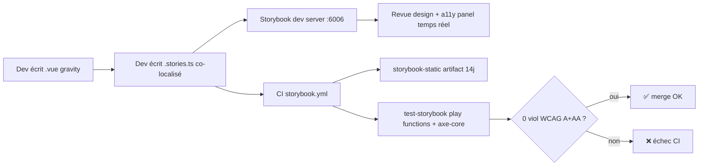

# Storybook partiel — 6 composants à gravité

> Première story UI Foundation (Story 10.14, Phase 4). Le frontend `components/gravity/`
> documente les composants à gravité juridique/émotionnelle maximale. La logique métier
> est implémentée dans les Epic 11–15 ; cette codemap décrit le socle documentaire,
> accessibilité et CI.

## 1. Contexte

Story 10.14 (16ᵉ story Phase 4, bascule Phase 0 infra → UI). Storybook installé
**partiellement** sur les 6 composants à gravité issus de la UX spec Step 11 §5.1 :

- `SignatureModal` (FR40) — signature cryptographique FundApplication
- `SourceCitationDrawer` (FR71) — traçabilité sources RAG / catalogue
- `ReferentialComparisonView` (FR26) — verdicts multi-référentiels
- `ImpactProjectionPanel` (Q11+Q14) — dry-run migration référentiel, seuil 20 %
- `SectionReviewCheckpoint` (FR41) — checkpoint revue séquentielle > 50 000 USD
- `SgesBetaBanner` (FR44) — bannière BETA admin N2 bloquante

**Hors scope MVP** : les 60 composants brownfield, `FormalizationPlanCard`,
`RemediationFlowPage` (Phase Growth).

Décision Q16 UX : Storybook **complète** (et ne remplace pas) Vitest + jest-axe. La
gravité juridique/émotionnelle de ces 6 composants justifie un investissement
documentaire pérenne (démos d'états, preuve accessibilité, référence visuelle pour
revues design).



## 2. Arborescence cible

```
frontend/
├── .storybook/
│   ├── main.ts              (framework vue3-vite, 3 addons essentials/a11y/interactions)
│   ├── preview.ts           (import main.css + toggle dark mode global)
│   └── tsconfig.json        (strict hérité)
├── app/
│   ├── assets/css/main.css  (+20 tokens @theme sémantiques verdict/fa/admin)
│   └── components/
│       └── gravity/         (nouveau dossier ; 60 brownfield INCHANGÉS ailleurs)
│           ├── registry.ts  (GRAVITY_COMPONENT_REGISTRY frozen 6 entrées CCC-9)
│           ├── SignatureModal.vue + .stories.ts
│           ├── SourceCitationDrawer.vue + .stories.ts
│           ├── ReferentialComparisonView.vue + .stories.ts
│           ├── ImpactProjectionPanel.vue + .stories.ts
│           ├── SectionReviewCheckpoint.vue + .stories.ts
│           └── SgesBetaBanner.vue + .stories.ts
└── tests/components/gravity/
    ├── test_registry.test.ts
    ├── test_no_hex_hardcoded.test.ts
    ├── test_each_component_renders.test.ts
    ├── test_a11y_axe.test.ts
    └── test_main_css_tokens.test.ts

.github/workflows/
└── storybook.yml            (build + a11y test + artifact 14j + contents: read)
```

## 3. Lancer Storybook en local

```bash
cd frontend
npm install --legacy-peer-deps
npm run storybook         # dev server http://localhost:6006
npm run storybook:build   # bundle statique storybook-static/
npm run storybook:test    # tests addon-a11y + play functions (Chromium requis)
```

- **Toggle dark mode** : toolbar Storybook (icône *paintbrush*) → applique
  `classList.toggle('dark')` sur `<html>` (pattern CLAUDE.md).
- **Panneau Accessibility** en bas : violations axe-core en temps réel (A, AA, AAA
  tolerée MVP — rule `color-contrast-enhanced` désactivée dans `preview.ts`).
- **Globals theme=dark** dans un `.stories.ts` pour une story forcée en mode sombre
  (voir `SignatureModal.stories.ts → DarkMode`).

## 4. Ajouter un 7ᵉ composant à gravité

1. Créer `app/components/gravity/NewComponent.vue` :
   - `<script setup lang="ts">` + primitive Reka UI si applicable
   - Props typés (`defineProps<Props>()`, enum literal pour `state`)
   - Classes Tailwind avec variantes `dark:` sur fond/texte/bordure (tokens `@theme`
     uniquement, zéro hex hardcodé)
   - ARIA roles pertinents (`role="dialog"`, `aria-busy`, etc.)
   - Aucune animation GSAP custom (respect `prefers-reduced-motion` natif Reka UI)
2. Créer `app/components/gravity/NewComponent.stories.ts` :
   - CSF 3.0 (`satisfies Meta<typeof NewComponent>`)
   - Minimum 3 variants : default + état non-default + `DarkMode`
   - `play` function pour un état critique (optionnel mais recommandé)
3. Étendre `GRAVITY_COMPONENT_REGISTRY` dans `registry.ts` :
   - +1 `Object.freeze({ name, fr, states })`
   - Adapter le test `test_registry.test.ts` (length → 7)
4. Ajouter tests Vitest dans `tests/components/gravity/` :
   - Rendu réel via `@vue/test-utils` (règle d'or 10.5)
   - `jest-axe` toHaveNoViolations si non portalisé (Teleport = couverture via
     Storybook addon-a11y runtime uniquement)

## 5. Pièges documentés

- **Storybook init démos** — `storybook init --type vue3` crée `Button.stories.ts`,
  `Page.stories.ts`, `Header.stories.ts` dans `app/components/` qui collisionnent
  avec les composants brownfield. **Parade** : ne pas lancer `storybook init`,
  installer manuellement les devDeps + écrire `main.ts` / `preview.ts` soi-même. Le
  glob `stories: ['../app/components/gravity/**/*.stories.@(ts|mdx)']` empêche la
  régression future.
- **Peer dep Vite 6 conflit avec Storybook 8** — `npm install` échoue en `ERESOLVE`
  même si le peer Storybook déclare `vite@^6`. **Parade** : `--legacy-peer-deps`
  (documenté dans CI + local). Upgrade Storybook 9 (2026) quand dispo.
- **Reka UI pin `^1.0.0` obsolète** — la spec initiale Q2 indiquait `^1.0.0`, mais
  reka-ui n'a jamais publié la version 1.x ; la latest stable est `2.9.x`. **Parade** :
  pin `^2.9.0` (minor bloqué, patch autorisé). Revue minor-bump trimestrielle.
- **Reka UI + Tailwind 4 purge CSS** — Reka UI primitives n'émettent aucune classe
  Tailwind. Toute classe construite dynamiquement (`:class="`${foo}`"`) peut être
  purgée. **Parade** : classes écrites statiquement dans les `<template>`. Si
  dynamique indispensable : ajouter au `safelist` (cas absent pour les 6 squelettes
  MVP).
- **Nuxt auto-imports absent Storybook** — `useNuxtApp`, `navigateTo`, `useFetch` ne
  sont pas disponibles dans Storybook (bundle Vite standalone). **Parade** : les 6
  squelettes n'importent rien de `#imports` / `#app` — props-only, emits, zéro
  dépendance Nuxt. La logique Epic 11–15 wrappera via composables externes.
- **`addon-a11y` faux positifs dark mode** — axe-core teste les contrastes sur le
  CSS rendu, mais le toggle `dark` est asynchrone si géré via setState. **Parade** :
  decorator `preview.ts` applique `classList.toggle('dark', ...)` **synchrone**
  avant le rendu.
- **`aria-allowed-role` sur `<aside role="status">`** — axe refuse un `role="status"`
  imposé sur un `<aside>` (implicit role `complementary`). **Parade** : utiliser un
  `<div role="status">` pour les bannières de statut (ex. `SgesBetaBanner`).
- **Reka UI DialogPortal + happy-dom** — `<Teleport to="body">` dans `DialogPortal`
  ne matérialise pas toujours synchronement dans happy-dom. **Parade** : `jest-axe`
  sur Portal = difficile → couverture a11y des composants portalisés
  (SignatureModal, SourceCitationDrawer) assurée par **Storybook addon-a11y runtime
  + `test-storybook` CI**. Les tests Vitest `test_each_component_renders` pour ces
  deux composants vérifient props/état uniquement (pas le DOM portalisé).
- **Taille bundle `storybook-static/` > 15 MB** — addon-essentials (docs, controls,
  viewport, backgrounds, actions, outline, measure) pèse ~6 MB + 6 composants +
  jest-axe runtime. **Parade** : check shell `du -sk` en CI (step « Enforce size
  budget »). Désactiver `outline`/`measure`/`grid` via `disabledAddons` si
  dépassement futur.
- **`test-storybook` requiert Playwright Chromium** — `actions/setup-node` ne
  l'installe pas automatiquement. **Parade** : step CI explicite
  `npx playwright install --with-deps chromium`. Sans ce step, `test-storybook`
  échoue avec `browserType.launch` introuvable.
- **Frozen tuple CCC-9 sur tuples imbriqués** — `GRAVITY_COMPONENT_REGISTRY` doit
  `Object.freeze` **chaque entrée + chaque `states`**, pas seulement le tuple
  racine. **Parade** : pattern `Object.freeze([Object.freeze({..., states: Object.freeze([...])})])`
  + test `Object.isFrozen(entry.states)` enforcement.

---

### UX Patterns — Dialog vs Drawer vs Popover

| Pattern | Rôle ARIA | `aria-modal` | Focus trap | Escape ferme | Exemple |
|---------|-----------|--------------|------------|--------------|---------|
| **Dialog modal** | `role="dialog"` | `"true"` | **Oui** (Reka UI natif) | Obligatoire | `SignatureModal` (signature cryptographique, action critique bloquante) |
| **Drawer (side panel)** | `role="complementary"` + `aria-label` | **Absent** | **Non** (consultation parallèle) | Bonus (UX attendue, pas imposé par ARIA) | `SourceCitationDrawer` (consultation sources RAG) |
| **Popover (hover / click)** | `role="dialog"` non-modal ou `role="tooltip"` | `"false"` ou absent | Non | Oui pour dialog non-modal | Futur `ui/Popover` (Story 10.18) |

**Règle de décision** : un composant est-il **bloquant pour l'utilisateur** (doit terminer l'action avant de revenir au contenu principal) ? Oui → Dialog modal. Non → Drawer/Popover. Cette discipline évite les verrouillages de focus intempestifs dénoncés par les utilisateurs de lecteurs d'écran (cf. review 10.14 HIGH-2).

### Upgrade strategy — primitives Reka UI

Primitives utilisées dans les 6 squelettes (pin `^2.9.x`) :

| Composant | Primitives Reka UI 2.9 | Surveiller en 3.0 |
|-----------|------------------------|-------------------|
| `SignatureModal` | `DialogRoot`, `DialogPortal`, `DialogOverlay`, `DialogContent`, `DialogTitle`, `DialogDescription` | Breaking sur portail / focus trap / API `@update:open`. |
| `SourceCitationDrawer` | `ScrollAreaRoot`, `ScrollAreaViewport`, `ScrollAreaScrollbar`, `ScrollAreaThumb` (+ `Teleport` natif Vue) | API ScrollArea (rare breaking historique). |
| `ReferentialComparisonView` | `TabsRoot`, `TabsList`, `TabsTrigger`, `TabsContent` | API Tabs (stable depuis 2.0). |
| `ImpactProjectionPanel` | `ScrollAreaRoot` et enfants | cf. drawer. |
| `SectionReviewCheckpoint` | — (HTML natif `fieldset`/`input[checkbox]`) | — |
| `SgesBetaBanner` | — | — |

**Procédure upgrade Reka 3.0 (quand publié)** :
1. Lire `reka-ui/CHANGELOG.md` et filtrer par primitives listées ci-dessus.
2. Créer branche `chore/reka-ui-3-upgrade` → `npm install reka-ui@3`.
3. `npm run storybook:build` + `npm run storybook:test` — la CI détecte les régressions API.
4. `npm run test` — les tests Vitest `test_each_component_renders` + `test_a11y_axe` sont les filets.
5. Revue visuelle Storybook manuelle : 37 stories × 2 thèmes (light/dark).

**Procédure upgrade Storybook 9** (résout `--legacy-peer-deps` Vite 6) :
1. `npx storybook@latest upgrade` — génère un rapport de migrations auto.
2. Vérifier que `viteFinal` + `@vitejs/plugin-vue` reste requis (possiblement corrigé).
3. Tester `npm ci` sans `--legacy-peer-deps` — si OK, retirer le flag de `storybook.yml` + README.

### Décisions verrouillées pré-dev (Q1–Q5)

| # | Question | Décision | Rationale |
|---|---|---|---|
| Q1 | Storybook 8 vs 7 | **8.x** | CSF 3.0, Vite 5/6 natif, cohérent Nuxt 4. |
| Q2 | Reka UI version | **`^2.9` pin** (rev. initial `^1.0.0` obsolete) | 1.x inexistant, latest stable 2.x. |
| Q3 | Dossier composants | **`app/components/gravity/`** | Évite collision avec `ui/` (Epic 10.15–10.21). |
| Q4 | Stories localisation | **Co-localisées** | Convention Storybook 8 CSF 3.0. |
| Q5 | CI destination | **Artifact 14j** | Pas de GitHub Pages MVP. |

### Hors scope explicite

- Logique métier FR40/FR41/FR44/FR26/Q11 → Epic 11–15.
- `ui/Button`, `ui/Input`, `ui/Badge`, `ui/Drawer`, `ui/Combobox`, `ui/Tabs` → Stories 10.15–10.19.
- `EsgIcon.vue` + Lucide → Story 10.21.
- GitHub Pages publication → Phase Growth.
- Storybook sur 60 composants brownfield → jamais MVP.
- `FormalizationPlanCard`, `RemediationFlowPage` → Phase Growth.
