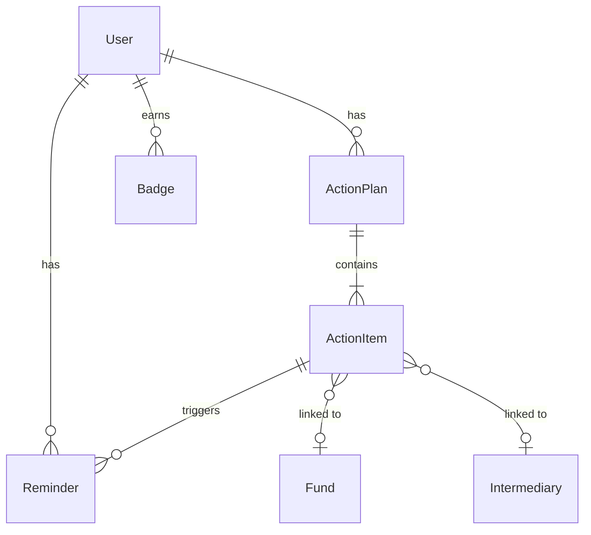

# Data Model: Tableau de bord principal et plan d'action

**Feature**: 011-dashboard-action-plan
**Date**: 2026-04-01

## Entités

### ActionPlan

Plan d'action personnalisé d'un utilisateur.

| Champ | Type | Contraintes |
|-------|------|-------------|
| id | UUID | PK, auto-généré (UUIDMixin) |
| user_id | UUID | FK → users.id, NOT NULL |
| title | String(255) | NOT NULL |
| timeframe | Enum(6, 12, 24) | NOT NULL — horizon en mois |
| status | Enum(active, archived) | NOT NULL, default=active |
| total_actions | Integer | default=0 |
| completed_actions | Integer | default=0 |
| created_at | DateTime(tz) | auto (TimestampMixin) |
| updated_at | DateTime(tz) | auto (TimestampMixin) |

**Contraintes** :
- Un seul plan actif par user_id (unique partiel sur user_id WHERE status='active')
- Archivage automatique de l'ancien plan lors de la génération d'un nouveau

**Relations** :
- `user` → User (many-to-one)
- `items` → ActionItem[] (one-to-many, cascade delete)

---

### ActionItem

Action concrète d'un plan d'action.

| Champ | Type | Contraintes |
|-------|------|-------------|
| id | UUID | PK, auto-généré |
| plan_id | UUID | FK → action_plans.id, NOT NULL |
| title | String(500) | NOT NULL |
| description | Text | nullable |
| category | Enum(environment, social, governance, financing, carbon, intermediary_contact) | NOT NULL |
| priority | Enum(high, medium, low) | NOT NULL, default=medium |
| status | Enum(todo, in_progress, on_hold, completed, cancelled) | NOT NULL, default=todo |
| due_date | Date | nullable |
| estimated_cost_xof | Integer | nullable, en FCFA |
| estimated_benefit | String(500) | nullable |
| completion_percentage | Integer | default=0, check 0-100 |
| related_fund_id | UUID | FK → funds.id, nullable |
| related_intermediary_id | UUID | FK → intermediaries.id, nullable |
| intermediary_name | String(255) | nullable — snapshot coordonnées |
| intermediary_address | Text | nullable — snapshot |
| intermediary_phone | String(50) | nullable — snapshot |
| intermediary_email | String(255) | nullable — snapshot |
| sort_order | Integer | default=0 |
| created_at | DateTime(tz) | auto |
| updated_at | DateTime(tz) | auto |

**Contraintes** :
- Si category = intermediary_contact, alors intermediary_name NOT NULL
- completion_percentage BETWEEN 0 AND 100
- Statut "cancelled" ne modifie pas la progression globale

**Transitions de statut** :
```
todo → in_progress → completed
todo → in_progress → on_hold → in_progress
todo → cancelled
in_progress → cancelled
on_hold → cancelled
```

**Relations** :
- `plan` → ActionPlan (many-to-one)
- `fund` → Fund (many-to-one, nullable)
- `intermediary` → Intermediary (many-to-one, nullable)
- `reminders` → Reminder[] (one-to-many, cascade delete)

---

### Reminder

Rappel programmé lié à une action.

| Champ | Type | Contraintes |
|-------|------|-------------|
| id | UUID | PK, auto-généré |
| user_id | UUID | FK → users.id, NOT NULL |
| action_item_id | UUID | FK → action_items.id, nullable |
| type | Enum(action_due, assessment_renewal, fund_deadline, intermediary_followup, custom) | NOT NULL |
| message | String(500) | NOT NULL |
| scheduled_at | DateTime(tz) | NOT NULL |
| sent | Boolean | default=false |
| created_at | DateTime(tz) | auto |

**Contraintes** :
- scheduled_at doit être dans le futur lors de la création
- Index sur (user_id, sent, scheduled_at) pour requête upcoming

**Relations** :
- `user` → User (many-to-one)
- `action_item` → ActionItem (many-to-one, nullable)

---

### Badge

Récompense de gamification.

| Champ | Type | Contraintes |
|-------|------|-------------|
| id | UUID | PK, auto-généré |
| user_id | UUID | FK → users.id, NOT NULL |
| badge_type | Enum(first_carbon, esg_above_50, first_application, first_intermediary_contact, full_journey) | NOT NULL |
| unlocked_at | DateTime(tz) | NOT NULL, default=now |

**Contraintes** :
- Unique (user_id, badge_type) — un badge ne peut être débloqué qu'une fois

**Relations** :
- `user` → User (many-to-one)

---

## Tables SQL

```sql
-- action_plans
CREATE TABLE action_plans (
    id UUID PRIMARY KEY DEFAULT gen_random_uuid(),
    user_id UUID NOT NULL REFERENCES users(id),
    title VARCHAR(255) NOT NULL,
    timeframe INTEGER NOT NULL CHECK (timeframe IN (6, 12, 24)),
    status VARCHAR(20) NOT NULL DEFAULT 'active',
    total_actions INTEGER DEFAULT 0,
    completed_actions INTEGER DEFAULT 0,
    created_at TIMESTAMPTZ DEFAULT NOW(),
    updated_at TIMESTAMPTZ DEFAULT NOW()
);
CREATE UNIQUE INDEX uq_active_plan_per_user ON action_plans(user_id) WHERE status = 'active';

-- action_items
CREATE TABLE action_items (
    id UUID PRIMARY KEY DEFAULT gen_random_uuid(),
    plan_id UUID NOT NULL REFERENCES action_plans(id) ON DELETE CASCADE,
    title VARCHAR(500) NOT NULL,
    description TEXT,
    category VARCHAR(30) NOT NULL,
    priority VARCHAR(10) NOT NULL DEFAULT 'medium',
    status VARCHAR(20) NOT NULL DEFAULT 'todo',
    due_date DATE,
    estimated_cost_xof INTEGER,
    estimated_benefit VARCHAR(500),
    completion_percentage INTEGER DEFAULT 0 CHECK (completion_percentage BETWEEN 0 AND 100),
    related_fund_id UUID REFERENCES funds(id),
    related_intermediary_id UUID REFERENCES intermediaries(id),
    intermediary_name VARCHAR(255),
    intermediary_address TEXT,
    intermediary_phone VARCHAR(50),
    intermediary_email VARCHAR(255),
    sort_order INTEGER DEFAULT 0,
    created_at TIMESTAMPTZ DEFAULT NOW(),
    updated_at TIMESTAMPTZ DEFAULT NOW()
);

-- reminders
CREATE TABLE reminders (
    id UUID PRIMARY KEY DEFAULT gen_random_uuid(),
    user_id UUID NOT NULL REFERENCES users(id),
    action_item_id UUID REFERENCES action_items(id) ON DELETE CASCADE,
    type VARCHAR(30) NOT NULL,
    message VARCHAR(500) NOT NULL,
    scheduled_at TIMESTAMPTZ NOT NULL,
    sent BOOLEAN DEFAULT FALSE,
    created_at TIMESTAMPTZ DEFAULT NOW()
);
CREATE INDEX idx_reminders_upcoming ON reminders(user_id, sent, scheduled_at);

-- badges
CREATE TABLE badges (
    id UUID PRIMARY KEY DEFAULT gen_random_uuid(),
    user_id UUID NOT NULL REFERENCES users(id),
    badge_type VARCHAR(30) NOT NULL,
    unlocked_at TIMESTAMPTZ DEFAULT NOW(),
    UNIQUE(user_id, badge_type)
);
```

## Diagramme de relations


